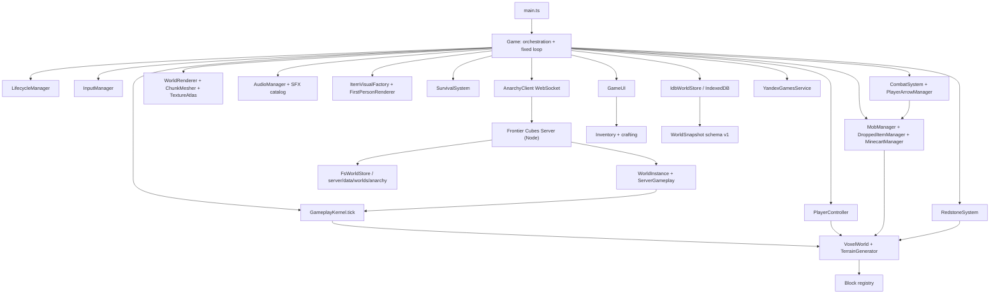
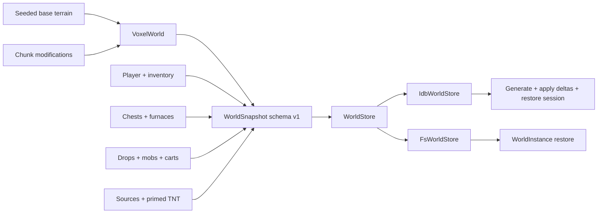

# Архитектура

## Farming V1 + Networking V2 — 2026-09-04

Current `main` integration keeps sparse Farming simulation in `GameplayKernel` (`world → farming → falling → players → …`) and replaces the old latest-input / chase-snap Anarchy movement with Networking V2.

- Farming: `src/farming/`, block IDs 150–157, `hydrated` / `age` on canonical `BlockRenderState` and `block_update` / `block_batch`. Online clients do not tick farming; the Anarchy server does.
- Movement: FIFO `PlayerCommandQueue`, `ackCommandSeq`, client prediction, accepted ACK does not mutate live pose. `PROTOCOL_VERSION = 3`.
- Remote players: `RemoteInterpolationBuffer` keyed by **serverTick**, never packet arrival as the timeline.
- Targeted online actions: explicit intent (`targetBlockId` / face / captured bow aim). Server validates A or rejects; never silent B.

## Farming V1 — shared sparse simulation

`src/farming/` is the single farming simulation module. `FarmingSystem` subscribes to `VoxelWorld.observeCommittedBlocks`, keeps a sparse map of Farmland/crop/stem positions by chunk, and lazily builds water indices only for nearby loaded chunks. Chunk unload discards runtime indices; restored modifications rebuild them on load. Canonical world modifications and `blockStates` remain the only persistence source—there is no farming save file or per-crop timestamp.

The fixed kernel order is `world → farming → falling → players → …`. Hydration runs every 100 ticks and growth every 1200 ticks. A hydration phase precedes growth when both pulses coincide, so crops observe current water state independent of restored insertion order. Only loaded chunks within the SP mesh radius or the server's connected-player active centers are visited; an explicit empty server center list visits nothing. No unloaded/offline/disconnected catch-up occurs.

Farmland stores `hydrated?: boolean`; crops/stems store `age?: number` clamped to 0…7. These fields extend existing `BlockRenderState`, `WorldSnapshot`, and normal `block_update`/`block_batch` state. The Anarchy `ServerGameplay` owns the same shared `FarmingSystem` and shared `performUseHeld` path as SP, but supplies server RNG, active player centers, plugin permission callbacks, authoritative inventory mutation, canonical dropped entities, and coalesced block deltas.

Farmland extends canonical `blockGeometry`/collision/selection at 15/16 height. `ChunkMesher` writes dry/wet farmland into the opaque batch and every crop/stem quad into the existing per-chunk vegetation `BufferGeometry`; it creates no mesh/material per plant. Carrot/Potato map ages `0–1/2–3/4–6/7` to their four textures. Attached mature stems resolve their N/E/S/W direction from adjacent matching fruit at render time, avoiding redundant network state.


## Online networking v2 — 2026-09-04

**Current contract.** Supersedes Prediction checkpoint (Model B), latest-input `lastInput`, and silent server re-raycast for Online actions. WebSocket + 20 TPS + shared `PlayerController` remain. `PROTOCOL_VERSION = 3`. Older joins are rejected. Targeted actions require `targetBlockId` and validate from the authoritative pose of `commandSeq`.

**CLIENT OWNS INTENT. SERVER OWNS RESULT.**

```text
MOVEMENT:
  InputManager → PlayerCommand(commandSeq, clientTick, WASD/look/slot)
  → predictLocalMove (history[commandSeq] = pre+post)
  → WS input
  → PlayerCommandQueue.enqueue (bound 32)
  → serverTick N: takeForTick() one command or sticky last
  → AppliedMovementStep { serverTick, commandSeq, pose }
  → player_state.ackCommandSeq + appliedSteps[]
  → inspect history[ackCommandSeq] vs snapshot
  → accept: bookkeeping only (diffMotionFull === [])
  → mismatch: restore snapshot, replay unacked commands

BLOCK / BOW:
  RAF live aim (PR #39 localInteractionAim)
  → capture actionSeq + commandSeq + target/face/hit or yaw/pitch
  → server validates that intent
  → execute A or reject
  → never silent B from delayed current ray
```

FIFO answers:

| Question | Answer |
|---|---|
| What does this ACK confirm? | `ackCommandSeq` after `serverTick` |
| Which command did serverTick N use? | `appliedSteps[].commandSeq` for that tick; sticky last if the queue was empty |
| Which history entry matches? | `history[ackCommandSeq]` post-state |
| Which target did this place/break use? | `action` / `interact` fields, not server look |
| Which aim spawned this arrow? | `bow_release.yaw/pitch` captured at release |

Equivalence epsilon is `1e-4` xz/y and `1e-3` speed. Speed / onGround / flying disagreement is a real correction. `predNo*` flags remain DEV-only.

Modules: `shared/playerCommand.ts`, `shared/playerActions.ts`, `server/playerCommandQueue.ts`, `src/gameplay/actionValidation.ts`, `src/net/actionIntent.ts`, `src/net/onlineActionMessages.ts`. `Game.ts` orchestrates; it does not own the algorithms.

Look-based raycast remains **only** when an action has no intent (SP tests, untargeted bow charge / eat). Network targeted actions always carry intent.

Remote interpolation stays on the PR #38 `serverTick` clock (never packet arrival). Production buffer is 12 samples. Delay starts at 100 ms (BASE LAN smoothness) and grows toward `clamp(100 + jitterP95, 80, 180)` only after underflow — jitter alone must not freeze `renderTick`. After capped/extrap, a new sample re-anchors the clock and blends ≤100 ms. Teleport (≥6 blocks) and respawn (dead→alive) hard-snap. Flying stays on samples. F3 reports delay, bufferDepthMs, underflow, recovery, maxVisualStep.

Historical Model B / latest-input sections below describe the **previous** Online pipeline. Do not re-implement them.

## Local interaction aim (live look) — 2026-09-04

Local block pick and first-person camera must share one look source. `applyImmediateRenderLook` already applies `InputManager.yaw/pitch` every RAF. `PlayerController.yaw/pitch` still update only inside the 20 TPS tick (physics / serialized view / walk facing).

Do **not** raycast with `session.player.viewDirection()` for local interaction. Use `localInteractionAim(player, input)` in `src/player/localAim.ts`:

- origin = `player.eyePosition()` (canonical eye, not third-person camera)
- direction = `viewDirectionFromLook(input.yaw, input.pitch)` (same YXZ basis as the first-person camera)

`Game.refreshLocalCrosshair` runs on the render path so the selection outline tracks the crosshair between ticks. `updateTargetAndActions` (20 TPS) reuses that helper, then consumes clicks / mining. Online use/bow/break capture that same live aim into sequenced actions. SP `useInteraction` / Q-drop use the same look.

Third-person: targeting stays eye + player facing. Front camera look is inverted for presentation only.

## Remote player interpolation (server-tick timeline) — 2026-09-03

Remote players are a **presentation** pipeline. They do not use local prediction, `LocalPlayerRenderState`, or packet-arrival timestamps as simulation time. Other network entities still use `EntityInterpolationBuffer` (arrival-time delay ~80 ms). Do not mix the three modes.

Clock (in `src/net/remotePlayerInterpolation.ts`):

```text
clockTick  = latestServerTick + (now - latestReceivedAt) / REMOTE_TICK_MS
renderTick = max(previousRenderTick, clockTick - delayTicks)
```

- `REMOTE_TICK_MS = 50` (20 TPS). `REMOTE_INTERP_DELAY_MS = 100` → `delayTicks = 2`.
- Each sample is keyed by `player_state.tick` (`serverTick`). `receivedAt` is telemetry and the elapsed term of the **latest** sample only. Older packets cannot move already-buffered sample times.
- Find the two surrounding snapshots and lerp: linear xyz/pitch/velocity, shortest-path yaw (`lerpAngle`). Booleans (`onGround`, `sprinting`, `sneaking`, `invisible`) use midpoint `t < 0.5 ? previous : next`.
- One sample: **hold** the spawn/first pose. Do not invent a long extrapolation.
- No future sample: coast on latest velocity for at most `REMOTE_EXTRAPOLATION_MS = 100`, then **hold the capped pose** (do not snap back to the last snapshot, do not coast forever).
- Reject duplicate (`tick === last`) and stale (`tick < last`) snapshots. Bounded ring of 8. Render clock never rewinds.
- Rejoin (`player_joined` of an existing id) calls `RemotePlayerView.reset()` and drops the old timeline. `player_left` disposes the buffer.

Locomotion: `PlayerVisualAnimator` gets interpolated `movementSpeed` (xz hypot), `onGround`, `verticalVelocity`, `sprinting`, `sneaking`. Not packet rate, not correction events. Attack/mining/bow/eating remain hardcoded false/0 until a later PR.

DEV: F3 nearest-remote line (`snap/s`, `serverTick`, `buf`, `arr/jitter`, `under/s`, `extrap`). `?remoteDiag=1` also logs one sample timeline per second.

## Checkpoint extra vs tickGap — 2026-09-03

Live `extra=3` with `tickGap=1 physicsTicks=1` is **not** a seqGap heuristic. `inspectPredictedPlayer` sets `extraTicks = simTicks = serverTick - lastAckedServerTick`. That count is what `predictedStateFromCheckpoint` actually runs.

`tickGap` uses `lastStateTick` from **receive**. `lastAckedServerTick` updates only on reconcile commit. `pendingLocalSnapshot` keeps the latest packet only, so skipped snapshots still advance `lastStateTick` and leave the checkpoint N ticks behind.

`lastAccepted + latestInput × simTicks` is valid only when every skipped server tick used that same input. Server samples `lastInput` per physics tick. DEV `PlayerSnapshot.appliedTicks` is the per-tick applied seq/y/vy trace (last 8). The next production compare should replay that span, not one latest seq × N.

## Prediction checkpoint (Model B) — 2026-09-03 (historical)

**Superseded by Online networking v2 FIFO.** Kept as the record of why latest-input + `history[latest]` false-corrected. Production compare is `history[ackCommandSeq]` with no extraTicks replay.

Owner dump `seq=545 lastAck=543 gap=2 physicsTicks=1 firstDiff=x` proved `inputSeq` is not a physics tick. The client predicted seq 544 and 545; the **old** server simulated **one** latest-input tick of 545. `history[545]` is one walk step ahead of that authoritative pose. FIFO applies 544 then 545 on consecutive ticks instead.

Three clocks:

| Name | Meaning |
|---|---|
| `inputSeq` | Packet/order id. Latest movement **state** (`lastInputSeq`). Intermediate seqs are not simulated. |
| `clientPredTick` | Local prediction physics step (every client 20 TPS tick). |
| `serverTick` / `tickNumber` | Authoritative simulation checkpoint on `player_state`. |

`player_state` fields are separate: `tick = serverTick`, `physicsTicks = N` for this outer update, `inputSeq = latest state actually used`.

Reconcile (Model B): comparable pose = **last accepted movement state** + `simTicks` of the snapshot's latest input. `simTicks = serverTick - lastAckedServerTick` when the tick is known, else packet `physicsTicks`. Accept is a live-pose no-op; mismatch restores the snapshot and replays remaining pred ticks. Duplicate detection uses `serverTick` when known, else `inputSeq` (preserves `predNoSend` / hidden-tab tests that omit tick).

Evaluated models:

- **A** — drive client ticks only when the server ticks. Rejected: the client cannot see the server slot; local look/move would wait.
- **B** — predict every local tick; snapshot carries enough tick/time to identify the equivalent simulation point. **Chosen.** Smallest change that matches latest-input server semantics without FIFO.
- **C** — FIFO one server tick per client seq. Rejected by design (reverts Anarchy movement).

Do not compare `history[inputSeq]` and do not invent seqGap heuristics (`gap > physicsTicks`, subtract one tick, larger tolerance, smoothing).

Timeline harness: `src/net/predictionTimeline.ts`. Owner gap=2 → history would correct (~walkStep), checkpoint dist=0.

## One-correction diagnostic — 2026-09-03

Owner 20/20 localhost still positional-corrects (`corr/s` 5–11). This pass does **not** change prediction, tolerances, interpolation, TPS, or PlayerController.

`inspectPredictedPlayer` compares snapshot `inputSeq=N` to `history[N]`, then applies `extra = max(0, physicsTicks - seqGap)` ticks of that **same** latest input. `physicsTicks=1` → exactly `history[N]`. `lastInputSeq` is the latest movement **state**, not a unique physics tick. `tickNumber` is the server checkpoint.

`[corrDiag]` prints SEQ / TIMING / PHYSICS / INPUT / CLIENT POSE (`history[N]`, comparable, live) / SERVER POSE / DIFF / STATE / WORLD (`getBlock(false)`, AABB, `chunkLoaded`, `mutationMarks`, visibility) / CATEGORY A–G.

WorldInstance 1:1 (`applyInput` + `tick` vs `predictLocalMove`) matches on Anarchy for walk and the other modes. Deterministic PlayerController + wrapper is not the remaining 20/20 bug. Latest-input coalesce (client 2 seqs, server 1 tick) still produces a walk-step `firstDiff=z` dump — that path is proven, not assumed to be the live 20/20 case.

## Hidden-tab Page Visibility — 2026-09-03

Single game tab. `GameLifecycleManager` sets `BACKGROUND` on hide; `worldSimulationActive` is false, so `Game.frame` zeroes the accumulator and skips `tickOnline`. The client sends no movement and predicts no ticks. The server keeps `lastInput` at 20 TPS. Incoming `player_state` still lands on the same WebSocket; the client stores **one** latest pending snapshot. Those packets reuse `inputSeq`, so reconcile **ignores** them as `duplicate-seq`. Local pose freezes while the server walks ~`WALK_SPEED × hiddenSeconds`.

A frozen `requestAnimationFrame` on resume can still feed up to 0.25 s (`MAX_FRAME_DELTA`) → 4 catch-up ticks from the stale pose. That is not a 2 s replay, but it is enough to start a correction storm against a pose metres away.

Policy (lifecycle only): hide sends the same idle packet as the pause menu; resume resets `previousTime`/`accumulator`, snaps the local player to the latest snapshot, and clears prediction history. Look is preserved. This is not a FIFO, not a larger accept window, and not a TPS change.

DEV: F3 `visibility=visible/hidden focus=1/0 hiddenDurationMs resumeTicks resumeSnapshots`; `tickClock.inputGapMs` / `inputPackets` as `inGap` / `inBurst`. Logs `[vis]`, `[vis-resume]`, `[vis-resync]`.

## Session resume isolation + event-loop load — 2026-09-03

`sessionStorage` key `fc.anarchy.sessionToken` is per-tab, but **duplicating a tab copies it**. `WorldInstance.join` resumes the same `ServerPlayer`, replaces `sink`, and used to leave the old WebSocket in `AnarchyServer.sockets`. Both sockets could `applyInput()`. Closing the old tab called `disconnect()` on the live player.

Invariant: one player, one `connectionId`, one movement source. Resume mints a new id, sends `error code=session_taken` to the old socket, and ignores input whose `connectionId` does not match. Stale `close` does not disconnect the new connection.

Flight `snapSent≈15` is an **outer-loop stall**, not prediction. `syncChunksFor` used `serializeModifications()` (entire world) for every newly streamed column; flying crosses columns fast. Now one chunk's delta is serialized, and at most 2 **new** generates run per sync (already-generated columns still stream). Drain continues each outer loop.

Reconnect ~1697 ms: `welcome` JSON parse + `world.restore` + `LOADING_WORLD` gen/mesh. DEV logs `[reconnectLoad]`, `[frameSpike]`, `[longtask]`. Server tickClock adds lateness/callback/ELD. `?quietWorld=1` caps streaming to 1 chunk.

## Server 20 TPS clock vs catch-up snapshots — 2026-09-03

Owner F3: `pred/s=20` `state/s=17` `corr/s=3` `netPos/s=3` `soft *=0`. Remaining jitter is **positional correction**, not speed/flying flags.

`setTimeout(tickMs - work)` accumulated Node slack (~4–10 ms), so the **outer** loop ran ~17 Hz. `gameplayTicksDue` still produced ~20 physics ticks via catch-up, then **one** `player_state` with `inputSeq = lastInputSeq`. Client `history[N]` is the pose after **one** predicted tick of N. A 2-tick catch-up pose is ~one walk step ahead → `corr/s≈3`.

Fix: schedule the next outer loop on an **absolute 50 ms slot** (`scheduleNextTickSlot`) so lateness shortens the next wait. Snapshots carry `physicsTicks` (not a fake seq). Reconcile compares `history[N]` plus `max(0, physicsTicks - seqGap)` extra ticks of that same latest input. Real xz/y mismatches still correct. No lerp, no larger tolerance.

F3: `srv phys/s snapGen/s snapSent/s lastPhysΔ`. Every correction logs `[corrDiag]` with `firstDiff`.

## Online incoming `player_state` side effects — 2026-09-03

Owner A/B: Normal Online jitters; `?predNoState=1` (send+predict, skip applying local `player_state`) is completely smooth. Local prediction, PlayerController, fixed-step render, and outbound input are OK. The remaining bug was **incoming local `player_state`**.

Matching pose at `history[seq]` now **accepts on xz/y only**. Velocity, onGround, and flying disagreements are `softReject` (logged, no restore/replay). That is the fly+SHIFT case: `CREATIVE_VERTICAL_SPEED = 7.5` vs `PREDICTION_ACCEPT_SPEED = 0.2` (~3%) used to rewind every snapshot and rewrite `velocity.y`.

Local snapshots are queued on receive and applied at the start of the next 20 TPS tick (`tickOnline` / idle send), not inside the WebSocket callback. Survival restore runs only when health/hunger/dead actually change (`hurtResistance.reset()` is no longer called 20 times a second).

DEV: `?predStateObserve=1` parse+inspect with zero mutation; category skips `predSkipReconcile|Survival|Riding|Gamemode|Respawn|Look|Render`. Keep `predNoState` / `[firstBadEvent]`.

## Online network-path isolation — 2026-09-03

Manual A/B: Normal Online still jitters; `?predNoNet=1` (same prediction/render, no movement send, no local `player_state`) is smooth. Remaining jitter is in the **network path**.

DEV-only query flags (ignored in production):

```text
?predNoNet=1            = predNoSend + predNoState
?predNoState=1          send + predict; do not apply/reconcile local player_state; remotes stay on
?predNoSend=1           do not send movement input; still receive/apply snapshots
?predStateObserve=1     receive + parse + inspect; mutate nothing
?predSkipReconcile=1    skip rewind/ack only
?predSkipSurvival=1     skip health/hunger restore
?predSkipRiding=1 ?predSkipGamemode=1 ?predSkipRespawn=1 ?predSkipLook=1 ?predSkipRender=1
```

F3: `Motion online/normal|noState|noSend|noNet|observe send=on|OFF state=on|OFF` plus `soft speed/onGround/flying`.

Local `player_state` apply is deferred to the next tick. **Accepted or ignored acks write no PlayerController fields**. Pose mismatch (`xz`/`y`) still restores+replays. Health/hunger restore only on actual change. Every other network callback that can mutate the local player is traced. First frame with `rΔ < 0` or `|rΔ| > 0.12` dumps `[firstBadEvent]`.

DEV input packets may carry `clientSentAt`; snapshots echo `netTiming` (client send / server recv / sim / server send).

Urgent remesh, gravity, speeds, 20 TPS, and render interpolation are unchanged.

## Online Anarchy correction diagnosis — 2026-09-02

`prd/s=20` vs `state/s=18` was Node `setInterval(50)` drift (no catch-up), not PlayerController divergence. Lockstep same class / same world / same dt is identical. A 2-vs-1 latest-input walk is ~0.22 blocks — the observed 0.3–0.6 rewind.

Server loop uses `gameplayTicksDue` (same bounds as client `advanceFixedStep`). Multiple owed ticks: `tickCatchUp` then **one** `player_state`. Latest-input unchanged (no FIFO).

DEV: `?corrDiag=1` dumps one correction; F3 `snap recv/drop/gap`; `FC_DEBUG_SNAP=1`; `/predsim`.

## Online Anarchy input: latest movement state — 2026-09-02

Continuous WASD/sprint/sneak/flight is **state**, not a FIFO of packets. `applyInput` replaces `lastInput`. Each 20 TPS tick simulates that state once. `snapshot.inputSeq` is `lastInputSeq`. Skipped seqs are not simulated.

One-shot / hold edges:

- `attack` / `break_block` / `place_block` / `interact` — immediate messages
- `input.use` / `input.mining` — latest hold; `pendingUseRelease` so a coalesced bow release is not lost
- `pendingJump` so a jump pulse is not overwritten by a later packet in the same window

Client prediction still ticks every local seq. Reconciliation compares the snapshot to **last accepted pose + simTicks of the latest input state**, not to `history[N]`. Replay is remaining pred ticks after consuming `simTicks` oldest entries.

DEV: `FC_DEBUG_BOW=1` (server), `?bowDiag=1` (client).

## Online Anarchy local motion pipeline — 2026-09-02

SP and Online local presentation share one render model:

```text
Game.frame
  advanceFixedStep → leftover < FIXED_DT, ticks = 0..4
  0..4 × Game.tick
    after each tick: LocalPlayerRenderState.pushAfterTick(live pose)
  render
    sample last adjacent pair (S_{n-1}, S_n)
    alpha = leftover / FIXED_DT
    cameraPivot = sampled feet + eyeHeight
```

`PlayerController.previousPosition` is **not** the render origin (fall distance only). Interpolating `(S1, S3)` after two ticks in one rAF can move the camera **backward** relative to a high-alpha `S1→S2` frame. The last adjacent pair after two ticks is `(S2, S3)`.

Online `tick()` is `tickOnline` only (no client world sim). Each fixed step: sync `creativeFlightAllowed` from gamemode, send `input.seq` (unless DEV `predNoSend` / `predNoNet`), `predictLocalMove` = `PlayerController.tick` + `history[seq]`. The render buffer is the same object as singleplayer.

Server: `applyInput` replaces `lastInput`. Each 20 TPS tick simulates that latest state once. `PlayerSnapshot.inputSeq` is `lastInputSeq`. Client compares snapshot to last-accepted pose + `simTicks` of that latest input (`serverTick` is the checkpoint). Match → no pose write. Mismatch → restore + replay remaining pred ticks. Snap ≥ 6 copies `previousPosition = position`. Smaller corrections leave `previousPosition` for lerp.

DEV: F3 `motionProbe` (local player). `?motionDiag=1` dumps a 2 s SP/Online trace.

## Online Anarchy local prediction + urgent remesh — 2026-09-02

Local Anarchy motion is **predicted** on the existing `PlayerController`, not chased.

```text
tickOnline (20 TPS)
  syncCreativeFlightAllowed(player, summary.mode)
  send input.seq
  predictLocalMove  → PlayerController.tick + history[predTick, seq] = state AFTER tick
player_state (tick = X, physicsTicks = N, inputSeq = latest state)
  syncCreativeFlightAllowed from snapshot.gamemode BEFORE inspect
  if serverTick already acked or missing seq → ignore movement
  comparable = lastAckedState + simTicks of that latest input (scratch copies creativeFlightAllowed)
  if within tolerance → commit checkpoint, do not touch the live player
  else restore snapshot pose + replay remaining pred ticks
render
  lerp LocalPlayerRenderState previous → current (same as SP; snapshots do not drive this)
  look: applyImmediateRenderLook every frame
```

`inputSeq` is the **latest** movement seq used for this server tick (`lastInputSeq`). Packets between ticks replace `lastInput`; skipped seqs are never simulated. A second snapshot with the same seq means no newer packet arrived and lastInput was held — the client ignores that duplicate ack.

Server still owns gameplay: `WorldInstance.tickConnectedPlayers` runs the real physics; health/world/combat stay authoritative. Large corrections (≥ 6 blocks) snap `previousPosition`. Smaller corrections leave `previousPosition` for render lerp. `stepTowardTarget` remains for tests / legacy helpers only.

Reconnect: `resetPredictionBuffer` on welcome; server `inputSeqAfterReconnect()` still `-1` so a new client starting at seq 0 is accepted.

Live `block_update` / `block_batch` still apply in the WebSocket handler via `applyNetworkBlockChanges` (collision/state immediately). Visible mesh is **not** rebuilt there. `Game.queueUrgentMutationMesh` records chunk keys (edited chunk + `neighborFluidMeshOffsets`). `processWorldJobs` drains a dedicated slice (`URGENT_MUTATION_MESH_LIMIT = 3`, `URGENT_MUTATION_MESH_BUDGET_MS = 2`) with `allowPendingLighting` / `requireNeighborLight: false`. Ordinary streaming budgets stay `WORLD_JOB_BUDGET_MS = 4` and `WORLD_LIGHT_BUDGET_MS = 2`. Lighting still runs; a slightly stale-light mesh can appear now and remesh again when `lightMeshStale`.

DEV server hitch log: `FC_DEBUG_TICK_MS=1` warns when wall time ≥ 16 ms (`tick-ms n=… wall=… gameplay=…`). Not a production profiler.

## UI on authoritative server/player main — 2026-09-02

`GameUI` remains the only DOM/menu/HUD/container owner after the PR #22 merge. Main's `OnlineServerLiveStatus`, `InventoryContext.submitAction` and `applyAuthoritativeCursor` contracts are retained; authored UI markup and CSS wrap those contracts instead of replacing them. Online inventory clicks/recipes still become protocol actions, container snapshots still patch the open UI, and death/respawn/chat callbacks remain owned by `Game` and lifecycle.

`Game` and the shared/server layers were not redesigned by this integration. `tickOnline` remains input/presentation only, server packets remain world/inventory authority, and the PR #28 overlay plus PR #31 player/camera code stay render consumers. UI QA, player QA and breaking QA are sibling DEV-only dynamic routes in `main.ts`; no harness enters the production graph.

World deletion continues through `WorldListActions.delete`; the dialog never accesses IndexedDB directly. Its modal focus contract is now deterministic: Cancel receives initial focus, Tab/Shift+Tab are contained within both actions, Escape/Cancel/backdrop restore the previous screen handler and return focus to the Delete trigger.

## UI visual system — 2026-08-30

`src/uiTokens.css` is the single production typography/token entry point imported before `style.css`. It declares local Cyrillic/Latin WOFF2 faces for Press Start 2P and Inter plus display/UI/debug font roles, color, spacing and target-size tokens. Font binaries are static assets under `public/fonts`; their OFL records and upstream mapping are documented in `docs/FONT_ASSETS.md`. Runtime does not fetch fonts.

`GameUI` remains the only DOM UI owner. Loading creates stable label/bar/percent/detail nodes; `updateWorldLoading` patches them and ARIA progress attributes instead of replacing the screen. HUD remains a fixed-tick state projection: `hungerHudIcons` is a pure 0..20 → ten-icon mapper parallel to the existing heart/armor helpers. CSS owns responsive size only; it does not introduce a render-loop or simulation dependency.

Creative continues through `renderCreativeInventory`, `.mc-stage`, `patchCreativeDynamic`, `bindContainerChrome` and the caller's `InventoryContext.onClose`. `containerUiScaleWithClose` fits the logical panel and a minimum 44 px close target as one stage. The catalog is the only scrolling region; the reduced 166 logical-pixel Creative body is content-derived and the player hotbar follows it directly. No second inventory implementation or pointer-lock path exists.

World Select keeps the existing `WorldListActions` contract. Rows own selection state and double-click calls `load`; footer buttons call the same `back`, `create`, `load` and `delete` callbacks. The delete confirmation is an in-screen `role=dialog`; it traps focus between its actions and restores the prior Escape handler plus trigger focus when dismissed. It does not touch save storage directly.

`src/dev/UiQaHarness.ts` is an opt-in DEV adapter selected by `?qaUi=` in `main.ts`. It instantiates the real `GameUI` with deterministic inventory/world summaries and callbacks, while deliberately skipping `Game`, WebGL, simulation and persistence. This is a layout/interaction fixture, not a parallel UI or gameplay system, and is excluded from production by the `import.meta.env.DEV` branch plus dynamic import.
## Player appearance / character visual / camera — post-server integration 2026-09-02

`PlayerController` остаётся единственным simulation-authority: position — feet-center, yaw/pitch/velocity/physics обновляются fixed 20 TPS. Presentation вынесен в `src/rendering/player/`: `PlayerVisual` получает interpolated feet и render-frame live look, `PlayerVisualAnimator` хранит только visual phase/body yaw/swing, `ThirdPersonCamera` вычисляет presentation camera. Ни один из этих классов не меняет controller, movement semantics, raycast origin или save schema.

`PlayerAppearance` — data-only контракт `{ skinId, model: 'classic'|'slim', layers }` под `src/player/appearance/`; он остаётся Node-safe. Three-dependent `MinecraftSkinRegistry` живёт в `src/rendering/player/MinecraftSkin.ts`, знает built-in descriptors и кэширует `THREE.Texture` по `skinId` с ref-count; filter — nearest, mipmaps off, sRGB, clamp. Будущий импорт обязан пройти `validateMinecraftSkinDimensions(64,64)` / `registerValidated`; legacy 64×32 намеренно отклоняется. `PlayerSkinGeometryCache` кэширует base/outer geometry по presentation/model/part/layer. World model использует scale `1.8 / 32`; hat inflate 0.5 model pixel, jacket/sleeves/pants 0.25 model pixel. Classic arm 4×12×4; Slim 3×12×4 плюс pivot Y 21.5 вместо 22 model pixels. Left limbs используют modern independent UV islands, не mirrored right limbs.

`Game` владеет одним registry/cache на приложение. `GameSession.playerVisual` владеет instance material/transforms и освобождается вместе с миром; `FirstPersonRenderer` держит отдельный skin handle, поэтому texture реально общая, а смена appearance безопасна до release предыдущего handle. `ItemVisualFactory` остаётся единственным источником held geometry/material/texture для first- и third-person. Player skin material использует entity-light uniform; held item наследует тот же root light. Hurt flash меняет per-player light multiply; invisibility выключает только skin meshes, сохраняя held item.

Camera mode — `firstPerson | thirdPersonBack | thirdPersonFront`; F5 меняет только presentation state. `THIRD_PERSON_CAMERA_DISTANCE = 4`. `availableThirdPersonDistance` делает 8 offset segment probes радиусом 0.1 через реальный `blockCollisionBoxes`, поэтому full cubes, stairs, slabs, fences, doors/chests/lantern/chain учитываются, non-solid decoration — нет. Retraction immediate, restore exponential; camera position и live look применяются каждый RAF. Front mode ставит camera перед view vector и разворачивает yaw `+π`, pitch меняет знак; input/player facing не инвертируются.

Future UI после интеграции UI PR: отдельная панель «Персонаж / Скин» использует только `Game.setPlayerAppearance()`, показывает preview тем же `PlayerVisual`, выбирает built-in/model/layers и позже local validated PNG из IndexedDB. Она не должна создавать второй renderer/model contract.

Online remote players используют тот же `PlayerVisual`, что local third-person. `RemotePlayerView` is a thin Three wrapper around `RemoteInterpolationBuffer` (server-tick timeline, 100 ms delay, bounded 100 ms extrapolation then hold). Interpolated feet/yaw/pitch/velocity plus midpoint discrete sneak/sprint/onGround/invisibility feed the render-frame animator. Temporary `BoxGeometry` удалён. Remote lighting использует тот же `applySampledEntityLight`; server/HeadlessEntityHost не импортируют Three. Текущий protocol не содержит authoritative held item id или appearance metadata, поэтому remote visual использует `DEFAULT_PLAYER_APPEARANCE` и neutral empty hand — ничего не угадывается. Будущий appearance sync остаётся редким metadata event `{ skinId, model, layers? }`, никогда PNG/base64 или per-tick texture payload. Remote attack/mining/bow/eating sync is a later PR.

## Block breaking overlay — integrated 2026-09-02

`BlockBreakingOverlay` is a local visual consumer of `GameSession.miningProgress`. `WorldRenderer.setBreakingProgress(hit, progress)` is the only gameplay hook. In Online Anarchy the client continues to send mining intent through `input.mining`; `ServerGameplay.advanceMining` / `breakBlock` remain the only block-destruction authority, and the client world changes only after authoritative `block_update` / `block_batch`. The overlay never predicts or mutates a block.

Overlay geometry is independent of `ChunkMesher`. It resolves selection boxes and shape keys from the canonical Node-safe `world/blockGeometry.ts`; `rendering/specialBlockGeometry.ts` only supplies the oriented Three.js geometry wrapper. Stage changes swap a cached nearest-filter texture, while identical render-frame samples return without re-resolving block state or allocating geometry. Selection outline stays `renderOrder=10`. Production crack masks live at `public/textures/gui/destroy/` and are original Frontier art, not committed Mojang `destroy_stage_*` sheets. The current overlay is local-player only and uses the same authoritative eye/look target in all three camera perspectives.

## Glowstone / lantern / chain — 2026-08-28

Glowstone is a registry cube (`BlockId.Glowstone = 146`, `emission: 15`, glass SFX). Lantern and chain are new `renderShape` values, not a second block system. Selection/collision AABBs live in `world/blockGeometry.ts`; mesh UVs and hanger/chain planes stay in `specialBlockGeometry` and re-export the same sim boxes. `ChunkMesher.addLantern` / `addChain` write cutout geometry. Held `special_model` uses the same atlas UV rects as the world mesh. Inventory/hotbar for lantern and chain use authored `item/lantern` and `item/chain` sprites; glowstone stays a 3D cube preview.

Placement lives in `src/gameplay/useInteraction.ts` (`placeFromHit` / `placeBlockAt`) plus `world/placement.ts` support tests. Singleplayer `Game.useTargetOrItem` and Anarchy `ServerGameplay.useHeld` / `placeBlock` call that one simulation. Vertical hit only. `attachment: floor | ceiling` is stored in existing `blockStates`. `canSupportHanger` accepts a sturdy cube/slab/stair face **or** another chain/lantern so a hanging lantern continues a chain. Support integrity is the existing neighbor queue; hanging chains are not supported by the chain below, so breaking the ceiling cascades.

Light uses `BlockDefinition.emission` and the current add-emitter / region relight path. Torch stays 14. No extra per-frame scans and no lighting budget change.

Recipes live in `CRAFTING_RECIPES`. Import mapping: `blocks/glowstone.png` (1.12) with `block/glowstone.png` fallback; lantern/chain block+item sprites from 1.14+/1.16+ names. Runtime ships Faithful 32x tiles (same pack as `stone.png` / `gold_ore.png`). Generate-missing no longer paints these three.

## Creeper / fence / plants / tooltip / RU — 2026-08-28

`MobManager.syncVisual` applies generic death rotation/shrink whenever `state === 'die'`, including creepers. Fuse pulse is kind-specific idle only. `beginDeath` zeros `fuseSeconds` so a primed creeper killed by the player cannot finish fuse. `explodeCreeper` still `removeMob(..., 'explosion')` with no corpse and no death loot.

`collisionCandidateCellRange` in `world/collision.ts` is the shared player/mob broadphase helper. `MAX_BLOCK_COLLISION_Y_OVERHANG = 0.5` expands candidate minY by at most one cell so fence geometry that occupies voxel Y=n but collides to Y=n+1.5 is still queried when feet are above the cell. Fence visual boxes stay height 1; `blockCollisionBoxes` still uses `fenceLocalBoxes(..., 1.5)`. Jump velocity and `STEP_HEIGHT = 0.6` are unchanged.

Vegetation support is an explicit ID group in `placement.ts` (`isVegetationBlock`), not `renderShape: 'cross'` (cobweb stays out). Support cell is the block below. Grass/fern/flowers require GrassBlock or Dirt; DeadBush requires Sand. Integrity still uses the existing Map-deduped neighbor queue and `processSupportIntegrity` budget. Detached plants with `drop:false` do not spawn items. Water may still enter replaceable plant cells.

`SurvivalSystem.applyEffect('absorption')` sets absorption HP to `4 × (amplifier + 1)` and refreshes duration; ordinary Golden Apples therefore replenish to 4 and never stack to 8. `Game.refreshHud` reads `session.survival.absorption` regardless of game mode. `heartHud` remains presentation-only.

Item labels come from `src/i18n/ru.ts` via `requiredDisplayName`. Internal item/block IDs, recipes, saves and `/give` parsers stay English. One `.mc-item-tooltip` node plus delegated pointer events on the inventory modal replace native `title` on item slots; `patchKeyedHost` copies `data-item-tooltip` / `data-item-id` / `aria-label` without remounting the Creative catalog.

## Gameplay / UI / entity polish — 2026-08-28

`CombatSystem.FRONTIER_MELEE_VERTICAL_SCALE` (0.67) is the only vertical melee adapter. `applyKnockback` / `applyExtraKnockback` still own horizontal 1.8 constants; Y is scaled so flat apex is ~½ the previous measured height. Player and mob share these helpers. `completeMeleeAttack` slows attacker XZ ×0.6 and does not clear sprint. `PlayerController` derives `sprinting` from current input each tick; `sprintNeedsRelease` is gone.

`itemIcons.usesBlockModelIcon` routes cube + special_model block items through `special_preview`. `ItemIconRenderer` bakes a 64×64 orthographic nearest-filter preview once via `ItemVisualFactory.createItemModel` + `prepareSpecialIconPreview`, caches the data URL, and disposes temp geometry/materials. Generated items stay atlas sprites. Inventory close is a `.mc-stage` sibling to the right of `.mc-panel`; `containerUiScaleWithClose` reserves `MC_CLOSE_GUTTER`. Existing `onClose` / pointer-lock path is unchanged.

`World.raycast` accepts `geometry: 'selection' | 'collision'` (default selection). Collision uses `blockCollisionBoxes` so non-solid vegetation/fire do not stop projectiles. Player and skeleton arrows pass `{ geometry: 'collision' }`. Crosshair/mining still use selection.

`PlayerArrowManager.tryCollect` grants `ItemId.Arrow` via `Inventory.addItem` for resting player arrows (AABB overlap + pickup delay). Creative removes the entity without stacking. Full inventory leaves the projectile. Skeleton projectiles have no pickup path (Java 1.8 `canBePickedUp=0`). In-ground lifetime 60s; flying timeout remains 8s. `ArrowVisualFactory` is untouched.

`resolveStairShape` treats a perpendicular neighbor on the high/`facing` side as **outer** and the back side as **inner**, matching 3-quadrant vs 1-quadrant occupancy. `stairLocalBoxes` / ChunkMesher / collision / selection share that shape. No second stair table.

Chicken leg UV is `[29,0]` on this pack's sheet; cuboid/pivots stay ModelChicken 1.8. `heartHud.absorptionHudIcons` emits only filled/half yellow icons to the right of the 10 red hearts. Absorption effect expiry zeros leftover HP. Save stores player `absorption` + `absorptionTicks`.

## Interaction / support / input / mob polish — 2026-08-27

`world/blockGeometry.controlLocalBoxes` — AABB envelopes кнопки/рычага (те же размеры, что у mesh cuboids; без Three.js). `specialBlockGeometry.buttonSelectionBox/leverSelectionBoxes` — oriented cuboids (matrices) для ChunkMesher и outline. Existing DDA читает sim envelopes. У наклонной ручки lever небольшой неизбежный AABB envelope, не full voxel и не отдельный raycaster. `RedstoneSystem.publishSourceState` синхронизирует только изменившийся geometry state в World; source map/timers остаются authority для power. Никакого второго redstone simulation.

`placement.ts` содержит shape-keyed SUPPORT_RULES **и explicit vegetation IDs**, `supportCellForBlock`, `isBlockStillSupported`. Общие attachmentNormal и sturdy-face collision rectangles определяют поддержку decorations. Plants use the block below plus substrate sets (GrassBlock/Dirt vs Sand). `World.writeBlockRaw` и non-fluid `setBlockState` ставят dependent changed cell + шесть соседей в Map-dedupe. `processSupportIntegrity(256)` выполняется после fluid queue в world tick и после gameplay/explosions в Game; overflow/unloaded-support tickets остаются. Никакого chunk scan/generation. Material replacement удаляет старый block state. Detach применяет batch Air через прежний mesh/light path, `consumeDetachedBlocks` отдаёт события ровно один раз; Game уведомляет redstone и создаёт canonical dropped stack (включая Creative environmental drops). Plants with `drop:false` produce no item. World не зависит от renderer/drop manager. Door two-cell lifecycle не добавлялся в этот decoration contract.

`BlockDefinition.fluidDisplaceable` разрешает fluid entry в Torch/RedstoneTorch/Button/Lever/Wire/Rail независимо от ordinary placement replaceable. Water replacement атомарно занимает cell и оставляет drop event; Lava replacement оставляет cleanup event без loot. Ранее replaceable plants сохраняют fluid-entry semantics. Pressure plates/Ladder/door/solid furniture остаются barriers. Fluid scheduler/routing/delays/bucket helper не менялись.

`ArrowPhysics.EmbeddedArrowState` хранит voxel ID/coordinates, impact point чуть внутри hit и pre-impact velocity. Оба owner managers проверяют support по collision boxes после projectile raycast. Потеря support → clear inGround → residual velocity component ×random×0.2 → прежняя gravity/drag/collision. Player-fired resting arrows теперь pickable (`PlayerArrowManager.tryCollect`); skeleton arrows не добавляются в inventory. Caps player48/skeleton40 сохранены. `ArrowVisualFactory` geometry не менялась.

`PointerLockAttempt` — helper одного запроса existing InputManager: raw options first, plain один раз только NotSupportedError/legacy TypeError, generation/finished guards против stale rejection. `PointerMotionFilter` хранит16 magnitudes с running sum, отвергает non-finite и удерживает один sample только при >800 и >12×recent average после4samples; следующий comparable sample возвращает точную сумму, isolated sample отбрасывается. Ordinary movement не задерживается/не сглаживается. Acquire/release/blur/visibility сбрасывают историю. DEV input HUD обновляется4Hz, без console spam. Unknown unlock не объявляется Escape без key evidence.

Mob AI задаёт `facingYaw` и `locomotionSpeed`; recoil velocity принадлежит physics. `meleeKnockback` подавляет AI до посадки; legs/walkPhase не используют внешний импульс, skeleton retreat сохраняет взгляд на target. Interpolation сохранена. Flat vertical audit не выявил ошибки integration/step: combat Y/XZ constants не менялись.

DEV `GameplayPolishQa` импортируется только при `?polishQa=1` и seed `interaction-support-polish`. UI создаёт bounded fixture по явному клику и вызывает реальные Game/World/managers. Нет window game-state API или второй симуляции; disposal снимает timer/panel. В production import удаляется сборщиком.

## Item / arrow / placement cleanup — 2026-08-27

Authored-item ownership: `scripts/authored-item-assets.mjs` содержит source→runtime mappings и `POTION_COLORS`. `prepareAuthoredItems()` читает все обязательные источники и составляет potion PNG до любых записей. `png-rgba.mjs` — build-time RGBA8 decoder/encoder для двух фактически найденных 32×32 layers (PNG filters 0–4; unsupported format — error). Tint применяется только к overlay RGB; bottle/cork накладываются source-over, alpha сохраняется. `import-assets.mjs` больше не удаляет public/textures рекурсивно; scoped `--items-cleanup` не меняет unrelated curated textures. `generate-missing-textures.mjs` не владеет этими восемью destinations ни в normal, ни в force mode. Source assets не меняются. GeneratedItemGeometry/ItemVisualFactory и ручной first-person pose не изменены.

Arrow geometry живёт только в `ArrowVisualFactory`: пять shaft quads, четыре tip triangles, два tail feather quads, всего 18 triangles и один draw call/arrow. 64×64 entity sheet: первый 32×10 профиль смотрит в +U; wood x8..25 / y4..5, head x26..31, feathers x0..8 / y0..9. UV U идёт вдоль local +Z. Tip +0.065 компенсирует существующий collision backoff 0.035 обоих менеджеров; simulation position/velocity не меняются. `ARROW_FORWARD` общий для player/skeleton/DEV harness. Normal/fire materials используют одинаковую voxel-light обвязку, одну texture и geometry. Minecart exterior — panel UV через существующий TexturedCuboid adapter (logical 64×32); внутренний пол/стенки сохранены; geometry cache keyed by dimensions/material role.

`src/world/placement.ts`: `canUseAsPlacementAnchor(block)` разрешает solid non-replaceable hit; replaceable hit обрабатывается отдельно как same-cell replacement. `canAttachToFace(world, x,y,z, normal)` проверяет полное покрытие boundary face actual collision rectangles, не union AABB. Cube/slab/stair — разрешённые support shapes; thin decorations, inset chest, door, fence не sturdy. Game применяет проверку до записи/расхода stack: torch/button/lever/ladder — actual supporting face; wire/rail/plate/door — floor. Заменяемая vegetation не опора; attachment проверяет реальный блок под destination. Последующий polish добавил локальную support integrity для decorations (см. выше), не переписывая fluid scheduler.

Shield отсутствует в item union/registry/render categories, FirstPersonFrameState, CombatSystem и damage dispatch. Classic sword blocking — отдельное transient use-state существующего CombatSystem, не возвращение shield. Bow/block movement ×0.2; idle/axe movement ×1. `inventory/legacyItems.ts` распознаёт старый `shield` ID и превращает только этот stack в null до validation. Используется в Inventory.deserialize, World.restore chest/furnace slots, DroppedItemManager.restore. Combat.restore whitelist-ит существующие item IDs и игнорирует лишние поля старого state. Generic offhand API/storage остаётся; offhand viewmodel отсутствует.

Последующий classic combat pass заменяет melee contracts на 1.8.9: см. `MINECRAFT_1_8_COMBAT_REFERENCE.md`. Bow flight/geometry и перечисленные cleanup systems не меняются.

## Цели

Архитектура Frontier Cubes рассчитана на большую, но ограниченную browser alpha:

- детерминированная fixed-step simulation с частотой `20 TPS`;
- data-first registries вместо разбросанных switch-таблиц;
- процедурный мир, который сохраняет только изменения;
- bounded runtime systems для chunks, dropped items, mobs и projectiles;
- независимая local playability при отсутствии platform SDK;
- минимальное число production dependencies: Three.js для WebGL, Vite/TypeScript для toolchain.

Это браузерная voxel alpha с **двумя режимами мира**:

- **Singleplayer** — client-authoritative, `WorldSnapshot` via `IdbWorldStore` (IndexedDB `frontier-cubes-saves` / `worlds`).
- **Online Anarchy** — отдельный Node process (`npm run dev:server`), WebSocket JSON protocol, server-authoritative world/player/blocks. Localhost now; VPS later is config, not a rewrite.

Colyseus отсутствует; транспорт — `ws` + browser `WebSocket`. ECS framework по-прежнему не используется. Подробности: `docs/LOCAL_SERVER.md`.

Online Anarchy simulation host is `server/gameplay.ts` (`ServerGameplay`) plus `WorldInstance`. Both singleplayer `Game` and the server tick **`src/gameplay/GameplayKernel.ts`** for the shared system order. RMB use/placement is **`src/gameplay/useInteraction.ts`**: SP and the server share `performUseHeld` / `placeBlockAt`; hosts keep UI vs plugin/window effects. `ServerGameplay` uses `HeadlessEntityHost` and the **same** managers as singleplayer (drops, falling, mobs, minecarts, arrows, redstone, explosions) with **no Three.js**. Poses use `src/math/vec3.ts` (`Vec3` / `Vec3Like`), not `THREE.Vector3`. `VoxelWorld.deferredLighting = false` on the server; the client stays deferred. `world.onCommittedBlocks` plus `onCommittedBlockState` batch voxel **id and `BlockRenderState`** into `block_update` / `block_batch` (facing, door open, button powered, `fluidLevel` / `fluidFalling`). Initial `welcome.blockStates` already had full state; live packets used to send only `blockId`, so flowing water remeshed as source cubes. Client `applyNetworkBlockChanges` writes id then state and reuses `fluidCornerHeight` (no second fluid renderer, no client fluid tick online). Entity interest snapshots (radius 48, cap 96, **arrows/TNT first**) reuse existing visual managers via `src/net/applyEntitySnapshots.ts`. Client render uses `EntityInterpolationBuffer` (`src/net/entitySnapshotInterpolation.ts`): server tick → snapshot history → sample at `now - 80ms` between two poses. That path is **not** `interpolateVisuals(clientAlpha)` and is **not** local-player chase. `entity_event` carries hurt/death/projectile spawn-hit for the same `entityId`. Inventory clicks share `src/inventory/inventoryUiAction.ts` with the UI. Online `Game.tick()` returns after `tickOnline` and does not run local world/mob/fluid/combat/drop simulation. Online death skips the SP death screen. Every server death path (`/kill`, fall, fire, lava, TNT, mob, PvP) goes through `ServerGameplay.respawnIfDead`, which flushes `health` dead then alive. The client restores PLAYING input (`src/core/onlineRespawn.ts`) without `canvas.focus` / pointer-lock request when already locked, so a respawn blur cannot leave `tickOnline` stuck in BACKGROUND. Use is `interact` only; the server runs the shared `performUseHeld` from authoritative look + raycast. `place_block` still exists for look-validated creative/explicit coords and uses the same `placeBlockAt`.

Protocol (`shared/protocol.ts`, still version 1): client `inventory_action` / `craft` / `interact` / `attack` / `pickup` / `vehicle_input` plus `input.mining` / `use` / `vehicleForward`; server `block_batch` / `block_update` (optional `state`) / `health` / `effects` / `entity_snapshot` / `entity_event` / `command_result` / `time`. Unknown server types still reject.

Online chest/furnace clicks are not optimistic. The client sends `inventory_action`; the server mutates via `applyInventoryUiAction` and replies with the existing `inventory` message (`inventory` + `cursor` + `window.slots`). `applyAuthoritativeContainerSlots` writes those slots onto the local `getChest`/`getFurnace` object **even when the GUI is already open**; `applyAuthoritativeCursor` then re-paints. Opening the GUI is only for the first snapshot (`shouldOpenOnlineContainer`). Other players with the same chest/furnace window receive the same `inventory` packet (their own inventory + updated `window.slots`). No new protocol type. Persistence format unchanged.

Online Anarchy still applies `block_update` / `block_batch` in the WebSocket handler (`applyNetworkBlockChanges`) regardless of pause. `processWorldJobs` (deferred light + remesh) also runs while online `PAUSED` / `BACKGROUND` so dirty chunks do not wait for Continue. Kernel / `tickOnline` stay PLAYING-only. Hidden-tab RAF throttle is the browser's; we do not force 60 FPS. On hide the client sends one idle so the server does not keep walking; on resume it discards wall-clock catch-up and resyncs to the latest snapshot. Inventory overlays stay PLAYING. Entity interpolation remains in `render()`.

Singleplayer IndexedDB path is unchanged. Online never writes Anarchy to IndexedDB.

## Карта подсистем



Главный принцип: `Game` соединяет системы, но правила blocks/items/crafting, player physics, survival formulas и entity simulation остаются в отдельных модулях, которые можно тестировать без WebGL UI.

## Boot и владение ресурсами

`src/main.ts` находит canvas/UI roots, создаёт один `Game` и запускает `initialize()`.

Во время initialization параллельно:

1. открывается IndexedDB;
2. инициализируется Yandex SDK либо local no-op path;
3. строится runtime texture atlas из whitelist-файлов `public/textures`.

После этого показывается интерактивное главное меню и вызывается platform loading-ready marker. `Game` владеет renderer, scene, camera, lifecycle, audio, input, save и platform adapters. Объекты конкретного мира собраны в `GameSession` и освобождаются при выходе/смене мира.

## Fixed loop и порядок tick

Render loop использует `requestAnimationFrame`. `advanceFixedStep()` ограничивает raw delta `MAX_FRAME_DELTA = 0.25 s` и не выполняет больше `MAX_CATCH_UP_TICKS = 4` simulation ticks за кадр: избыток времени отбрасывается, чтобы stall 300 ms не разгонял spiral of death. Пока accumulator ≥ `FIXED_DT = 0.05 s`, выполняется simulation tick. Локальный игрок интерполируется через `LocalPlayerRenderState` (соседняя пара завершённых pose, `alpha = leftover / FIXED_DT`). Камера, мобы, drops, arrows и TNT интерполируются между previous/current simulation snapshots.

Simulation продвигается только в lifecycle state `PLAYING`. `LOADING_WORLD` готовит initial radius без player physics, mining и pointer lock. Container GUI (Survival/Creative inventory, chest, furnace, crafting table, Recipe Book) **не** является pause: мир остаётся в `PLAYING`, tick продолжается, а player gameplay input блокируется отдельно (`gameplayModal.ts`). Настоящая остановка simulation — Pause menu (`Esc` → `PAUSED`) и platform/background/ad/death. Furnace burn/cook всегда идёт через `VoxelWorld.tickFurnaces()` в общем world tick, без UI-таймера.

### GameplayKernel

`src/gameplay/GameplayKernel.ts` is the shared simulation **order**. It does not reimplement physics, fluids, mobs, or combat. Hosts (`Game` for singleplayer, `ServerGameplay` + `WorldInstance` for Anarchy) pass existing manager methods.

**In the kernel:** `world.tick` (time, scheduled, fluids, support, furnaces — once), falling, player physics, player actions (SP targeting; server mining/use is inside the players hook), projectiles, vehicles, mobs, mob events, optional SP post-explosion support, drops, redstone, explosions.

**Not in the kernel:** DOM, Three.js meshes, WebSocket, IndexedDB, filesystem, audio, HUD, interpolation, protocol. Online `Game.tickOnline` still skips the kernel (server is authoritative).

**Daylight:** `src/gameplay/daylight.ts` `daylightFactor(timeOfDay)` is the only curve for sky, mob spawn/sunlight, and server mob updates.

**Debug:** `?debugTick=1` appends the last kernel order to F3. Server `FC_DEBUG_TICK=1` appends the same order to the existing 200-tick log line (no per-tick spam).

Текущий tick логически выполняет:

```text
world.tick
↓ falling
↓ players (physics + survival)
↓ playerActions (SP use/mine overlay)
↓ projectiles
↓ vehicles
↓ mobs
↓ mobEvents (drops/damage/enqueue explosions; SP may drain queue)
↓ preDropSupport (SP only)
↓ drops
↓ redstone
↓ explosions (drain queue)
```

Host extras after a completed kernel tick: SP autosave/HUD; server riding snapshot flush, `block_batch`, `player_state`, `entity_snapshot`.

Такой порядок даёт простой детерминированный каркас, но не заявляет bit-exact vanilla ordering.

### Shared interaction (Phase 2)


`src/gameplay/useInteraction.ts` is the shared **use and placement simulation**. It does not own UI, audio, plugins, or networking.

```text
              performUseHeld / placeBlockAt
                         │
              ┌──────────┴──────────┐
              │                     │
         Game (SP)            ServerGameplay
              │                     │
     toasts / SFX / UI      events / window / dirty
```

**In the module:** empty-bucket pickup, use-target blocks (when closer than a cart), food/bow start, flint, TNT-cart, minecart-on-rail, nearby cart mount, filled bucket, placement (anchors, lantern/chain support, slab merge, facing/attachment).

**Hosts:** SP `Game.useTargetOrItem` (online: send `interact` only). Server `useHeld` (no hit: raycast from look) and `placeBlock` (look-validated cell → `placeBlockAt`). `world/placement.ts` remains the support/anchor tests.

**Not here:** combat/mining, GameplayKernel order, protocol. EntityHost is Phase 4 (below).

### Shared block geometry (Phase 3)

`src/world/blockGeometry.ts` is the simulation source for local AABBs, neighbor stair/rail/fence resolution, attachment normals, slab/stair/lantern/chain/door/ladder/torch/button/lever boxes. No Three.js, meshes, materials, or textures.

```text
                SIMULATION GEOMETRY
                       │
             ┌─────────┴─────────┐
             │                   │
           SERVER              CLIENT
             │                   │
        collision/AI       mesh generation
        raycast            visual geometry
        placement
```

`src/rendering/specialBlockGeometry.ts` imports those definitions for torch matrices, selection outline, and lantern/chain mesh UVs, and re-exports the sim functions so ChunkMesher / ItemVisualFactory stay on one table. Collision, selection, placement, `useInteraction`, ladders, rails, `Game`, and `ServerGameplay` import `world/blockGeometry` directly.

Rendering still wraps `facingVector` / `attachmentNormal` as `THREE.Vector3` for outline tests; simulation uses plain `{x,y,z}`.

**Not here:** moving renderer folders, protocol, GameplayKernel order. EntityHost is Phase 4 (below).

### Shared entity host (Phase 4)

`src/entities/EntityHost.ts` is the rendering seam for entity managers. Simulation (spawn, physics, AI, damage, serialize) talks to the host instead of constructing Mesh / Geometry / Material.

```text
                ENTITY SIMULATION
                       │
             ┌─────────┴─────────┐
             │                   │
          SERVER               CLIENT
             │                   │
        no rendering        EntityHost
                            Three.js
```

- **Server:** `HeadlessEntityHost` — all `create*` return `undefined`. `ServerGameplay` does not construct `ItemVisualFactory` or a dummy entity scene. `RedstoneSystem` takes `{ host }` (`HeadlessEntityHost` on the server); primed TNT has no mesh. Fuse pulse lives on `ThreeEntityHost.pulsePrimedTnt`.
- **Client:** one `ThreeEntityHost` on `Game.scene`, sharing first-person `ItemVisualFactory` / `ArrowVisualFactory` (`owns*Visuals: false`). Lazy voxel / minecart / item / arrow factories so wrapping a Scene for one manager does not eagerly build unused meshes.
- **Managers:** accept `EntityHost`. Production Game and the server pass a host. Tests that still pass `new THREE.Scene()` go through `resolveEntityHost` plus Vitest `tests/setupClientEntityHost.ts` (`registerLegacyEntityRootWrapper`). `src/entities/index.ts` does **not** re-export `ThreeEntityHost` / `mobModels` so `server/gameplay.ts` cannot load renderer code through the barrel.
- **Stay in sim:** `Vec3` pose/velocity, kernel order, Phase 2 useInteraction, Phase 3 blockGeometry, serialize/restore.
- **Stay in ThreeEntityHost:** `ItemVisualFactory`, `ArrowVisualFactory`, `MinecartVisualFactory`, `VoxelVisualFactory` / `createMobModel`, fire overlay, sampled entity light, primed-TNT mesh.

**Not here:** second MobManager, moving `src/rendering/` folders, EntityHost as a gameplay loop, protocol, persistence/RNG/plugins.

Death pose is **not** a 20 TPS network animation. Server/sim `MobEntity.deathSeconds` still advances on the fixed tick for `finishDeath` / `shouldKeepRemoteDeath`. Client-only `deathVisualElapsed` advances from `Game.frame` via `MobManager.advanceDeathVisuals(rawElapsed)` (one pass over living mobs, same loop as shared fire animation). `ThreeEntityHost.syncMob` still uses the existing curve (`deathSeconds / 0.7` → `rotation.z = progress * π/2`, `scale = 1 - progress * 0.25`); the field is fed render elapsed when the visual clock is active. `applyAuthoritativeDeath` / `beginDeath` arm that clock once. Entity interpolator samples base x/y/z/yaw; death visual transform is applied after that pose.

### Shared persistence port (Phase 5)

Simulation talks to `WorldSnapshot` + `WorldStore`. Adapters own IndexedDB vs filesystem. GameplayKernel / useInteraction / blockGeometry / EntityHost / protocol are unchanged.

```text
             WorldSnapshot (schema v1)
                       │
             ┌─────────┴──────────┐
             │                    │
        IdbWorldStore        FsWorldStore
             │                    │
     frontier-cubes-saves   server/data/worlds/<id>/
```

- **Snapshot:** `src/save/types.ts` `WorldSnapshot` (alias `SerializedWorldState`). `WORLD_SCHEMA_VERSION = 1`, independent of protocol version and schematic `importVersion`.
- **Player:** SP `player: SerializedPlayerState`. Server roster `players?: Record<id, SerializedPersistedPlayer>` (filesystem `players.json`).
- **Entities:** existing manager `serialize()` blobs (drops, mobs, minecarts, falling, redstone). No meshes, interpolators, `deathVisualElapsed`, hurt flash.
- **Store:** `load` / `save` / `exists` / optional `delete` / `list`.
- **IDB:** database name and store key unchanged. `SaveService` remains the IDB engine; `IdbWorldStore` parses/validates.
- **FS:** still `meta.json` + `world.json` + `players.json`. Mapper `snapshotToFsRecords` / `fsRecordsToSnapshot`. Writes are queued; files use temp+rename; `world.json`/`players.json` then `meta.json`.
- **Empty vs corrupt:** missing `meta.json` → `null` (create). Existing corrupt/incomplete files throw `PersistenceError` — no silent procedural overwrite.
- **Import:** `npm run server:import` parses a dump as `WorldSnapshot` then `FsWorldStore.save`. Not startup. Not `.schem`.

### Shared RNG + lighting adapters (Phase 6)

Simulation must not call `Math.random()` directly. Visuals may.

```text
RandomSource.next()  →  SYSTEM_RANDOM (Math.random under the adapter)
                     →  seededRandomSource(seed)  (tests)
```

- **Interface:** `src/gameplay/random.ts` `RandomSource` / `RandomFn`. Helpers: `rollDropCount` / `rollBlockDropCount`, `dropScatterVelocity`, `nextIntInclusive`.
- **Live hosts:** `Game.simRandom` and `ServerGameplay.random` are `systemRandomFn`. Injected into `MobManager`, `PlayerArrowManager`, explosion queue, block-drop counts, drop scatter. Default manager fallback is also `systemRandomFn`, not a second `Math.random` site.
- **Not here:** reseeding live Anarchy/SP from the world seed (would change spawn/loot). Terrain stays on `mulberry32` / `hashCoords` in `Generator` / `noise.ts` — coordinate-hashed, not the tick stream.
- **Visual/identity:** `potionParticles.ts`, `AudioManager` pitch/variant, `SaveService` world id / default seed still use `Math.random` / `crypto.randomUUID`.

Lighting **mode** is a host concern. Flood implementation stays in `LightEngine`.

```text
deferred (Game)     → queue dirty regions → processDeferredLighting(budget)
immediate (server)  → setBlock relights before return; processDeferredLighting = 0
```

- `LightingAdapter.lightingModeOf(world)` reads `VoxelWorld.deferredLighting`.
- Client `Game.runLightingJobs` calls `processDeferredLighting` with existing `WORLD_LIGHT_BUDGET_MS = 2` (loading 8). Do not raise the playing budget.
- Server never runs the client scheduler. `deferredLighting = false` as before.
- Simulation queries (`combinedLight`, `getDirectSkyLight`, `sampleVoxelLightLevels`) are re-exported from `world/lightingState.ts`. Shader compose stays in `rendering/worldLighting.ts`.
- Lateral sky (`LATERAL_SKY_RADIUS = 14`), typed ring queue, and flood caps are unchanged.

Online entity **visual** light is a client host concern. `MobManager.update` still samples light every sim tick in Singleplayer. The Anarchy client does **not** run that tick, so `syncVisual` / interpolate must apply `EntityHost.applyLight` every visual refresh — not only when `hurtFlashSeconds > 0`. Spawn may sample an unloaded or unlit deferred chunk; later interpolate re-samples once LightEngine has filled the arrays. Hurt flash tints that already-correct sample; it is not the initializer. Drops, falling blocks, arrows, minecarts, and primed TNT follow the same visual-sync contract. Server `HeadlessEntityHost.applyLight` stays empty.

### Tooling split (Phase 7)

Formal compile/import boundaries. Gameplay systems were not rewritten.

```text
SHARED SIMULATION (Node-safe)
  GameplayKernel, useInteraction, blockGeometry,
  VoxelWorld, EntityHost (headless), WorldSnapshot,
  RandomSource, LightingAdapter, Vec3
        │
        ├── CLIENT  (DOM, Three, Vite, IndexedDB, UI, input)
        └── SERVER  (Node, fs, WebSocket, HeadlessEntityHost)
```

**Forbidden:** shared → Three / DOM / IndexedDB / `window` / WebSocket / `fs`. Server → `src/rendering/**`, `src/ui/GameUI`, `src/core/Game`, `three`. Client may import all of the above.

**TypeScript configs**

| Config | Role |
| --- | --- |
| `tsconfig.json` | Compatibility umbrella (`npm run typecheck` / `tsc --noEmit`). Still includes DOM. |
| `tsconfig.sim.json` | Shared simulation. `lib: ES2022`, no DOM. `types: node` plus `types/sim-globals.d.ts` for `performance` / `structuredClone` / fetch / Web Streams. Excludes `ThreeEntityHost`, `mobModels`, `voxelVisuals`, `LegacyModel`. |
| `tsconfig.client.json` | Browser client: `src/**` + protocol. DOM + Vite. |
| `tsconfig.server.json` | `server/**` + protocol. Node types. No DOM lib. Follows imports into shared sim only. |

**Commands:** `npm run typecheck:sim` / `typecheck:client` / `typecheck:server`. `npm run check:boundaries` is a grep/import scan (`scripts/check-import-boundaries.mjs`). `npm run smoke:sim` loads kernel/interaction/geometry/snapshot/RNG/host under a Node loader that **throws on `three`**. `npm run smoke:server` starts Anarchy, ticks, mutates, persists, stops.

**Input:** `MoveInput` (`src/input/MoveInput.ts`) is the shared sample. `KeyboardEvent` / `MouseEvent` stay in `InputManager`. `LifecycleState` lives in `src/core/lifecycleTypes.ts` so the server can import `onlineSession` sequence helpers without `document` / `window`.

**Intentional leftovers:** `src/ui/recipeBook.ts` and `src/ui/containerInteractions.ts` are Node-safe inventory logic that lives under `ui/` because `inventoryUiAction` already used them. They are in the sim config. They are not `GameUI`. `src/net/` and `shared/protocol.ts` are the protocol adapter, not simulation.

### Plugin platform (Phase 8)

Plugins are **server-only**. Shared simulation stays free of `PluginManager`.

```text
SHARED GAME CORE
  GameplayKernel (tick order)
  useInteraction (allowPlace / allowInteract / onPlaced)
  VoxelWorld / combat / inventory
        │
        │  semantic results (not renderer events)
        ▼
ServerGameplay / WorldInstance   ← plugin event adapter
        │
        ▼
EventBus  ──►  Plugins (ServerAPI)
        └──►  Network (ordinary protocol; no plugin packets)
```

`src/gameplay/simulationEvents.ts` is the shared catalog + `SimulationEventSink`. Singleplayer uses `IGNORE_SIMULATION_EVENTS`. `server/pluginEventAdapter.ts` maps names onto `server/events.ts`. `ServerGameplay` emits pre-events before mutation and post-events after. Shared code does not import `PluginManager`.

Plugins load from `server/plugins/` after the world is READY. A missing directory is fine. Failed plugins are isolated. The canonical `/hello` example lives in `server/plugin-examples/` and is not auto-loaded; copy it into `server/plugins/` or set `FC_EXAMPLE_PLUGIN=1`. Lifecycle, API, cancellation, and the trusted-code model: `docs/PLUGINS.md`.

**Not here:** homes / TPA / economy / kits / moderation. Those are later features, not Phase 8.

**Tests:** default Vitest environment remains Node (unchanged). Client visual tests import Three and use `setupClientEntityHost.ts`. Shared packs: `npm run test:sim`. Server: `npm run test:server`.

## Lifecycle

`GameLifecycleManager` использует состояния:

```text
LOADING → MENU → LOADING_WORLD → PLAYING ↔ PAUSED
                         ↓
                        DEAD
PLAYING → AD / BACKGROUND → controlled resume
```

`LOADING_WORLD` держится, пока `initialAreaReady` не подтвердит generate+light+mesh в квадрате render distance вокруг spawn (новые миры и load save). Progress bar — weighted milestones (`worldLoading.ts`), не fake timer. Pointer lock `canCapture` только в `PLAYING`. На входе в `PLAYING` audio возобновляется и Yandex `GameplayAPI.start()` вызывается idempotently. В остальных states simulation/audio останавливаются и вызывается `GameplayAPI.stop()`. Background также инициирует save. Platform `loadingReady()` остаётся boot-time и не подменяется world overlay. Открытый container не переводит lifecycle из `PLAYING`, поэтому audio/GameplayAPI не стопаются вместе с GUI.

Текущая state machine хранит только одно предыдущее состояние. Для production желательно перейти к набору независимых pause reasons, чтобы user pause, platform modal и visibility не могли ошибочно отменить друг друга.

## Audio

`AudioManager` (`src/core/AudioManager.ts`) is the only runtime audio authority. It lazy-creates `AudioContext` on user gesture, fetches `public/audio/sfx/*.mp3` once, decodes to cached `AudioBuffer`s, and plays one-shots through `play` / `playAt` / `playBlock`. Gameplay uses `SoundEventId` (`src/audio/soundEvents.ts`); it never names files.

Block hit/break/place/step share six `soundGroup` families (stone/wood/dirt/sand/wool/glass) with pitch/volume profiles. World events use a cheap PannerNode (`equalpower`, linear distance) and skip past `maxDistance`. Player-local: eat, drink, pickup, hurt, bow shoot, and the player's own footsteps via `playBlock(..., { positional: false })`. Catalog `block.step.*` stays positional so future mob steps can pan. Voices are one-shot: create → play → disconnect. Buses cap overlapping hits/steps; explosion has higher priority. `playTone` remains DEV fallback only.

Pause/mute/masterVolume and Yandex lifecycle still suspend the context outside `PLAYING`. Missing files warn once in DEV and stay silent in production. Minecraft original sounds are local reference only (`.local/minecraft-reference-audio/`, gitignored); see `docs/AUDIO_ASSETS.md`.

DEV `?audioDebug=1` mounts a bottom-left overlay of decoded buffer count, context state, and recent `SoundEventId` plays. F3 includes an `SFX` line. Production builds omit the overlay.

## Data registries

### Blocks

`src/blocks/types.ts` определяет stable numeric `BlockId` и data contract: hardness, collision/light `opaque`, independent `occludesFaces`, `renderLayer`, `renderShape`, tool, tier, drops, textures, emission, flammability, gravity, liquid, replaceability, redstone power, contact damage и `soundGroup` (material SFX family).

`src/blocks/registry.ts` является canonical block catalog. Он строит индексы по numeric ID и string key, валидирует uniqueness и автоматически создаёт block items для definitions, которые не отключили `hasItem`.

Numeric IDs лежат в chunk arrays и saves. Их нельзя переиспользовать для другого блока без migration.

### Items и inventory

`src/items/registry.ts` содержит discriminated unions для block/resource/food/tool/weapon/armor. Max stack, durability, tool stats, food values и equipment constraints приходят из definition, а не из UI.

`Inventory` владеет 36 ordinary slots, armor record и off-hand. Все getters возвращают clones, поэтому внешняя система не может тихо изменить внутренний stack. Serialization валидируется при restore.

### Crafting и smelting

Recipes в `src/crafting/recipes.ts` поддерживают exact item, `anyOf` и tags. Matcher нормализует occupied bounds, умеет shifted/mirrored shaped recipes и shapeless backtracking, возвращая consumption plan.

`VoxelWorld.tickFurnaces()` использует те же `findSmeltingRecipe()` и `getFuelBurnTicks()`, что data layer и tests. Iron/gold, glass, charcoal и raw foods проходят через один canonical registry; output count, cooking time и max stack берутся из definitions.

## World model

### Chunks

`Chunk` хранит blocks в плотном `Uint16Array` длиной `16 × WORLD_HEIGHT × 16` (`WORLD_HEIGHT = 256`, `Y 0..255`). Индекс:

```text
index = y × 16 × 16 + z × 16 + x
```

`WORLD_HEIGHT` в индекс не входит: старые save deltas по linear index остаются валидными после увеличения высоты. Lighting arrays (`skyLight` / `blockLight`) того же размера. Generator заполняет только `0..max(surface, sea)`; `Chunk.occupancyTop` ограничивает sky fill, emitter scan, fluid activation и mesher, чтобы пустой столб Y=85..255 не стоил как полный мир. `WORLD_LIGHT_BUDGET_MS = 2` не поднимается из‑за высоты.

Schematic import живёт в `src/world/import/` как DEV/offline tool (NBT + Sponge `.schem` + Minecraft→Frontier mapper). `jungle_log` / `jungle_wood` → `oak_log`; `cocoa` → Air; прочие unknown → `diamond_block`. **Production `Играть онлайн → Анархия PvP` больше не читает IndexedDB и не вызывает importer.** Клиент коннектится к `ws://127.0.0.1:2567`. Сервер владеет world id `anarchy`, seed `anarchy-spawn-v1`, filesystem persist. Если server data пустой — procedural create + `estimateWorldSpawn`, без `.schem`. Исторический IndexedDB `anarchy` остаётся local-only и не является online authority. Явный перенос: `npm run server:import -- dump.json` (см. `docs/LOCAL_SERVER.md`). `openAnarchyWorld()` сохранён для тестов/legacy IndexedDB path и **не** вызывается из UI connect.

`VoxelWorld` переводит world coordinates в chunk/local coordinates через floor division и positive modulo, что корректно работает с отрицательными X/Z.

Online local motion: the Anarchy client **does** run `PlayerController.tick` for the local player as prediction (same 20 TPS, no kernel / world / falling / damage). It does **not** hard-assign `player.position` from every `player_state` and does **not** exponentially chase X/Y/Z. Server simulates at 20 TPS from `lastInput`; snapshots carry `inputSeq` so the client can compare the predicted **pose** at that seq (`src/net/localPlayerPrediction.ts`). Matching xz/y acks leave the live player untouched (velocity/onGround/flying disagreements are logged, not rewound). Pose mismatches restore that pose and replay only later seqs. Snapshots are applied at the start of the next client tick, not in the WebSocket callback. Mouse look is applied from `InputManager` every frame (`applyImmediateRenderLook`). Local block pick / bow use `localInteractionAim` (player eye + that same live look) so the outline matches the crosshair between 20 TPS ticks. `PlayerController.yaw/pitch` still update on the fixed tick for physics. Remote interpolation (`RemotePlayerView` / `RemoteInterpolationBuffer`) samples a server-tick timeline 100 ms behind the estimated latest tick and is never applied to the local id. Other network entities keep the arrival-time delay model (`EntityInterpolationBuffer`, ~80 ms) onto existing meshes; `MobEntity.networkRenderPose` is visual-only so hitboxes keep the latest snapshot. A resumed Anarchy session (same `sessionToken` after quit / Singleplayer / re-join) resets server `lastInputSeq` and the client prediction buffer so a new client starting at seq 0 is not treated as stale. `AnarchyClient` generation + current-client identity drop leftover websocket callbacks.

`GameLifecycleManager` enters `BACKGROUND` on real tab hide. `window.blur` does **not** pause while the tab is visible and the pointer is locked, a lock request is pending, or an online respawn restore guard is active — even if `document.hasFocus()` is briefly false. That was the post-death WASD stall: look still rendered, `tickOnline` did not run. Pointer-lock acquire resumes PLAYING before deciding whether the lock is legal. Online hide also sends one idle input and, on return to PLAYING, resyncs local movement to the latest authoritative snapshot so a frozen tab cannot phase-shift prediction.

### Generation

`TerrainGenerator` хеширует строковый seed и использует собственные value-noise/fBm helpers (`smoothstep` для mountain mask). Column generation выбирает biome (dryness/climate, без отдельного mountain biome) и height:

```text
height = clamp(BASE(66) + broad×4 + detail×1.5×biomeDetail + hills(0–8) + mountainMask×amp(10–20), 58, MAX_GENERATED_SURFACE=84)
```

Mountain mask — low-frequency fBm (`x/260`) с `smoothstep(0.16, 0.46)`, поэтому возвышенности широкие и пересекают несколько chunks. Biome влияет на surface/material/vegetation и только на detail amplitude, не на macro height, чтобы не было cliff на Forest↔Plains↔Desert.

Chunk pass заполняет bedrock (`Y 0–2`), world-wide Stone cap (`Y=3`, `BEDROCK_COVER_DEPTH = 1`), stone/top layers/water, затем вырезает ridged 3D caves (world-coordinate noise, не per-chunk RNG; `minCaveY = 4`), размещает небольшие irregular cave lava ponds только в закрытом Stone basin (depth 1–3; shrink/reject open waterline and cave-edge drops via deterministic `terrainSolid`, never “missing chunk = wall”). После `getChunk` `activateGeneratedFluidBoundaries` ставит в очередь только exposed lava/water (Air/replaceable/другая жидкость рядом или снизу; cross-chunk x=15/16 при load соседа). Interior sources не schedule. Ordinary worldgen ponds stay idle. Ores: coal/iron/gold/redstone vein attempts ×2, diamond ≈ current/3 (`veins: 1` + `extraVeinChance: 1/3`, `size` прежний) и decor. Caves/lava/ores не режут cap и bedrock. Обычный carve только при `y ≤ min(surface в 3×3) - CAVE_ROOF_DEPTH` (`4`): noise не доходит до grass/sand и не вытекает 1×1 на склоне. Отдельные 1×1 surface mouths отключены. Итоговые height/biome каждого столбца сохраняются в `Chunk.surfaceHeights`/`biomeCodes`, чтобы mesher не повторял noise sampling для каждого видимого face. Высоты соседей для крыши берутся из предвычисленной карты chunk+halo, не из 9× `columnAt` на каждый voxel.

Новый spawn (`collectSpawnColumns`) ранжирует plains с низким mountain contribution в радиусе 192, без generation hitch на create. DEV `?worldgenDebug=1` показывает `surfaceY` / `mtn` / `hills` / `cave` / `cap` / `blk` на chunk HUD.

Генератор не читает browser state или wall clock, поэтому базовый terrain воспроизводим по seed. Tick simulation (loot, explosions, mob spawn/AI, arrow spread) идёт через `RandomSource`; live hosts use `SYSTEM_RANDOM`, so they are not replay-deterministic unless a test injects `seededRandomFn`. Visual particles/audio keep `Math.random()`.

### Modifications и block entities

При `setBlock(..., record = true)` изменение сохраняется в:

```text
Map<chunkKey, Map<linearBlockIndex, BlockId>>
```

При повторной генерации chunk delta накладывается поверх base terrain. Chest/furnace states хранятся отдельно по world block key `x,y,z`. Redstone сохраняет только source/primed-entity state, а derived wire power пересчитывает после restore.

- Scheduled block queue ограничена, за tick обрабатывается bounded число updates. Gravity-блоки ставят falling-block spawn вместо телепорта.
- Fluids (`src/world/fluids.ts` + `src/world/fluidSurface.ts`): source (`fluidLevel` 8) и flowing (1–7, optional `fluidFalling`). Water delay 5 ticks / horizontal decay 1 (до 7 клеток); lava delay 30 / decay 2 (до 3). Сначала вниз, потом в стороны. Horizontal slope routing строит один маленький reverse-distance field в reusable typed arrays: Manhattan-local radius после initial cell = 4 для water / 2 для lava, source-cell закрыта, solid/unloaded cells непроходимы, путь может поворачивать. Из четырёх initial directions выбираются только minimum-cost, ties сохраняются; если drop не найден, spread обычный четырёхсторонний. Это не общий pathfinder и не volume cap. Уже заполненная falling-cell снизу всё равно удерживает down-priority, поэтому водопад не создаёт mid-air umbrella; на support нижний range снова получает source-strength semantics. Очередь cap 2048, до 48 updates и `FLUID_JOB_BUDGET_MS = 1.5` за tick, с dedupe (`fluidKeys`) и no-op writes. Simulation level и render corner height разделены: `fluidCornerHeight(world, cornerX, y, cornerZ, type)` детерминирован в world-space; source/falling удерживают поверхность сверху. Same-fluid internal vertical faces не рисуются. Writes через `applyBlockBatch` с `deferLighting` и без neighbor schedule. Air↔water and lava material changes enqueue bounded lateral-sky recompute. Fluid-level-only — remesh, не relight. `processLighting` resumes active work; queued edits acquire a free lane before further initial chunks. Distant fluids (chebyshev > min(meshRadius, 2)) остаются в очереди, но не исполняются. Смешение: lava source ↔ water → obsidian на клетке лавы; flowing lava ↔ water → cobblestone. Старые saves без state = source. Worldgen не сыпет одиночную пещерную лаву и не заливает cave air до Y 12: lattice pond attempts (`LAVA_POND_CELL = 16`) с ellipse+noise footprint, basin в cave floor, surface ниже Stone shore, depth 1–3, interior sources без enqueue. Flowing lava не создаёт новые source blocks.

Каждый chunk хранит два `Uint8Array` света, `skyFilterHeights` (256 column frontiers), `skyReady` / `skyLateralReady` / `blockLightReady`, transient `lightPending`, and `lightVersion` / `meshedLightVersion`. Sky is a vertical direct baseline plus a resumable lateral frontier, not the removed six-pass full-chunk relaxation. `LATERAL_SKY_RADIUS = 14`: 15 -> 14 -> ... -> 1 -> 0, within the existing one-chunk halo. Opaque blocks stop sky; leaves/cutout cubes and liquids attenuate vertical sky by 1 and cost 2 per indirect step; glass/ice and small geometry pass. The vertical cell stores incoming sky before its own filter. Shader ambient/gamma/face shade and uniform-only daylight are unchanged.

`getChunk` generates terrain without light. Initial work: resumable vertical fill -> sky frontier seeding/flood -> block clear/seed/flood. `processLighting` checks a deadline every 4 scanned columns / 32 nodes and has finite hard caps (256 columns per engine continuation, 4096 queue nodes; an initial call may also fill up to 256 vertical columns). PLAYING budget stays 2 ms, loading 8 ms; JavaScript scheduling/allocation and commit bookkeeping can overshoot, so this is not a hard real-time guarantee. The reusable packed Uint32 ring deduplicates with per-active-chunk bitsets (8 KiB at height256), grows only to active loaded voxel capacity and never silently drops entries at the former 8192 limit. `WeakMap<VoxelWorld, LightState>` owns one sky/block queue per world, not a second lighting system.

Height256 contract: `occupancyTop` remains a conservative, non-shrinking highest authored/generated/imported block. Vertical fill and direct-sun queries start at `scanMaxY()`, not a hard-coded terrain ceiling. `skyFilterHeights` limits frontier scans. `skyStoredHeights` stores each column's materialized extent (512 bytes/chunk); `Chunk.skyLightAtIndex` returns implicit 15 above that extent, including when a transparent Lantern/Glass raises occupancy without sky invalidation. Flood and packed mesher reads use this accessor, never raw zero-filled upper sky. Opaque high-Y edits/imports invalidate and materialize the required columns before mesh readiness. `blockLightTop` separately bounds old light spill, which may extend above a neighbor's occupancy; block clear/seed must include it and incoming neighbor spill.

Light snapshots are lazy 4096-byte pages per changed channel, copied before the first logical write. Sky snapshots capture effective implicit values. Final page comparison preserves no-op/coalesced versions and cardinal/diagonal reader masks. Completion releases snapshot pages and chunk-entry references, retains at most 16 flag buffers and shrinks an enlarged ring to 128 KiB. The commit comparison is not independently time-sliced. `lightingMemoryUsage(world)` is on-demand CPU/DEV accounting, not a per-frame heap scan; it excludes JS object overhead and GPU resources.

`disposeWorldLighting` is called by Game session teardown and the DEV viewer. It deletes the weak-map state and the matching legacy `lastState` diagnostics reference, so returning to the menu does not retain the previous world's dense arrays through the engine.

All four runtime Game paths (singleplayer new/load and Anarchy new/persisted) set `deferredLighting` before restore/setup. Import retains `skipSupport`, `deferChunkLighting` and 8192-write batches. Import invalidation restarts the current continuation without losing queued emitters, invalidates all eight sampled neighbors, resets all three readiness flags, and skips stale unready external arrays during initial block seeding. Production Anarchy remains a canonical persisted save with no runtime schematic import or metadata-triggered rebuild.

PLAYING job fairness (`src/world/streamingScheduler.ts`): budgets **не** поднимались (`WORLD_JOB_BUDGET_MS = 4`, light slice 2 ms). Если в кадре была generation, mesh больше не пропускается целиком. Nearby ready mesh (chebyshev ≤ 2 или wait ≥ 150 ms) может взять **один** mesh slot; иначе generation может вытеснить mesh не чаще одного кадра подряд. Priority: ring (player / neighbors / ring-2 / rest) + age boost + лёгкий movement-ahead tie-break + distanceSq; score пересчитывается каждый mesh pass от текущего player chunk. `discardObsoletePendingMesh` снимает `pendingMesh` вне wanted mesh radius (generated data и `dirty` сохраняются). `pruneChunks` удаляет pending key вместе с chunk. Mesh lane по-прежнему `continue` мимо blocked head.

Lighting lane: sky/block computations do not wait for neighbor completion. Only `lightContextReady` waits for all eight chunks sampled by the mesher, including diagonals; generation unlock/dependency inspection uses the same offsets. Skip-blocked scheduling, nearby priorities, obsolete-owner abandonment and distant preemption remain. Active region/add-emitter work keeps the single queue; queued edits take a free lane before starting another initial chunk, avoiding indefinitely delayed edits during flight. Unlit jobs remain sorted by near unlock priority and do not start outside the generation radius. Existing LIGHT origin/queue diagnostics and 2 ms budget are retained. Pending regions and touched chunks block rebuilding until stable; unfinished jobs do not publish mesh versions.

Мутации: `Game` enables `world.deferredLighting` for both new and loaded worlds, so placement, sources, furnace and light getters cannot drain a synchronous flood in normal gameplay. Synchronous utilities remain for tests/explicit DEV setup. Unchanged material/filter/emission skips relight; fluid level-only changes still only remesh. Filter/occlusion changes merge a bounded region: affected XZ columns reset to vertical baseline for full height, then lateral light refills within those bounds. Block light resets bounded XYZ and seeds local sources plus incoming light on all six region faces. This supports removal, not just addition; edits inside unchanged bounds restart an in-progress job. Torch/furnace emission-only transitions do not recompute sky. Final arrays are compared with lazy snapshots, then one coalesced version bump refreshes changed chunks and only border/diagonal readers; no per-node remesh or false dirty for unchanged reset/refill.

`ChunkMesher` uses `sampleSurfaceVertexLight` for cube corners and actual special vertices (slab/stairs/fence/door/ladder/rail/lever/button/lantern/chain/fluid). Bilinear exposed-cell samples exclude full occluders from intensity; a diagonal behind two opaque side cells cannot leak through a sealed corner. AO is a separate bounded 0.8..1 factor. Fire retains its explicit emissive override. `hasDirectSkyLight` uses stored sky as an early-out and a bounded single-column direct sample for gameplay: lateral level 14 is not direct sun.

DEV: `?perf=1` overlay (LIGHT jobs/nodes/cols/frame/maxSlice/dirtyL плюс GEN/LIGHT/MESH ready/blocked, LIGHT `criticalBlocked`/`oldestCritical`/`skipsBlockedHead`/`floodOwner`, LIGHT origin stream/fluid/edit/other, `FLUID` queue/writes/noop/dedupe/pausedDistant, `meshReady`/`meshUrgent`/`meshOldestDirtyAge` (scheduler dirty/prefetch, не player-visible wait)/`meshStarvationAvoided`, SIM player/mobs/world/combat/entities/other, PLAYER-VISIBLE `WANTED→VISIBLE` / `READY-WANTED→MESH` histograms, prefetch history separately, READY MESH STARVATION > 500 ms from readyWanted timestamp, LAST SLOW VISIBLE CHUNK when wanted→visible > 2 s, LAST SPIKE age). F8 или `?perf=1&chunks=1` — цветная сетка 16×16 по streaming state. F7 — sky/block/final false-color. F9 — freeze inspected front chunk (CURRENT STATE vs LAST WANTED PERIOD). FRONT CHUNK может показать DEPENDENCY CHAIN. HUD: chunk X/Z, gen/lit/mesh, versions, sky/block. `queuedObsolete` считает pending jobs вне wanted set (mesh = `pendingMesh`, не dirty halo).

## Fluid scheduling and bucket interaction contract (2026-08-27)

- `World.scheduleFluid` — единый material-aware вход для нового work: только существующая Water/Lava, delay не меньше 5/30 ticks. Generic `applyBlockBatch` notifications и generated boundaries используют его через `scheduleFluidAround`; Air не получает tickets. Dedupe хранит coordinate→ticket Map и не переносит существующий material deadline на `+1`.
- Ticket хранит material до writes и сохраняет identity до consume. Block replacement/removal инвалидирует pending/extracted ticket; новое содержимое не наследует его due time. `restartFluidSchedule` нужен только при bucket-повышении same-material flow до нового source. `takeDueFluids` выбирает до 48 jobs; `consumeDueFluid` проверяет живой ticket, `retryDueFluid` разрешает `+1` только уже due работе, отложенной CPU budget. `processFluidQueue` вызывается ровно раз из `World.tick` на 20 TPS. Новые клетки не попадают в текущий due snapshot.
- `computeFluidUpdate`, flow-cost field, decay, down-first, hill routing и fluid surfaces не изменены follow-up. Follow-up notifications выбирают rate каждого actual receiver; Air/Stone origin больше не даёт ошибочный Water fallback для Lava.
- `World.raycast(..., { stopOnLiquids: true })` расширяет **существующий DDA**, используя voxel AABB для первого liquid. Default path и глобальный `blockSelectionBoxes` по-прежнему пропускают жидкости. Только empty bucket включает опцию; после попадания `isFluidSource` решает pickup.
- `src/items/bucketInteraction.ts` — небольшой shared interaction helper для Game и integration tests, не новая fluid/inventory system. Source remove/place через `applyBlockBatch` с deferred lighting, same-fluid promotion через `setBlockState` и fresh material deadline. Survival/Creative используют существующие Inventory APIs и Game drop callback. Registry: empty=16, filled=1. Узкий player-save adapter разбивает legacy bucket stacks (старый max64) перед обычной validation и возвращает excess для canonical drops; остальные save contracts прежние.

## Rendering


`TextureAtlas.create()` собирает нужные block textures в power-of-two canvas atlas. Содержимое tile — `32×32`, вокруг него экструдируется gutter `4 px`; UV указывают только на content. Pixel art использует nearest magnification, `NearestMipmapLinearFilter`, mipmaps, ограниченную renderer-capability anisotropy и sRGB. Это снижает shimmer и не даёт mip levels смешивать соседние tiles. Missing texture получает заметный magenta/black fallback. Raw `assets/` остаётся локальным и исключён из публичного Git; воспроизводимая runtime-копия состоит из 162 whitelist-файлов в `public/textures`, включая `oak_door_upper`, entity sheets/layers, Steve arm, arrow projectile, bow stages и шесть vegetation sprites.

`ChunkMesher` проходит плотный block array, читает соседние chunk arrays один раз на build и добавляет только faces, у которых сосед не `occludesFaces`. Cube hot path развёрнут по шести направлениям и не вызывает `world.getBlock()`/`columnAt()` на каждый face. Geometry содержит positions, normals, UV, tint colors и lighting attributes. Grass/leaves получают biome RGB tint из chunk column cache. `opaque` больше не выбирает render material. `cross`-растения с `lightingMode: vegetation` пишут две диагональные плоскости × две намотки в отдельный vegetation buffer чанка: sample normal `(0,1,0)`, чтобы sky/block sample совпадал с grass top. Отдельных `Object3D` на растение нет. Leaves/torch/door остаются в общем DoubleSide cutout. Torch — cuboid `TORCH_WIDTH×TORCH_HEIGHT` с UV crop opaque региона; wall torch использует общий `torchLocalMatrix` (основание на стене, `TORCH_WALL_TILT = -0.40`).

`WorldRenderer` создаёт независимые material paths через `createWorldChunkMaterial`:

- opaque `MeshBasicMaterial` без blending;
- cutout material с `alphaTest=0.42`, `transparent=false`, depth test/write и `DoubleSide` для leaves и alpha sprites;
- vegetation cutout material с тем же atlas/`alphaTest`, но `FrontSide`, потому что растения уже имеют двустороннюю геометрию;
- fire cutout material: dedicated strip texture, glow, UV frame animation, 4 edge planes + 2 inner X (`renderShape: fire`);
- translucent glass material с opacity `0.52`;
- отдельный translucent water material с opacity `0.70` и более поздним render order.

Все шесть шейдеров делят `worldDaylightUniform` (fire glow material его не умножает на baked light), который `Game` обновляет каждый render frame. Dirty chunks перестраиваются с лимитом jobs и бюджетом миллисекунд; на PLAYING generation-кадре допускается один urgent/fair mesh slot, repeated dirty changes coalesce. Дальние chunk visuals освобождают geometry.

Selection outline — тот же `LineSegments` в `WorldRenderer`. `selectionBoxesForBlock()` строит oriented boxes из фактической special geometry (cube / torch / button / lever / plate / wire / door / ladder / cross / fire / stairs / slab / chest / fence / rail); геометрии кэшируются по shape key. `World.raycast` сохраняет voxel DDA. Default `geometry: 'selection'` пересекает `blockSelectionBoxes`. Projectiles pass `geometry: 'collision'` and use `blockCollisionBoxes`, so non-solid vegetation is skipped while player targeting is unchanged. Outline, mining и use читают selection `VoxelHit`.

Block breaking overlay — `BlockBreakingOverlay`, владение у `WorldRenderer`. Это отдельный transparent mesh (`depthTest=true`, `depthWrite=false`, `polygonOffset`, `renderOrder=5`, ниже жёлтого outline `10`). Он читает уже готовый `miningProgress` и не является break authority: не вызывает `setBlock` и не dirty/remesh chunk. В Online Anarchy `Game.tickOnline` отправляет mining intent, серверные `ServerGameplay.advanceMining` / `breakBlock` принимают решение, а мир клиента меняется только из authoritative block messages. `setBreakingProgress(hit, progress)` прячет overlay при `progress <= 0`, `progress >= 1`, смене/пропаже target и Air. Stage = `min(9, floor(progress * 10))` для открытого интервала `(0, 1)`. Каждая face overlay использует UV 0..1 отдельной nearest-filter текстуры `public/textures/gui/destroy/destroy_stage_N.png` (оригинальные Frontier masks, не Mojang destroy sheets). Геометрия строится из canonical selection boxes в `world/blockGeometry.ts`, включая fence connections; Three.js wrapper остаётся в `specialBlockGeometry.ts`, cache key = `selectionShapeKey` + fence flags. Повторный render-frame sample той же цели/блока/progress возвращается до повторного shape resolve. Сейчас один local-player overlay; instant-break (hardness ≤ 0, Creative) по-прежнему завершается в том же tick, поэтому staged cracks обычно не видны. HUD mining bar пока сохранён: его снимет отдельная UI branch.

Chest не идёт в chunk cube mesh. `ChunkMesher` собирает `meshed.chests`; `ChestRenderer` держит shared body/lid/latch geometry + entity material (`entity/chest/normal`) и lightweight per-visible-chest groups. Lid hinge сзади, `targetOpen` только у открытого сундука, `openProgress` интерполируется по render dt (FPS-independent lerp). Facing пишется в `blockStates` при placement (`chestFacingFromYaw`); legacy без facing → north. Хранилище 27 slots по `x,y,z` не менялось.

`itemRenderProfiles` — data-only слой классификации pose `block/generated/handheld/bow` и отдельного held mesh `block_cube` / `generated` / `special_model`. `item/handheld` — semantic parent `item/generated`: та же sprite geometry, без отдельной 3D-геометрии инструментов. First-person generated/handheld/bow делят один объект `FIRST_PERSON_GENERATED`: shared pose `[0.67, -0.29, -0.70]`, Euler `[1, -90, 34]°`, `scale 0.60` (final Three.js uniform, не `0.68 * multiplier`). Значения выбраны вручную через live QA; yaw −90° не заменять vanilla matrix или candidate 8/18/32°. Block cubes сохраняют отдельный pose; shield pose удалён. JSON `rotation [0,-90,25]` — реальный display rotate (front +Z → camera −X), а не «basis conversion», и в production не применяется. Канонический adapter — `heldItemVanillaTransform.ts` (`T_hand * T_disp/16 * Rx * Ry * Rz * S`); 1.9 и 1.21.8 idle RH совпадают; research, не production contract. Dev `held*` остаётся QA override этого production pose. Именованные candidates `qaPose=subtle|balanced|stronger` живут только в `heldItemQa.ts` и не пишут production defaults; явный `held*` перекрывает candidate. В `qaView=held` / `qaPoseCompare=1` DEV harness показывает live calibrator (`HeldItemPosePanel`): sliders + numeric inputs, keyboard nudge, reset к production/subtle/balanced/stronger, COPY POSE/QUERY/TS. Смена representative items не сбрасывает live pose. Optional `sessionStorage` ключ `held-item-qa-pose` (URL побеждает). Панель не входит в production gameplay. `?qaItem=` по умолчанию изолирует предмет (`qaView=front|back|left|right`); `qaView=held` — first-person; `qaPoseCompare=1` принудительно held и циклит representative items (`1–8`, `[` `]`) без правки query. `qaView=held&pose=idle` печатает FOV/aspect, matrices, axis stages, silhouette landmarks и F2 2048×1152 comparison (камера сравнения — F2 16:9 FOV70; overlay не цель выбора pose). `qaSideDebug=1` красит стороны. `ItemVisualFactory` — общий adapter: cube block item из atlas, sprite items через `GeneratedItemGeometry`, special inventory cuboids (button/plate/stairs/slab) и closed chest entity model тем же factory. `itemIcons.ts` задаёт общий isometric угол; `orthographicFitExtent(width, height)` вписывает XY AABB в square (`SPECIAL_ICON_FILL = 0.86`) без per-item padding. `ItemIconRenderer.bake()` клонирует special mesh в preview-only material (`itemIconPreview.ts`: без `uEntityLight`/`vEntityWrap`, `NoToneMapping`, RT `SRGBColorSpace`, лёгкий vertex face shade) и кэширует data-URL. Held/world entity materials не мутируются. Ordinary cubes остаются `TextureAtlas.url`. Vanilla 1.21.8 item JSON: lever/ladder = `item/generated` + `block/*` texture; oak_door = generated, но `item/oak_door.png` в pack нет — runtime stack `oak_door_upper`+`oak_door`. Held torch не переиспользует placed cuboid; projectile `ArrowVisualFactory` не используется для held arrow. Shield удалён из registry, renderer и combat; только save migration распознаёт старый ID.

`GeneratedItemGeometry` следует ItemModelGenerator 1.9: один SOUTH front quad и один NORTH back quad на весь sprite (back U mirrored), толщина Z 7.5–8.5 в 0–16 model units (`1/16`), силуэт даёт alpha texture. Side faces только на opaque→transparent границах (`alpha == 0`, out-of-bounds = transparent) с merge соседних spans одного facing; winding — внешняя оболочка (CCW с outward normal). Texel coords масштабируются в те же 16×16 model units, поэтому 32×32 pack не меняет размер/толщину, только детализацию границы. Along-span UV покрывает полные texel (`u = texel/size`); collapsed UV берёт центр opaque texel, чтобы nearest не сэмплировал transparent neighbor. `qaSideDebug` пишет vertex colors по facing и не попадает в production cache. PNG scan и geometry создаются один раз и кэшируются по texture path; во frame loop меняются только transform или ссылка на уже готовый bow variant mesh. Generated item `createEntityMaterial({ wrap: false })` сохраняет voxel light для drops, но не mob wrap-shade на тонких сторонах.

`FirstPersonRenderer` владеет отдельными scene и perspective camera (`fov=70`, `near=0.01`, `far=12`, aspect из canvas). Это отдельный hand pass: world camera / settings FOV (`60–100`, default `75`) на viewmodel не влияют. После world render `Game` очищает только depth buffer и рисует руку/предмет поверх мира; renderer info сбрасывается один раз перед обоими проходами, поэтому F3 учитывает полную сцену. Textured Steve arm — UV-cuboid и показывается только при пустом main slot **и** без invisibility; при любом held item или активной невидимости рука скрыта (held item может остаться). Frame state содержит движение, землю, sprint, mining, swing, food/bow progress, fire overlay и potion overlay flags. Bow остаётся generated mesh с texture swap `bow` / `bow_pulling_0/1/2` по vanilla pull `0+ / 0.65 / 0.9`, замедляет игрока и плавно сужает **world** FOV; mesh не изгибается. Каждая поза вычисляется от неизменяемого preset, а не от предыдущего кадра, что исключает накопление transform drift. Модель меняется только при смене item id или дискретной bow stage. `qaView=held&pose=idle` замораживает residual idle bob, чтобы matrices были сравнимы.

Render camera не ждёт следующего fixed tick: `applyImmediateRenderLook()` каждый `requestAnimationFrame` применяет текущие `InputManager.yaw/pitch` и optional render-only roll. `HurtFeedback` (`src/rendering/hurtFeedback.ts`) слушает canonical `SurvivalSystem.onDamage` (`dealt > 0`, не ignored): red `#hurt-flash` overlay ~220 ms peak alpha 0.28 и camera `rotation.z` kick ~2.1° / 180 ms (DOT слабее). Decay по времени, не по кадрам; yaw/pitch игрока не мутируются. Mob hurt flash — `MobManager.damage` (не LMB, не fire DOT) → `hurtFlashSeconds` 220 ms → per-entity `entityLight` red multiply. Shared geometry/textures stay; `VoxelVisualFactory` clones entity materials once per mob so `uEntityLight` is not a species-wide uniform. First-person burning overlay — `SharedFireTexture.createFirstPersonOverlay()`: два lower-corner PlaneGeometry, shared UV animation, opacity 0.76, `depthTest: false`. World fire и mob overlay остаются 6-plane `createScaledOverlay`. Potion status overlay — `SharedPotionParticles` (`potionParticles.ts`): до 7 small additive swirl quads from `particle/particles.png` row 8, rising from the lower view, max opacity 0.32, tops ≤ −0.10 so the crosshair stays clear; slightly cooler tint for invisibility and warmer for regeneration. `PlayerController` по-прежнему потребляет тот же input на границе simulation tick для физики и сериализации. Такое разделение убирает ступенчатое вращение при сохранении детерминированного `20 TPS` gameplay loop.

`BlockDefinition.renderShape` маршрутизирует non-cube blocks в расширяемые builders. Lever — stone base и pivoted handle; torch — cuboid stick с wall/floor `torchLocalMatrix`; vegetation — batched crossed quads с `lightingMode`/`biomeTint` на definition; fire — 6 planes (4 edges + inner X) в отдельный layer с animated strip; wire — ground quad; button — малый cuboid на floor/wall/ceiling; pressure plate — тонкая plate (oak и stone, texture с definition); oak door — вертикальный cuboid толщиной `3/16` на occupied face с UV half/hinge; ladder — тонкая plane на support face (`LADDER_PLANE` / `LADDER_DEPTH`); stairs/slabs — axis-aligned cuboids в `ChunkMesher` из `stairLocalBoxes`/`slabLocalBoxes` (UV по региону грани, не stretch на всю composite); fence — post + autoconnect arms, collision height 1.5; rail — ground strip с neighbor shape, isolated look-axis placement и `railTextureYaw` для EW; chest — entity model вне chunk mesh. `BLOCK_FAMILIES` задаёт source texture/hardness/tool и slab/stair/fence IDs, поэтому новый wood species — строка семьи, не новый renderer. Ladder climbing — `ladderMotion.ts` + `PlayerController`: thin climb volume, wish INTO support, не `W = вверх`. Stairs не являются climb block. Creative flying перекрывает ladder, пока `isFlying`.

`BlockRenderState.slabType` и `stairHalf` независимы от door `half`. Stair `shape` вычисляется из соседей (vanilla inner/outer) и не пишется в save. Старые saves: slab без type → bottom; stairs без facing/half → north/bottom. `stone_stairs` hidden, ID сохранён.

## Player, survival и combat

### PlayerController

Позиция игрока привязана к центру ступней. Collision resolver строит AABB, двигает его по Y/X/Z против **каждого** solid box клетки (`blockCollisionBoxes`), затем пробует generic step-up `0.6` (в том числе пока игрок на ladder, чтобы выйти на верхний край). Stairs/slabs используют реальную форму, поэтому ходьба по ступеням — обычный WASD + step-up, без `onLadder`. Ladder: `findLadderContact` по thin volume, vertical velocity `LADDER_CLIMB_SPEED` / `-LADDER_MAX_DESCENT_SPEED` / 0 при sneak. Cactus — inset box; door — occupied-face slab.

Controller отвечает только за movement/physics state и сообщает fall damage callback. Health ownership остаётся в `SurvivalSystem`. Creative flight живёт в том же controller: `creativeFlightAllowed` с Game tick **и** Online `tickOnline` (из `summary.mode` / snapshot `gamemode` **до** `PlayerController.tick` / reconcile). Double-Space window 7 ticks, `isFlying` runtime-only. Пока летит — нет gravity и нет ladder vertical rewrite; Space/Shift задают vertical wish, Ctrl — `CREATIVE_SPRINT_FLY_SPEED`. Посадка (`landed`) сбрасывает полёт. Survival никогда не получает fly. Prediction scratch (`predictedStateFromCheckpoint`) копирует `creativeFlightAllowed` — это не часть `PlayerMovementState`.

`PlayerTickResult.jumped` true только в tick реального takeoff (`jump && grounded && !liquid && !isFlying`). Поэтому удерживаемая кнопка не повторяет jump exhaustion каждый airborne tick. `inFire` — AABB overlap с `BlockId.Fire`, не только блок под ногами. Пока игрок в minecart, `locomotion: false`: walk/fall выключены, позиция снапается к seat после `MinecartManager.update`, чтобы streaming следовал за тележкой.

### SurvivalSystem

SurvivalSystem хранит health, hunger, saturation, exhaustion, absorption, air/fire timers, difficulty, hurt resistance и spawn point. Он принимает context, а не напрямую управляет UI. Armor stats читаются через узкий `Inventory.getSlot` contract. Canonical total — `getArmorPoints()` / `getArmorStats().points`, clamp `0–20` (`MAX_ARMOR_POINTS`). Damage mitigation и HUD читают одно значение. `fire` и `lava` идут через `reduceDamageByArmor` (не `ARMOR_BYPASS_SOURCES`). Burning reasons разделены: `contactFire` (текущее пересечение с Fire), `arrowFireTicks` (Fire Arrow, ~5 с), `fireTicks` (lava linger). `isOnFire` — любая причина; first-person overlay читает его. Вода обнуляет arrow и lava timers. Status effects (`absorption` / `regeneration` / `invisibility`) — tick map (`hasEffect` / `effectTicks`); drinkable potions last 3600 / 1200 ticks. HUD and first-person potion overlay read these ticks; effects are not serialized.

Damage pipeline:

```text
requested damage
→ hurt-resistance filtering
→ active sword block, only for blockable sources
→ optional armor formula
→ absorption
→ health/death callbacks
```

`Game.onPlayerDamaged` — единственный visual hook: `fullHurt && !ignored` → `hurt.trigger()`. Creative не вызывает `survival.damage`. Full accepted hit может иметь нулевой HP damage из-за absorption, но сохраняет full hurt/base KB. Rejected и differential hits не повторяют этот эффект. Survival sprint input отдельно блокируется при hunger `≤ 6`; Creative этот gate не использует.

### CombatSystem

CombatSystem хранит generic held/offhand IDs и transient swordBlocking, не cooldown. Registry задаёт total damage. Melee result содержит damage/critical/extraKnockbackLevel/attackerYaw; health принадлежит MobManager/SurvivalSystem. InputManager считает все attack edges между fixed ticks, Game обрабатывает каждую попытку, target gate решает accepted/fullHurt. Нет CPS limiter или sweep.

`combat/HurtResistance.ts` — единственная реализация 20-tick immunity для player/mob/projectile hits: при remaining >10 equal/weaker rejected, stronger получает raw difference без reset/fullHurt; при ≤10 — full hit/reset20. Сначала сравнение raw, затем sword `(raw+1)/2`, armor `(25-clamp(A,0,20))/25`, absorption. Toughness data остаётся совместимой, но не участвует. Fire/Lava armor сохраняет прежний Frontier contract; fire DOT не blockable, fire contact blockable.

`applyKnockback` меняет существующий velocity in place: halve XYZ; +8 b/s horizontal по направлению away; Y=min(Y/2+8,8) даже в воздухе. `applyExtraKnockback` отдельно добавляет facing impulse (10 XZ +2 Y для sprint). Game вызывает `completeMeleeAttack` только с actual accepted result: extra hit уменьшает attacker XZ ×0.6 и ставит sprint-release latch. Обычные/rejected hits не замедляют. Латч снимается при release sprint или forward≤0.05; это явная требуемая адаптация, не автоматический W-tap.

MobManager и PlayerController используют существующие collision paths и временный meleeKnockback flag: движение до gravity/drag, `applyMeleeDrag` задаёт XZ ×0.91 в воздухе / ×(0.6×0.91) на обычной земле, gravity32 и Y×0.98. Mob AI не перезаписывает velocity до посадки; player input добавляет acceleration вместо поглощения импульса через обычный velocity blend. Liquid/ladder/flight возвращают обычный controller. Обычная ходьба, projectile impulse и world physics не переписаны. Различия collider step height и контактов terrain остаются alpha approximation.

Sword use вычисляется на fixed tick из selected sword + held use + active gameplay + alive; release/switch/death/overlay/pause сбрасывают. Game масштабирует forward/strafe ×0.2 и отключает sprint. FirstPersonRenderer накладывает pose на существующий itemHolder без Mesh/Geometry/Material/Texture на click; idle defaults не изменены. Combat serialization не содержит blocking/timers; старые лишние поля игнорируются, world save schema прежняя.

`ArrowPhysics` задаёт общий для player и skeleton контракт в блоках на tick: launch velocity, Gaussian inaccuracy с сохранением длины вектора, `0.99` air drag, `0.6` water drag и `0.05 block/tick²` gravity. `ArrowVisualFactory` кэширует один mesh из тонкого shaft-cuboid, маленького pyramid tip и двух tail-only feather quads; authored entity/arrow 64×64, local +Z forward. `PlayerArrowManager` владеет ограниченным набором player arrows, за tick выполняет continuous segment raycast до ближайшего block/mob/minecart intersection, считает damage из текущей скорости и оставляет block-hit projectile в `inGround` до bounded timeout. Flaming arrows (`fireArrow.ts`) поджигают living entity на 100 ticks и праймят TNT block; TNT minecart детонирует сразу; в обычный мир fire block не ставится. World fire (`renderShape: fire`) — отдельный ChunkMesher layer из 6 плоскостей с animated strip texture (`fireTexture.ts` / `fireGeometry.ts`). `fireSources.ts` — AABB overlap, 1 HP/с interval, daylight/skylight thresholds для hostile sunlight burn.

## Entities

### DroppedItemManager

Dropped items имеют bounded capacity, pickup delay, despawn timer, simple voxel physics, merging, partial pickup и serialization. Маленький feet-anchored AABB (`0.28×0.28`) переиспользует `fireSources.ts` overlap: Lava наносит 4, Fire 1 damage за fixed 20-TPS contact tick, health начинается с 5, уничтожение использует обычный manager removal (`burned`) до merge/pickup. Water damage = 0. Java-1.9-style Lava kick сохранён, modern generic Water buoyancy не применяется. `environmentHealth?` optional в serialized entry: старые saves default к 5 без schema-version bump. `onPickup` возвращает реально принятую inventory count, поэтому полный inventory не удаляет предмет из мира. Visuals идут через `EntityHost` (`createDroppedItem` / bob / count copies). SP `Game` шарит тот же `ItemVisualFactory`, что и first-person renderer. Headless server не создаёт mesh. World-dropped meshes на клиенте получают `sampleEntityLight` на 20 TPS; visual position интерполируется на render frame.

### MobManager

MobManager владеет mob entities и skeleton projectiles. Definitions задают size, health, speed, ranges, damage, cooldown и loot. Runtime state machine включает idle/wander/chase/attack/hurt/die. Automatic spawn: passive path unchanged; hostile **surface night** uses `SURFACE_NIGHT_HOSTILE_SPAWN_FACTOR = 0.5`; dark cave hostiles are a separate candidate (low sky, solid floor, no liquid) with max one new cave hostile per chunk per event and a 12-block density guard. Skeleton projectiles используют те же `ArrowPhysics`. Visuals (mob models, skeleton arrows, hurt tint, fire overlay) принадлежат `EntityHost.syncMob` / `createArrow`, не менеджеру. SP шарит Game-owned `ArrowVisualFactory` через `ThreeEntityHost`.

Освещение мобов идёт из voxel `skyLight`/`blockLight`: `sampleEntityLight` усредняет feet/torso/head на simulation tick, `createEntityMaterial` (`MeshBasicMaterial` + wrap ≥ 0.76) умножает на этот RGB. Visual root/yaw/walkPhase считаются в `interpolateVisuals(alpha)` через `entityInterpolation.ts` (lerp + shortest-yaw, snap при ≥ 6 блоков). Online interpolator задаёт `networkRenderPose` (x/y/z/yaw); death `rotation.z` / scale считаются из client `deathVisualElapsed` (render dt), не из 20 TPS `deathSeconds`. Gameplay/AI/hitboxes остаются на simulation transform. Death visual fields не сериализуются.

Вместо тяжёлого pathfinding используется direct steering, voxel collision/line of sight и optional `stepHeight` в `moveVoxelBody` (мобы карабкаются на один блок). Hostile melee сравнивает 3D distance между eye positions и требует voxel LOS. `playerTargetable: false` сохраняет player-centred spawning/despawn для Creative, но убирает игрока из hostile target selection. Events `playerDamage`, `explosion` и `drop` накапливаются и потребляются `Game`, что сохраняет границу между entity simulation и player inventory/health/world destruction.

Caps зависят от coarse pointer profile. Restore может принудительно создать сохранённых мобов в пределах общего hard cap.

### FallingBlockManager

Когда gravity-блок теряет опору, `VoxelWorld` кладёт spawn в bounded queue. Host создаёт falling entity; на сервере visual отсутствует. Gravity `-32` и voxel AABB; при земле блок возвращается в grid. Save schema 1 опционально сериализует in-flight entities.

### MinecartManager

`MinecartManager` — bounded rail vehicle (cap 16). Visual — open-top 3D group (`minecartGeometry.ts`, `entity/minecart` exterior, opaque DoubleSide floor/walls, optional TNT cube seated on the inner floor). Floor top is `0.16` so the 2/16 rail strip cannot show through. Movement: **ON_RAIL** samples `railPath.ts` (current cell + immediate neighbor). End of a loaded track calls `leaveRail` (`alongSpeed × end tangent` → world velocity, 4-tick recapture grace). **OFF_RAIL** uses `moveVoxelBody` + gravity + ground friction; rider W/S/A/D are ignored until a real rail cell is crossed. Rider W/S on-rail проецирует look на tangent, cap `WALK_SPEED`. A/D no-op. Dismount is the rising edge of Shift/sprint (`minecartDismountFromSprint`), not sneak/C. LMB uses `resolvePlayerAttackTarget`: nearer cart AABB vs block selection vs mob (reach 3). Survival `breakCart` drops Minecart (plus TNT if unprimed TNT variant) via `DroppedItemManager`; Creative removes without a drop; ridden cart and primed TNT cart are ignored. Player push — AABB overlap, только компонента на tangent. TNT Use ставит variant `tnt`; Flint `handleFlintUse` / `resolveFlintAndSteelUse` consumes the use before Fire placement; fuse 80 ticks; Fire Arrow — immediate `explodeNow` (hit AABB height `1.15`, cart preferred over a slightly closer rail voxel). Сериализация — optional `minecarts` (position, velocity, yaw, variant, fuse, `onRail`). Isolated rail orientation = player look axis; EW family использует `railTextureYaw = π/2`. Это practical approximation, не vanilla minecart physics.

`VoxelVisualFactory` обслуживает textured entity cuboids; item visuals вынесены в `ItemVisualFactory`. Оба используют `createEntityMaterial` из `worldLighting.ts`. `TexturedCuboidGeometry` вычисляет legacy cross-layout UV для всех шести faces из logical offset/width/height/depth; normalized UV одинаковы для 1× и 2× physical sheets. Entity materials используют nearest, sRGB, no mipmaps и alpha test.

`LegacyModel` является единым adapter для code-defined rigs: `16 model units = 1 block`, legacy Y направлен вниз, default ground plane равен `Y=24`. `rotationPoint` создаёт `Group pivot`, а `addBox origin` остаётся локальным центром cuboid; Euler X/Z меняют знак после отражения Y. Несколько definitions могут добавлять boxes в parts с одинаковыми именами — так base sheep и wool остаются разными слоями на общих pivots.

Cow, pig, chicken, sheep, zombie, skeleton, creeper и spider имеют отдельные legacy definitions. Sheep добавляет inflated fur layer поверх более длинных base legs, чтобы шерсть не заменяла видимые ноги. Только skeleton torso материал получает `DoubleSide`, сохраняя читаемость тонкой грудной клетки; zombie outer headwear использует локальный `alphaTest=0.45`, а остальные mob materials остаются на базовом threshold/front side. Spider имеет eyes overlay. Animation всегда вычисляет `baseRotation + bounded offset`, поэтому pose не накапливает ошибку. Soft horizontal mob separation использует не более `1024` unordered pair checks за update. Physics AABB остаётся в `MobDefinition` и не зависит от visual mesh. Числовой reference и честные пометки exact/approx находятся в `MOB_MODEL_REFERENCE.md`.

## Basic redstone

`RedstoneSystem` — отдельная bounded simulation над `VoxelWorld`. `Game` вызывает `notifyBlockChanged()` после placement, mining и explosion destruction, затем обновляет систему один раз за fixed tick.

Состояние разделено на:

- source map для torch, lever, button и pressure plate;
- derived `wirePower` map со значениями `0–15`;
- dirty queue/set для ленивого распространения;
- bounded collection primed TNT;
- очередь explosion events, которую `Game` сливает в `ExplosionQueue`;

Dust распространяет сигнал по шести voxel-соседям, уменьшая уровень на единицу. Torch постоянна, lever переключается use action, button хранит оставшееся pulse time, pressure plate получает occupancy из positions игрока, мобов и dropped items.

Powered TNT удаляется из мира и становится отдельной entity с fuse `4 s`, gravity и voxel AABB. На клиенте mesh uses `block/tnt` (`PRIMED_TNT_TEXTURE_KEY`) via `RedstoneSystem` `root` (SP scene); Anarchy server omits `root`. Fuse flash tints `material.color` white ↔ warm, never replacing the map with a solid red cube. Visual интерполируется между ticks. После fuse RedstoneSystem выдаёт typed explosion event. `Game` кладёт event в `ExplosionQueue`: resolve (скан без мутаций, scalar distance) → `applyBlockBatch` → один `relightRegion` на union bounds → `notifyBlocksChanged` с Set-dedupe → chain TNT через `primeTnt(..., { blockAlreadyRemoved: true })`. За tick обрабатывается ограниченный budget (jobs + voxels + ~2–3.5 ms). Одиночный TNT обычно укладывается в один tick; mass chain растягивается, не блокируя render. Explosion не вызывает immediate mesh rebuild.

Serialization version 2 хранит active sources, lever/button attachment/facing, остаток timed button и primed TNT с fuse и velocity. Restore принимает version 1. Wire power намеренно не сохраняется. Optional `blockStates` и `fallingBlocks` лежат в том же schema 1 snapshot.

Default safety bounds: до `2,048` sources, `64` primed TNT, `512` propagation steps за update и `8,192` queued updates. Это basic redstone approximation без directional dust shapes, quasi-connectivity и advanced components.

## UI и input

`GameUI` строит screens/modals как DOM, а не рисует интерфейс в WebGL. Это упрощает responsive layout и debugging. Inventory UI оперирует теми же `ItemStack`/matcher APIs, что и tests.

Main-menu family расширяет тот же `GameUI`, без параллельного router/UI-layer. `Game` передаёт callbacks для singleplayer / online mock / settings; `setScreen(..., onEscape)` хранит один back action для текущего DOM-screen и сбрасывает его при переходе. `src/ui/menuModel.ts` содержит только presentation data/formatters: два offline server mock entry и read-only список фактических desktop bindings, включая чат `T` / команду `/` из PR #6. Сохранения и server authority туда не вынесены. Generated background лежит в `public/ui/frontier-menu-background.png`; logo остаётся CSS/HTML text treatment, не branded raster asset.

World list хранит выбранный `world.id` только в текущем screen: single click выбирает, double click или footer action вызывает прежний load callback, delete остаётся за существующим confirmation/save-service flow. Online rows не делают network requests, connect action disabled. Settings по-прежнему применяются callback-ом в `Game`; controls screen ничего не мутирует.

Block containers (chest / furnace / crafting table) и Survival player inventory используют общий pixel layout (`containerTheme.ts`: logical ~176×166, slot pitch 18, UI scale с потолком 4). Примитивы: `.mc-panel`, recessed slots фиксированного `--mc-slot` (не `1fr`), player 3×9 + hotbar, labels, result slot, flame/arrow. Recipe Book — только crafting table и Survival 2×2: отдельная левая панель; кнопка книги живёт **в craft row** слева от 2×2/3×3, не внутри панели рецептов и не поверх border. Категории — вертикальные icon tabs (`Все` текстом). `recipeBook.ts` читает canonical `CRAFTING_RECIPES`; `SMELTING_RECIPES` остаются simulation-only. Placement транзакционный: вернуть real grid, затем real ingredients или ghost (`GhostCraftState`, никогда не `InventoryStack`).

Creative E — `.mc-stage` с вкладками Каталог / Инвентарь, ширина каталога 195 logical под scrollbar gutter. Catalog: `data-creative-catalog` (scroll identity) + 9 hotbar. Inventory tab: armor слева сверху (силуэты helmet/chest/legs/boots, без offhand) + 3×9 на полную ширину, каталог скрыт, не unmount. Live furnace ticks патчат `[data-slot]` и `[data-recipe-id]` in-place по `data-sig`. Hover — `::after` inset white overlay (не box-shadow вперемешку с bevel), без layout shift.

Chest world: `ChunkMesher` не эмитит cube faces (`renderShape: 'chest'`). `ChestRenderer` — единственный visual path. Facing = opposite of look. Lid hinge rear, positive `xRot`; lid underside — реальная `down` face (не omitted), отделена `CHEST_LID_SEAM`. Furnace cube remaps front по `blockStates.facing`; GUI icon cube-блоков с `textures.front` берёт front (`blockItemIconTexture`), не side. `burnTime > 0` → `textures.litFront` и `blockEmissionAt` = `torchBlockEmission()`. `LightEngine.seed/propagate` читает `world.blockEmissionAt`, не только definition.emission.

HUD получает фактический attack strength. Shield state/pose удалены из `FirstPersonRenderer`; DOM остаётся для интерфейса, не для руки или held item. Armor bar — `#status-bars .armor` над hearts: 10 pixel-art chestplate icons (`gui/armor_{empty,half,full}.png`), full=2 points, half=1; скрыт при `getArmorPoints() === 0`. Health — 10 pixel-art hearts (`gui/heart_{empty,half,full}.png`) with the same `--hud-status-icon-size` and gap as armor so the rows match in width. Активные invisibility/regeneration — `#effect-hud` справа снизу: иконка зелья, имя («Невидимость» / «Регенерация»), countdown `M:SS` из оставшихся ticks (`effectHud.ts`). Чип только пока ticks > 0; два эффекта стакаются вертикально.

`InputManager` владеет Pointer Lock: request/release, `pointerlockchange`/`pointerlockerror`, last unlock reason (`escape` / `programmatic` / `focus-lost` / `unknown`). `tryRequestPointerLock()` сообщает success через lock-change и failure через Promise rejection / `pointerlockerror` (без `void`-глотания). Esc пока locked игнорируется (браузер сам unlock); `pointerlockchange` с reason `escape` открывает pause **без** повторного `exitPointerLock`, если нет inventory/chat overlay. Continue / закрытие inventory / закрытие чата — один request. Overlay «Нажмите, чтобы продолжить» рисует только `GameUI` и только после фактического failure. Auto-retry нет. **T** / **`/`** открывают локальный чат (`GameUI` bottom-left). Чат — blocking overlay как inventory: world tick идёт, WASD/LMB нет. Команды — `src/chat` registry (`dispatchChatLine`).

Открытие container modal снимает pointer lock и подавляет WASD / look / attack / use / flight, но **не** вызывает `setState('PAUSED')`. Recipe Book — панель внутри уже открытого экрана и не меняет lifecycle. Pause menu по-прежнему единственный gameplay путь в `PAUSED`.

CSS применяет safe-area insets, compact landscape layouts и portrait rotation overlay. UI не должен менять simulation напрямую: callbacks возвращаются в `Game`.

`GameUI` также переключает `#app.controls-suppressed`, поэтому touch look/joystick/actions скрыты на menus и modals и не перехватывают pointer input поверх UI.

HUD обновляется с частотой `10 Hz` и меняет DOM только при изменившемся значении. F3 собирает rolling frame/tick average, p95/spike, chunk generation/mesh jobs и timings, dirty/rendered/loaded chunks, faces/triangles/draw calls и entity counts; текст пересобирается примерно `2.9 Hz`, а не каждый render frame.

## Persistence



`WorldSnapshot` is the canonical gameplay record (`SerializedWorldState` is the same type). `WORLD_SCHEMA_VERSION` is 1. Future versions fail parse instead of wiping the world. Visual clocks and Three.js objects are not stored.

`IdbWorldStore` wraps `SaveService`: IndexedDB database `frontier-cubes-saves`, store `worlds`, key `summary.id`. Structured clone on the storage boundary; summaries sorted by `updatedAt`; autosaves still chained in `Game`. Missing IndexedDB falls back to an in-memory Map (not durable).

`FsWorldStore` maps the snapshot onto `server/data/worlds/<worldId>/` (`meta.json`, `world.json`, `players.json`). Layout is not a single JSON file. Concurrent `save` calls are serialized. Corrupt existing files throw `PersistenceError`.

**Online Anarchy** does not write IndexedDB. Server persist interval and shutdown save are unchanged. Snapshot creation runs only on save/export, not per tick.

`npm run server:import -- dump.json` is IndexedDB dump → `WorldSnapshot` → `FsWorldStore`. It does not run at startup and does not read `.schem`.

## Yandex adapter

`YandexGamesService` изолирует optional SDK:

- `initialize()` ловит отсутствие или ошибку SDK;
- `loadingReady()` отправляется не более одного раза;
- `gameplayStart/Stop()` idempotent;
- platform pause/resume events переводятся в lifecycle callbacks;
- local development не блокируется `/sdk.js`.

Ads, authorization, cloud saves, leaderboards и payments находятся вне текущего adapter scope.

## Performance boundaries

В коде уже есть несколько hard/bounded limits:

- frame delta cap `0.25 s` и `MAX_CATCH_UP_TICKS = 4`;
- adaptive world-job budget (`WORLD_JOB_BUDGET_MS = 4`, loading `10`) от remaining frame headroom;
- один новый chunk за normal gameplay frame (loading — до 8, пока есть budget);
- dirty mesh Set-dedupe; 1–2 rebuild за frame плюс time budget, unlit chunks не мешатся;
- spatial priority (ближе к игроку раньше);
- periodic chunk pruning;
- scheduled block queue max `4096`, processing max `64/tick`;
- dropped item cap default `128`;
- desktop/mobile mob and projectile caps, separation до `1024` pairs/update;
- player arrow cap `48`, lifetime `8 s`.
- redstone source/TNT/queue/steps caps.

DEV profiler (`?perf=1`) — rolling FPS/p95/p99/spike attribution **with LAST SPIKE age**, SIM subsection timers и mesh wait histograms, без per-frame console. Chunk streaming inspector (GEN/LIGHT/MESH ready vs blocked, FRONT CHUNK, F9 freeze, PLAYER-VISIBLE `WANTED→VISIBLE` / `READY-WANTED WAIT`, READY MESH STARVATION > 500 ms) только при включённом profiler, HUD 4–8 Hz. Scenarios: `?perfScenario=CREATIVE_BREAK_STRESS` / `MOB_SMOOTHNESS`. Production HUD не считает p99 и не сканирует job queues, пока profiler выключен.

Эти ограничения защищают main thread от неограниченного роста, но не заменяют device GPU QA. `npm run benchmark:performance` измеряет 81 chunk generation/meshing и 600 updates для 24 mobs; `scripts/benchmark-perf-pass.ts` — mutation/job CPU; `npm run benchmark:streaming` — CPU streaming scheduler (walk/fly/reverse/zigzag). Worker meshing по-прежнему не оправдан как следующий обязательный шаг: сначала закрыты repeated remesh, full-chunk sky на каждый break и mesh starvation from generation-frame skip.

## Правила расширения

- Новый block: выделить новый stable `BlockId`, добавить registry definition, runtime texture whitelist и tests; при special shape добавить model/collision/state явно.
- Новый item: definition + texture + recipe/drop path + stack/equipment tests.
- Новая save field: обновить `WorldSnapshot` / `SerializedWorldState`, `parseWorldSnapshot`, round-trip test и schema version policy.
- Новая simulation system: fixed tick ownership у `Game`, bounded collections, explicit dispose и serializable state при необходимости.
- Redstone extension: сохранять derived/sourced state boundary, bounded propagation и общий explosion event contract; advanced component не должен обходить эти ограничения.
- Platform feature: держать за adapter boundary; local mode должен оставаться playable.
- Asset: сначала provenance/license, затем whitelist import; наличие файла в raw `assets/` не означает разрешение на runtime use.
