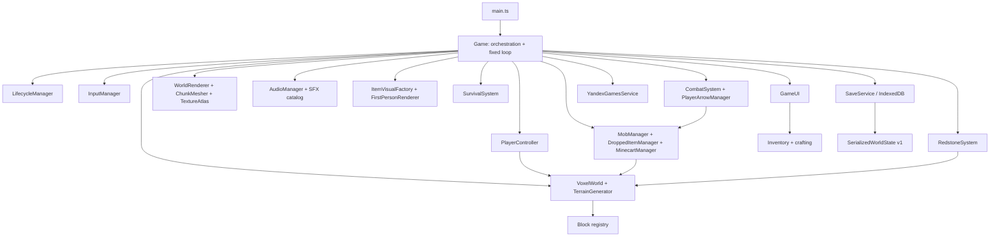
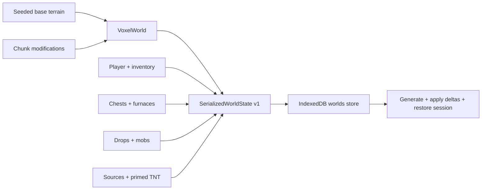

# Архитектура

## Creeper / fence / plants / tooltip / RU — 2026-08-28

`MobManager.syncVisual` applies generic death rotation/shrink whenever `state === 'die'`, including creepers. Fuse pulse is kind-specific idle only. `beginDeath` zeros `fuseSeconds` so a primed creeper killed by the player cannot finish fuse. `explodeCreeper` still `removeMob(..., 'explosion')` with no corpse and no death loot.

`collisionCandidateCellRange` in `world/collision.ts` is the shared player/mob broadphase helper. `MAX_BLOCK_COLLISION_Y_OVERHANG = 0.5` expands candidate minY by at most one cell so fence geometry that occupies voxel Y=n but collides to Y=n+1.5 is still queried when feet are above the cell. Fence visual boxes stay height 1; `blockCollisionBoxes` still uses `fenceLocalBoxes(..., 1.5)`. Jump velocity and `STEP_HEIGHT = 0.6` are unchanged.

Vegetation support is an explicit ID group in `placement.ts` (`isVegetationBlock`), not `renderShape: 'cross'` (cobweb stays out). Support cell is the block below. Grass/fern/flowers require GrassBlock or Dirt; DeadBush requires Sand. Integrity still uses the existing Map-deduped neighbor queue and `processSupportIntegrity` budget. Detached plants with `drop:false` do not spawn items. Water may still enter replaceable plant cells.

`SurvivalSystem.applyEffect('absorption')` sets absorption HP to `4 × (amplifier + 1)` and refreshes duration; ordinary Golden Apples therefore replenish to 4 and never stack to 8. `Game.refreshHud` reads `session.survival.absorption` regardless of game mode. `heartHud` remains presentation-only.

Item labels come from `src/i18n/ru.ts` via `requiredDisplayName`. Internal item/block IDs, recipes, saves and `/give` parsers stay English. One `.mc-item-tooltip` node plus delegated pointer events on the inventory modal replace native `title` on item slots; `patchKeyedHost` copies `data-item-tooltip` / `data-item-id` / `aria-label` without remounting the Creative catalog.

## Gameplay / UI / entity polish — 2026-08-28

`CombatSystem.FRONTIER_MELEE_VERTICAL_SCALE` (0.67) is the only vertical melee adapter. `applyKnockback` / `applyExtraKnockback` still own horizontal 1.8 constants; Y is scaled so flat apex is ~½ the previous measured height. Player and mob share these helpers. `completeMeleeAttack` slows attacker XZ ×0.6 and does not clear sprint. `PlayerController` derives `sprinting` from current input each tick; `sprintNeedsRelease` is gone.

`itemIcons.usesBlockModelIcon` routes cube + special_model block items through `special_preview`. `ItemIconRenderer` bakes a 64×64 orthographic nearest-filter preview once via `ItemVisualFactory.createItemModel` + `prepareSpecialIconPreview`, caches the data URL, and disposes temp geometry/materials. Generated items stay atlas sprites. Inventory close is a `.mc-stage` sibling to the right of `.mc-panel`; `containerUiScaleWithClose` reserves `MC_CLOSE_GUTTER`. Existing `onClose` / pointer-lock path is unchanged.

`World.raycast` accepts `geometry: 'selection' | 'collision'` (default selection). Collision uses `blockCollisionBoxes` so non-solid vegetation/fire do not stop projectiles. Player and skeleton arrows pass `{ geometry: 'collision' }`. Crosshair/mining still use selection.

`PlayerArrowManager.tryCollect` grants `ItemId.Arrow` via `Inventory.addItem` for resting player arrows (AABB overlap + pickup delay). Creative removes the entity without stacking. Full inventory leaves the projectile. Skeleton projectiles have no pickup path (Java 1.8 `canBePickedUp=0`). In-ground lifetime 60s; flying timeout remains 8s. `ArrowVisualFactory` is untouched.

`resolveStairShape` treats a perpendicular neighbor on the high/`facing` side as **outer** and the back side as **inner**, matching 3-quadrant vs 1-quadrant occupancy. `stairLocalBoxes` / ChunkMesher / collision / selection share that shape. No second stair table.

Chicken leg UV is `[29,0]` on this pack's sheet; cuboid/pivots stay ModelChicken 1.8. `heartHud.absorptionHudIcons` emits only filled/half yellow icons to the right of the 10 red hearts. Absorption effect expiry zeros leftover HP. Save stores player `absorption` + `absorptionTicks`.

## Interaction / support / input / mob polish — 2026-08-27

`specialBlockGeometry.buttonSelectionBox/leverSelectionBoxes` — canonical oriented cuboids (dimensions + matrices) для ChunkMesher и outline. `controlLocalBoxes` кэширует их AABB envelopes по block/attachment/facing/powered; existing DDA использует эти boxes. У наклонной ручки lever небольшой неизбежный AABB envelope, не full voxel и не отдельный raycaster. `RedstoneSystem.publishSourceState` синхронизирует только изменившийся geometry state в World; source map/timers остаются authority для power. Никакого второго redstone simulation.

`placement.ts` содержит shape-keyed SUPPORT_RULES **и explicit vegetation IDs**, `supportCellForBlock`, `isBlockStillSupported`. Общие attachmentNormal и sturdy-face collision rectangles определяют поддержку decorations. Plants use the block below plus substrate sets (GrassBlock/Dirt vs Sand). `World.writeBlockRaw` и non-fluid `setBlockState` ставят dependent changed cell + шесть соседей в Map-dedupe. `processSupportIntegrity(256)` выполняется после fluid queue в world tick и после gameplay/explosions в Game; overflow/unloaded-support tickets остаются. Никакого chunk scan/generation. Material replacement удаляет старый block state. Detach применяет batch Air через прежний mesh/light path, `consumeDetachedBlocks` отдаёт события ровно один раз; Game уведомляет redstone и создаёт canonical dropped stack (включая Creative environmental drops). Plants with `drop:false` produce no item. World не зависит от renderer/drop manager. Door two-cell lifecycle не добавлялся в этот decoration contract.

`BlockDefinition.fluidDisplaceable` разрешает fluid entry в Torch/RedstoneTorch/Button/Lever/Wire/Rail независимо от ordinary placement replaceable. Water replacement атомарно занимает cell и оставляет drop event; Lava replacement оставляет cleanup event без loot. Ранее replaceable plants сохраняют fluid-entry semantics. Pressure plates/Ladder/door/solid furniture остаются barriers. Fluid scheduler/routing/delays/bucket helper не менялись.

`ArrowPhysics.EmbeddedArrowState` хранит voxel ID/coordinates, impact point чуть внутри hit и pre-impact velocity. Оба owner managers проверяют support по collision boxes после projectile raycast. Потеря support → clear inGround → residual velocity component ×random×0.2 → прежняя gravity/drag/collision. Player-fired resting arrows теперь pickable (`PlayerArrowManager.tryCollect`); skeleton arrows не добавляются в inventory. Caps player48/skeleton40 сохранены. `ArrowVisualFactory` geometry не менялась.

`PointerLockAttempt` — helper одного запроса existing InputManager: raw options first, plain один раз только NotSupportedError/legacy TypeError, generation/finished guards против stale rejection. `PointerMotionFilter` хранит16 magnitudes с running sum, отвергает non-finite и удерживает один sample только при >800 и >12×recent average после4samples; следующий comparable sample возвращает точную сумму, isolated sample отбрасывается. Ordinary movement не задерживается/не сглаживается. Acquire/release/blur/visibility сбрасывают историю. DEV input HUD обновляется4Hz, без console spam. Unknown unlock не объявляется Escape без key evidence.

Mob AI задаёт `facingYaw` и `locomotionSpeed`; recoil velocity принадлежит physics. `meleeKnockback` подавляет AI до посадки; legs/walkPhase не используют внешний импульс, skeleton retreat сохраняет взгляд на target. Interpolation сохранена. Flat vertical audit не выявил ошибки integration/step: combat Y/XZ constants не менялись.

DEV `GameplayPolishQa` импортируется только при `?polishQa=1` и seed `interaction-support-polish`. UI создаёт bounded fixture по явному клику и вызывает реальные Game/World/managers. Нет window game-state API или второй симуляции; disposal снимает timer/panel. В production import удаляется сборщиком.

## Item / arrow / placement cleanup — 2026-08-27

Authored-item ownership: `scripts/authored-item-assets.mjs` содержит source→runtime mappings и `POTION_COLORS`. `prepareAuthoredItems()` читает все обязательные источники и составляет potion PNG до любых записей. `png-rgba.mjs` — build-time RGBA8 decoder/encoder для двух фактически найденных 32×32 layers (PNG filters 0–4; unsupported format — error). Tint применяется только к overlay RGB; bottle/cork накладываются source-over, alpha сохраняется. `import-assets.mjs` больше не удаляет public/textures рекурсивно; scoped `--items-cleanup` не меняет unrelated curated textures. `generate-missing-textures.mjs` не владеет этими восемью destinations ни в normal, ни в force mode. Source assets не меняются. GeneratedItemGeometry/ItemVisualFactory и ручной first-person pose не изменены.

Arrow geometry живёт только в `ArrowVisualFactory`: пять shaft quads, четыре tip triangles, два tail feather quads, всего 18 triangles и один draw call/arrow. 64×64 entity sheet: первый 32×10 профиль смотрит в +U; wood x8..25 / y4..5, head x26..31, feathers x0..8 / y0..9. UV U идёт вдоль local +Z. Tip +0.065 компенсирует существующий collision backoff 0.035 обоих менеджеров; simulation position/velocity не меняются. `ARROW_FORWARD` общий для player/skeleton/DEV harness. Normal/fire materials используют одинаковую voxel-light обвязку, одну texture и geometry. Minecart exterior — panel UV через существующий TexturedCuboid adapter (logical 64×32); внутренний пол/стенки сохранены; geometry cache keyed by dimensions/material role.

`src/world/placement.ts`: `canUseAsPlacementAnchor(block)` разрешает solid non-replaceable hit; replaceable hit обрабатывается отдельно как same-cell replacement. `canAttachToFace(world, x,y,z, normal)` проверяет полное покрытие boundary face actual collision rectangles, не union AABB. Cube/slab/stair — разрешённые support shapes; thin decorations, inset chest, door, fence не sturdy. Game применяет проверку до записи/расхода stack: torch/button/lever/ladder — actual supporting face; wire/rail/plate/door — floor. Заменяемая vegetation не опора; attachment проверяет реальный блок под destination. Последующий polish добавил локальную support integrity для decorations (см. выше), не переписывая fluid scheduler.

Shield отсутствует в item union/registry/render categories, FirstPersonFrameState, CombatSystem и damage dispatch. Classic sword blocking — отдельное transient use-state существующего CombatSystem, не возвращение shield. Bow/block movement ×0.2; idle/axe movement ×1. `inventory/legacyItems.ts` распознаёт старый `shield` ID и превращает только этот stack в null до validation. Используется в Inventory.deserialize, World.restore chest/furnace slots, DroppedItemManager.restore. Combat.restore whitelist-ит существующие item IDs и игнорирует лишние поля старого state. Generic offhand API/storage остаётся; offhand viewmodel отсутствует.

Последующий classic combat pass заменяет melee contracts на 1.8.9: см. `MINECRAFT_1_8_COMBAT_REFERENCE.md`. Bow flight/geometry и перечисленные cleanup systems не меняются.

## Цели

Архитектура Frontier Cubes рассчитана на большую, но ограниченную browser alpha:

- детерминированная fixed-step simulation с частотой `20 TPS`;
- data-first registries вместо разбросанных switch-таблиц;
- процедурный мир, который сохраняет только изменения;
- bounded runtime systems для chunks, dropped items, mobs и projectiles;
- независимая local playability при отсутствии platform SDK;
- минимальное число production dependencies: Three.js для WebGL, Vite/TypeScript для toolchain.

Это single-player client-only приложение. Server authority, networking и ECS framework отсутствуют намеренно.

## Карта подсистем



Главный принцип: `Game` соединяет системы, но правила blocks/items/crafting, player physics, survival formulas и entity simulation остаются в отдельных модулях, которые можно тестировать без WebGL UI.

## Boot и владение ресурсами

`src/main.ts` находит canvas/UI roots, создаёт один `Game` и запускает `initialize()`.

Во время initialization параллельно:

1. открывается IndexedDB;
2. инициализируется Yandex SDK либо local no-op path;
3. строится runtime texture atlas из whitelist-файлов `public/textures`.

После этого показывается интерактивное главное меню и вызывается platform loading-ready marker. `Game` владеет renderer, scene, camera, lifecycle, audio, input, save и platform adapters. Объекты конкретного мира собраны в `GameSession` и освобождаются при выходе/смене мира.

## Fixed loop и порядок tick

Render loop использует `requestAnimationFrame`. `advanceFixedStep()` ограничивает raw delta `MAX_FRAME_DELTA = 0.25 s` и не выполняет больше `MAX_CATCH_UP_TICKS = 4` simulation ticks за кадр: избыток времени отбрасывается, чтобы stall 300 ms не разгонял spiral of death. Пока accumulator ≥ `FIXED_DT = 0.05 s`, выполняется simulation tick. Камера, мобы, drops, arrows и TNT интерполируются между previous/current simulation snapshots.

Simulation продвигается только в lifecycle state `PLAYING`. `LOADING_WORLD` готовит initial radius без player physics, mining и pointer lock. Container GUI (Survival/Creative inventory, chest, furnace, crafting table, Recipe Book) **не** является pause: мир остаётся в `PLAYING`, tick продолжается, а player gameplay input блокируется отдельно (`gameplayModal.ts`). Настоящая остановка simulation — Pause menu (`Esc` → `PAUSED`) и platform/background/ad/death. Furnace burn/cook всегда идёт через `VoxelWorld.tickFurnaces()` в общем world tick, без UI-таймера.

Текущий tick логически выполняет:

1. world clock, scheduled block ticks, **budgeted fluid queue** и furnaces;
2. combat state: held/off-hand IDs и sword use-state; click count обрабатывается на fixed tick, cooldown отсутствует;
3. player input, hunger-aware sprint gate, AABB physics и survival/environment update;
4. chunk ensure/prune и ограниченный dirty rebuild;
5. block/mob targeting, mining, melee и use action;
6. food/bow use и player projectiles;
7. mob AI/physics/projectiles;
8. mob damage, drops и explosion events;
9. dropped-item physics/pickup;
10. pressure-plate occupancy, bounded redstone propagation, primed TNT fuse, explosion queue (budgeted batch apply) и explosion events;
11. autosave check и HUD refresh.

Такой порядок даёт простой детерминированный каркас, но не заявляет bit-exact vanilla ordering.

## Lifecycle

`GameLifecycleManager` использует состояния:

```text
LOADING → MENU → LOADING_WORLD → PLAYING ↔ PAUSED
                         ↓
                        DEAD
PLAYING → AD / BACKGROUND → controlled resume
```

`LOADING_WORLD` держится, пока `initialAreaReady` не подтвердит generate+light+mesh в квадрате render distance вокруг spawn (новые миры и load save). Progress bar — weighted milestones (`worldLoading.ts`), не fake timer. Pointer lock `canCapture` только в `PLAYING`. На входе в `PLAYING` audio возобновляется и Yandex `GameplayAPI.start()` вызывается idempotently. В остальных states simulation/audio останавливаются и вызывается `GameplayAPI.stop()`. Background также инициирует save. Platform `loadingReady()` остаётся boot-time и не подменяется world overlay. Открытый container не переводит lifecycle из `PLAYING`, поэтому audio/GameplayAPI не стопаются вместе с GUI.

Текущая state machine хранит только одно предыдущее состояние. Для production желательно перейти к набору независимых pause reasons, чтобы user pause, platform modal и visibility не могли ошибочно отменить друг друга.

## Audio

`AudioManager` (`src/core/AudioManager.ts`) is the only runtime audio authority. It lazy-creates `AudioContext` on user gesture, fetches `public/audio/sfx/*.mp3` once, decodes to cached `AudioBuffer`s, and plays one-shots through `play` / `playAt` / `playBlock`. Gameplay uses `SoundEventId` (`src/audio/soundEvents.ts`); it never names files.

Block hit/break/place/step share six `soundGroup` families (stone/wood/dirt/sand/wool/glass) with pitch/volume profiles. World events use a cheap PannerNode (`equalpower`, linear distance) and skip past `maxDistance`. Player-local: eat, drink, pickup, hurt, bow shoot, and the player's own footsteps via `playBlock(..., { positional: false })`. Catalog `block.step.*` stays positional so future mob steps can pan. Voices are one-shot: create → play → disconnect. Buses cap overlapping hits/steps; explosion has higher priority. `playTone` remains DEV fallback only.

Pause/mute/masterVolume and Yandex lifecycle still suspend the context outside `PLAYING`. Missing files warn once in DEV and stay silent in production. Minecraft original sounds are local reference only (`.local/minecraft-reference-audio/`, gitignored); see `docs/AUDIO_ASSETS.md`.

DEV `?audioDebug=1` mounts a bottom-left overlay of decoded buffer count, context state, and recent `SoundEventId` plays. F3 includes an `SFX` line. Production builds omit the overlay.

## Data registries

### Blocks

`src/blocks/types.ts` определяет stable numeric `BlockId` и data contract: hardness, collision/light `opaque`, independent `occludesFaces`, `renderLayer`, `renderShape`, tool, tier, drops, textures, emission, flammability, gravity, liquid, replaceability, redstone power, contact damage и `soundGroup` (material SFX family).

`src/blocks/registry.ts` является canonical block catalog. Он строит индексы по numeric ID и string key, валидирует uniqueness и автоматически создаёт block items для definitions, которые не отключили `hasItem`.

Numeric IDs лежат в chunk arrays и saves. Их нельзя переиспользовать для другого блока без migration.

### Items и inventory

`src/items/registry.ts` содержит discriminated unions для block/resource/food/tool/weapon/armor. Max stack, durability, tool stats, food values и equipment constraints приходят из definition, а не из UI.

`Inventory` владеет 36 ordinary slots, armor record и off-hand. Все getters возвращают clones, поэтому внешняя система не может тихо изменить внутренний stack. Serialization валидируется при restore.

### Crafting и smelting

Recipes в `src/crafting/recipes.ts` поддерживают exact item, `anyOf` и tags. Matcher нормализует occupied bounds, умеет shifted/mirrored shaped recipes и shapeless backtracking, возвращая consumption plan.

`VoxelWorld.tickFurnaces()` использует те же `findSmeltingRecipe()` и `getFuelBurnTicks()`, что data layer и tests. Iron/gold, glass, charcoal и raw foods проходят через один canonical registry; output count, cooking time и max stack берутся из definitions.

## World model

### Chunks

`Chunk` хранит blocks в плотном `Uint16Array` длиной `16 × WORLD_HEIGHT × 16` (`WORLD_HEIGHT = 96`). Индекс:

```text
index = y × 16 × 16 + z × 16 + x
```

`WORLD_HEIGHT` в индекс не входит: старые save deltas по linear index остаются валидными после увеличения высоты. Lighting arrays (`skyLight` / `blockLight`) того же размера, mesher/collision/raycast крутят `0 .. WORLD_HEIGHT-1`.

`VoxelWorld` переводит world coordinates в chunk/local coordinates через floor division и positive modulo, что корректно работает с отрицательными X/Z.

### Generation

`TerrainGenerator` хеширует строковый seed и использует собственные value-noise/fBm helpers (`smoothstep` для mountain mask). Column generation выбирает biome (dryness/climate, без отдельного mountain biome) и height:

```text
height = clamp(BASE(66) + broad×4 + detail×1.5×biomeDetail + hills(0–8) + mountainMask×amp(10–20), 58, 84)
```

Mountain mask — low-frequency fBm (`x/260`) с `smoothstep(0.16, 0.46)`, поэтому возвышенности широкие и пересекают несколько chunks. Biome влияет на surface/material/vegetation и только на detail amplitude, не на macro height, чтобы не было cliff на Forest↔Plains↔Desert.

Chunk pass заполняет bedrock (`Y 0–2`), world-wide Stone cap (`Y=3`, `BEDROCK_COVER_DEPTH = 1`), stone/top layers/water, затем вырезает ridged 3D caves (world-coordinate noise, не per-chunk RNG; `minCaveY = 4`), размещает небольшие irregular cave lava ponds только в закрытом Stone basin (depth 1–3; shrink/reject open waterline and cave-edge drops via deterministic `terrainSolid`, never “missing chunk = wall”). После `getChunk` `activateGeneratedFluidBoundaries` ставит в очередь только exposed lava/water (Air/replaceable/другая жидкость рядом или снизу; cross-chunk x=15/16 при load соседа). Interior sources не schedule. Ordinary worldgen ponds stay idle. Ores: coal/iron/gold/redstone vein attempts ×2, diamond ≈ current/3 (`veins: 1` + `extraVeinChance: 1/3`, `size` прежний) и decor. Caves/lava/ores не режут cap и bedrock. Обычный carve только при `y ≤ min(surface в 3×3) - CAVE_ROOF_DEPTH` (`4`): noise не доходит до grass/sand и не вытекает 1×1 на склоне. Отдельные 1×1 surface mouths отключены. Итоговые height/biome каждого столбца сохраняются в `Chunk.surfaceHeights`/`biomeCodes`, чтобы mesher не повторял noise sampling для каждого видимого face. Высоты соседей для крыши берутся из предвычисленной карты chunk+halo, не из 9× `columnAt` на каждый voxel.

Новый spawn (`collectSpawnColumns`) ранжирует plains с низким mountain contribution в радиусе 192, без generation hitch на create. DEV `?worldgenDebug=1` показывает `surfaceY` / `mtn` / `hills` / `cave` / `cap` / `blk` на chunk HUD.

Генератор не читает browser state или wall clock, поэтому базовый terrain воспроизводим по seed. Loot, часть explosions и некоторые runtime decisions используют `Math.random()` и не являются replay-deterministic.

### Modifications и block entities

При `setBlock(..., record = true)` изменение сохраняется в:

```text
Map<chunkKey, Map<linearBlockIndex, BlockId>>
```

При повторной генерации chunk delta накладывается поверх base terrain. Chest/furnace states хранятся отдельно по world block key `x,y,z`. Redstone сохраняет только source/primed-entity state, а derived wire power пересчитывает после restore.

- Scheduled block queue ограничена, за tick обрабатывается bounded число updates. Gravity-блоки ставят falling-block spawn вместо телепорта.
- Fluids (`src/world/fluids.ts` + `src/world/fluidSurface.ts`): source (`fluidLevel` 8) и flowing (1–7, optional `fluidFalling`). Water delay 5 ticks / horizontal decay 1 (до 7 клеток); lava delay 30 / decay 2 (до 3). Сначала вниз, потом в стороны. Horizontal slope routing строит один маленький reverse-distance field в reusable typed arrays: Manhattan-local radius после initial cell = 4 для water / 2 для lava, source-cell закрыта, solid/unloaded cells непроходимы, путь может поворачивать. Из четырёх initial directions выбираются только minimum-cost, ties сохраняются; если drop не найден, spread обычный четырёхсторонний. Это не общий pathfinder и не volume cap. Уже заполненная falling-cell снизу всё равно удерживает down-priority, поэтому водопад не создаёт mid-air umbrella; на support нижний range снова получает source-strength semantics. Очередь cap 2048, до 48 updates и `FLUID_JOB_BUDGET_MS = 1.5` за tick, с dedupe (`fluidKeys`) и no-op writes. Simulation level и render corner height разделены: `fluidCornerHeight(world, cornerX, y, cornerZ, type)` детерминирован в world-space; source/falling удерживают поверхность сверху. Same-fluid internal vertical faces не рисуются. Writes через `applyBlockBatch` с `deferLighting` и без neighbor schedule. Air↔water — только local sky column, без region flood. Fluid-level-only — remesh, не relight. `processLighting` сначала unlit/streaming jobs, leftover budget — pending region. Distant fluids (chebyshev > min(meshRadius, 2)) остаются в очереди, но не исполняются. Смешение: lava source ↔ water → obsidian на клетке лавы; flowing lava ↔ water → cobblestone. Старые saves без state = source. Worldgen не сыпет одиночную пещерную лаву и не заливает cave air до Y 12: lattice pond attempts (`LAVA_POND_CELL = 16`) с ellipse+noise footprint, basin в cave floor, surface ниже Stone shore, depth 1–3, interior sources без enqueue. Flowing lava не создаёт новые source blocks.

Каждый chunk хранит два `Uint8Array` света плюс `lightVersion` / `meshedLightVersion`. **Lighting is intentionally simplified for performance.** Sky light отвечает только на «есть ли доступ к открытому небу?» — вертикальный столбец сверху вниз: opaque (`occludesFaces`) обнуляет sky; air пропускает 15; water и leaf cubes ослабляют на 1; cross-plants/torch/door sky не меняют. Горизонтальный 6-pass / 4-pass sky spread **не используется**. Block light — локальный bounded BFS от emission (torch 14, burning furnace = torch, lava 15, redstone torch 7) с reusable typed queue и лимитом узлов. Shader: `max(sky^γ * uDaylight, torchWarm * block)` + `faceShade`. Смена времени суток не пересчитывает voxel map.

`getChunk` генерирует terrain **без** lighting. `processLighting(budgetMs)` — resumable: cursor по столбцам, flood head, yield по `WORLD_LIGHT_BUDGET_MS` (PLAYING ~2 ms, loading ~8 ms) и hard cap столбцов/узлов, чтобы scheduler **не** запускал монолитный 30 ms `lightChunk()`. Initial ready: generate+light `renderDistance+1` (halo), mesh только visible `renderDistance`, и только если 4 соседа в halo существуют и lit. Streaming chunk не становится visible с заведомо stale/provisional light.

PLAYING job fairness (`src/world/streamingScheduler.ts`): budgets **не** поднимались (`WORLD_JOB_BUDGET_MS = 4`, light slice 2 ms). Если в кадре была generation, mesh больше не пропускается целиком. Nearby ready mesh (chebyshev ≤ 2 или wait ≥ 150 ms) может взять **один** mesh slot; иначе generation может вытеснить mesh не чаще одного кадра подряд. Priority: ring (player / neighbors / ring-2 / rest) + age boost + лёгкий movement-ahead tie-break + distanceSq; score пересчитывается каждый mesh pass от текущего player chunk. `discardObsoletePendingMesh` снимает `pendingMesh` вне wanted mesh radius (generated data и `dirty` сохраняются). `pruneChunks` удаляет pending key вместе с chunk. Mesh lane по-прежнему `continue` мимо blocked head.

Lighting lane: sky/block **не** ждут, пока соседи lit (это только mesh `lightContextReady`). `processLighting` сначала собирает и исполняет **unlit streaming jobs**, leftover `WORLD_LIGHT_BUDGET_MS` идёт в `pendingLight` region. Region sky/block flood и add-emitter flood **резюмируются** (`skyColumn` / flood queue, owners `region` / `add-emitter`); incomplete add-emitter **не** bump'ает `lightVersion`. In-progress region/add-emitter не отдаёт flood unlit seed. `WORLD_LIGHT_BUDGET_MS = 2` без повышения. Region flood больше не имеет права съесть 2 ms slice до lighting новых wanted chunks, кроме случая когда flood уже идёт. Unlit вне generate radius не стартуют; flood mutex на obsolete/pruned owner сбрасывается (block cursor restart, sky сохраняется). Если flood держит дальний halo (chebyshev > 2), а рядом есть critical unlit, который unlock wanted mesh, mutex preempt'ится. Nearby unlit neighbors (chebyshev ≤ 2) получают generation/light priority. HUD: `skipsBlockedHead yes`, `stopsOnBlockedHead no`, `criticalBlocked` / `oldestCritical` / `floodOwner`, LIGHT origin `stream/fluid/edit/other`, DEV `FLUID q/active/updates/writes/noop/dedupe/meshDirtyChunks/lightDirtyChunks/pausedDistant/oldest`.

Мутации: skip lighting если sky-class и emission не изменились (tall grass → air). Torch/furnace **не** запускают sky recompute. Sky column update только при occlusion/leaf/water class change, локально, не весь chunk 6 раз. LightEngine не dirty-ит geometry на каждый voxel. Visual: mutation chunk + X/Z boundary; emission (torch/furnace) — light AABB; `lightVersion++` один раз на затронутый dirty chunk после job. `WorldRenderer.rebuildDirty` мешит если `dirty || lightVersion !== meshedLightVersion`, пропускает unlit и chunks вне mesh radius / без light context.

DEV: `?perf=1` overlay (LIGHT jobs/nodes/cols/frame/maxSlice/dirtyL плюс GEN/LIGHT/MESH ready/blocked, LIGHT `criticalBlocked`/`oldestCritical`/`skipsBlockedHead`/`floodOwner`, LIGHT origin stream/fluid/edit/other, `FLUID` queue/writes/noop/dedupe/pausedDistant, `meshReady`/`meshUrgent`/`meshOldestDirtyAge` (scheduler dirty/prefetch, не player-visible wait)/`meshStarvationAvoided`, SIM player/mobs/world/combat/entities/other, PLAYER-VISIBLE `WANTED→VISIBLE` / `READY-WANTED→MESH` histograms, prefetch history separately, READY MESH STARVATION > 500 ms from readyWanted timestamp, LAST SLOW VISIBLE CHUNK when wanted→visible > 2 s, LAST SPIKE age). F8 или `?perf=1&chunks=1` — цветная сетка 16×16 по streaming state. F7 — sky/block/final false-color. F9 — freeze inspected front chunk (CURRENT STATE vs LAST WANTED PERIOD). FRONT CHUNK может показать DEPENDENCY CHAIN. HUD: chunk X/Z, gen/lit/mesh, versions, sky/block. `queuedObsolete` считает pending jobs вне wanted set (mesh = `pendingMesh`, не dirty halo).

## Fluid scheduling and bucket interaction contract (2026-08-27)

- `World.scheduleFluid` — единый material-aware вход для нового work: только существующая Water/Lava, delay не меньше 5/30 ticks. Generic `applyBlockBatch` notifications и generated boundaries используют его через `scheduleFluidAround`; Air не получает tickets. Dedupe хранит coordinate→ticket Map и не переносит существующий material deadline на `+1`.
- Ticket хранит material до writes и сохраняет identity до consume. Block replacement/removal инвалидирует pending/extracted ticket; новое содержимое не наследует его due time. `restartFluidSchedule` нужен только при bucket-повышении same-material flow до нового source. `takeDueFluids` выбирает до 48 jobs; `consumeDueFluid` проверяет живой ticket, `retryDueFluid` разрешает `+1` только уже due работе, отложенной CPU budget. `processFluidQueue` вызывается ровно раз из `World.tick` на 20 TPS. Новые клетки не попадают в текущий due snapshot.
- `computeFluidUpdate`, flow-cost field, decay, down-first, hill routing и fluid surfaces не изменены follow-up. Follow-up notifications выбирают rate каждого actual receiver; Air/Stone origin больше не даёт ошибочный Water fallback для Lava.
- `World.raycast(..., { stopOnLiquids: true })` расширяет **существующий DDA**, используя voxel AABB для первого liquid. Default path и глобальный `blockSelectionBoxes` по-прежнему пропускают жидкости. Только empty bucket включает опцию; после попадания `isFluidSource` решает pickup.
- `src/items/bucketInteraction.ts` — небольшой shared interaction helper для Game и integration tests, не новая fluid/inventory system. Source remove/place через `applyBlockBatch` с deferred lighting, same-fluid promotion через `setBlockState` и fresh material deadline. Survival/Creative используют существующие Inventory APIs и Game drop callback. Registry: empty=16, filled=1. Узкий player-save adapter разбивает legacy bucket stacks (старый max64) перед обычной validation и возвращает excess для canonical drops; остальные save contracts прежние.

## Rendering


`TextureAtlas.create()` собирает нужные block textures в power-of-two canvas atlas. Содержимое tile — `32×32`, вокруг него экструдируется gutter `4 px`; UV указывают только на content. Pixel art использует nearest magnification, `NearestMipmapLinearFilter`, mipmaps, ограниченную renderer-capability anisotropy и sRGB. Это снижает shimmer и не даёт mip levels смешивать соседние tiles. Missing texture получает заметный magenta/black fallback. Raw `assets/` остаётся локальным и исключён из публичного Git; воспроизводимая runtime-копия состоит из 162 whitelist-файлов в `public/textures`, включая `oak_door_upper`, entity sheets/layers, Steve arm, arrow projectile, bow stages и шесть vegetation sprites.

`ChunkMesher` проходит плотный block array, читает соседние chunk arrays один раз на build и добавляет только faces, у которых сосед не `occludesFaces`. Cube hot path развёрнут по шести направлениям и не вызывает `world.getBlock()`/`columnAt()` на каждый face. Geometry содержит positions, normals, UV, tint colors и lighting attributes. Grass/leaves получают biome RGB tint из chunk column cache. `opaque` больше не выбирает render material. `cross`-растения с `lightingMode: vegetation` пишут две диагональные плоскости × две намотки в отдельный vegetation buffer чанка: sample normal `(0,1,0)`, чтобы sky/block sample совпадал с grass top. Отдельных `Object3D` на растение нет. Leaves/torch/door остаются в общем DoubleSide cutout. Torch — cuboid `TORCH_WIDTH×TORCH_HEIGHT` с UV crop opaque региона; wall torch использует общий `torchLocalMatrix` (основание на стене, `TORCH_WALL_TILT = -0.40`).

`WorldRenderer` создаёт независимые material paths через `createWorldChunkMaterial`:

- opaque `MeshBasicMaterial` без blending;
- cutout material с `alphaTest=0.42`, `transparent=false`, depth test/write и `DoubleSide` для leaves и alpha sprites;
- vegetation cutout material с тем же atlas/`alphaTest`, но `FrontSide`, потому что растения уже имеют двустороннюю геометрию;
- fire cutout material: dedicated strip texture, glow, UV frame animation, 4 edge planes + 2 inner X (`renderShape: fire`);
- translucent glass material с opacity `0.52`;
- отдельный translucent water material с opacity `0.70` и более поздним render order.

Все шесть шейдеров делят `worldDaylightUniform` (fire glow material его не умножает на baked light), который `Game` обновляет каждый render frame. Dirty chunks перестраиваются с лимитом jobs и бюджетом миллисекунд; на PLAYING generation-кадре допускается один urgent/fair mesh slot, repeated dirty changes coalesce. Дальние chunk visuals освобождают geometry.

Selection outline — тот же `LineSegments` в `WorldRenderer`. `selectionBoxesForBlock()` строит oriented boxes из фактической special geometry (cube / torch / button / lever / plate / wire / door / ladder / cross / fire / stairs / slab / chest / fence / rail); геометрии кэшируются по shape key. `World.raycast` сохраняет voxel DDA. Default `geometry: 'selection'` пересекает `blockSelectionBoxes`. Projectiles pass `geometry: 'collision'` and use `blockCollisionBoxes`, so non-solid vegetation is skipped while player targeting is unchanged. Outline, mining и use читают selection `VoxelHit`.

Chest не идёт в chunk cube mesh. `ChunkMesher` собирает `meshed.chests`; `ChestRenderer` держит shared body/lid/latch geometry + entity material (`entity/chest/normal`) и lightweight per-visible-chest groups. Lid hinge сзади, `targetOpen` только у открытого сундука, `openProgress` интерполируется по render dt (FPS-independent lerp). Facing пишется в `blockStates` при placement (`chestFacingFromYaw`); legacy без facing → north. Хранилище 27 slots по `x,y,z` не менялось.

`itemRenderProfiles` — data-only слой классификации pose `block/generated/handheld/bow` и отдельного held mesh `block_cube` / `generated` / `special_model`. `item/handheld` — semantic parent `item/generated`: та же sprite geometry, без отдельной 3D-геометрии инструментов. First-person generated/handheld/bow делят один объект `FIRST_PERSON_GENERATED`: shared pose `[0.67, -0.29, -0.70]`, Euler `[1, -90, 34]°`, `scale 0.60` (final Three.js uniform, не `0.68 * multiplier`). Значения выбраны вручную через live QA; yaw −90° не заменять vanilla matrix или candidate 8/18/32°. Block cubes сохраняют отдельный pose; shield pose удалён. JSON `rotation [0,-90,25]` — реальный display rotate (front +Z → camera −X), а не «basis conversion», и в production не применяется. Канонический adapter — `heldItemVanillaTransform.ts` (`T_hand * T_disp/16 * Rx * Ry * Rz * S`); 1.9 и 1.21.8 idle RH совпадают; research, не production contract. Dev `held*` остаётся QA override этого production pose. Именованные candidates `qaPose=subtle|balanced|stronger` живут только в `heldItemQa.ts` и не пишут production defaults; явный `held*` перекрывает candidate. В `qaView=held` / `qaPoseCompare=1` DEV harness показывает live calibrator (`HeldItemPosePanel`): sliders + numeric inputs, keyboard nudge, reset к production/subtle/balanced/stronger, COPY POSE/QUERY/TS. Смена representative items не сбрасывает live pose. Optional `sessionStorage` ключ `held-item-qa-pose` (URL побеждает). Панель не входит в production gameplay. `?qaItem=` по умолчанию изолирует предмет (`qaView=front|back|left|right`); `qaView=held` — first-person; `qaPoseCompare=1` принудительно held и циклит representative items (`1–8`, `[` `]`) без правки query. `qaView=held&pose=idle` печатает FOV/aspect, matrices, axis stages, silhouette landmarks и F2 2048×1152 comparison (камера сравнения — F2 16:9 FOV70; overlay не цель выбора pose). `qaSideDebug=1` красит стороны. `ItemVisualFactory` — общий adapter: cube block item из atlas, sprite items через `GeneratedItemGeometry`, special inventory cuboids (button/plate/stairs/slab) и closed chest entity model тем же factory. `itemIcons.ts` задаёт общий isometric угол; `orthographicFitExtent(width, height)` вписывает XY AABB в square (`SPECIAL_ICON_FILL = 0.86`) без per-item padding. `ItemIconRenderer.bake()` клонирует special mesh в preview-only material (`itemIconPreview.ts`: без `uEntityLight`/`vEntityWrap`, `NoToneMapping`, RT `SRGBColorSpace`, лёгкий vertex face shade) и кэширует data-URL. Held/world entity materials не мутируются. Ordinary cubes остаются `TextureAtlas.url`. Vanilla 1.21.8 item JSON: lever/ladder = `item/generated` + `block/*` texture; oak_door = generated, но `item/oak_door.png` в pack нет — runtime stack `oak_door_upper`+`oak_door`. Held torch не переиспользует placed cuboid; projectile `ArrowVisualFactory` не используется для held arrow. Shield удалён из registry, renderer и combat; только save migration распознаёт старый ID.

`GeneratedItemGeometry` следует ItemModelGenerator 1.9: один SOUTH front quad и один NORTH back quad на весь sprite (back U mirrored), толщина Z 7.5–8.5 в 0–16 model units (`1/16`), силуэт даёт alpha texture. Side faces только на opaque→transparent границах (`alpha == 0`, out-of-bounds = transparent) с merge соседних spans одного facing; winding — внешняя оболочка (CCW с outward normal). Texel coords масштабируются в те же 16×16 model units, поэтому 32×32 pack не меняет размер/толщину, только детализацию границы. Along-span UV покрывает полные texel (`u = texel/size`); collapsed UV берёт центр opaque texel, чтобы nearest не сэмплировал transparent neighbor. `qaSideDebug` пишет vertex colors по facing и не попадает в production cache. PNG scan и geometry создаются один раз и кэшируются по texture path; во frame loop меняются только transform или ссылка на уже готовый bow variant mesh. Generated item `createEntityMaterial({ wrap: false })` сохраняет voxel light для drops, но не mob wrap-shade на тонких сторонах.

`FirstPersonRenderer` владеет отдельными scene и perspective camera (`fov=70`, `near=0.01`, `far=12`, aspect из canvas). Это отдельный hand pass: world camera / settings FOV (`60–100`, default `75`) на viewmodel не влияют. После world render `Game` очищает только depth buffer и рисует руку/предмет поверх мира; renderer info сбрасывается один раз перед обоими проходами, поэтому F3 учитывает полную сцену. Textured Steve arm — UV-cuboid и показывается только при пустом main slot **и** без invisibility; при любом held item или активной невидимости рука скрыта (held item может остаться). Frame state содержит движение, землю, sprint, mining, swing, food/bow progress, fire overlay и potion overlay flags. Bow остаётся generated mesh с texture swap `bow` / `bow_pulling_0/1/2` по vanilla pull `0+ / 0.65 / 0.9`, замедляет игрока и плавно сужает **world** FOV; mesh не изгибается. Каждая поза вычисляется от неизменяемого preset, а не от предыдущего кадра, что исключает накопление transform drift. Модель меняется только при смене item id или дискретной bow stage. `qaView=held&pose=idle` замораживает residual idle bob, чтобы matrices были сравнимы.

Render camera не ждёт следующего fixed tick: `applyImmediateRenderLook()` каждый `requestAnimationFrame` применяет текущие `InputManager.yaw/pitch` и optional render-only roll. `HurtFeedback` (`src/rendering/hurtFeedback.ts`) слушает canonical `SurvivalSystem.onDamage` (`dealt > 0`, не ignored): red `#hurt-flash` overlay ~220 ms peak alpha 0.28 и camera `rotation.z` kick ~2.1° / 180 ms (DOT слабее). Decay по времени, не по кадрам; yaw/pitch игрока не мутируются. Mob hurt flash — `MobManager.damage` (не LMB, не fire DOT) → `hurtFlashSeconds` 220 ms → per-entity `entityLight` red multiply. Shared geometry/textures stay; `VoxelVisualFactory` clones entity materials once per mob so `uEntityLight` is not a species-wide uniform. First-person burning overlay — `SharedFireTexture.createFirstPersonOverlay()`: два lower-corner PlaneGeometry, shared UV animation, opacity 0.76, `depthTest: false`. World fire и mob overlay остаются 6-plane `createScaledOverlay`. Potion status overlay — `SharedPotionParticles` (`potionParticles.ts`): до 7 small additive swirl quads from `particle/particles.png` row 8, rising from the lower view, max opacity 0.32, tops ≤ −0.10 so the crosshair stays clear; slightly cooler tint for invisibility and warmer for regeneration. `PlayerController` по-прежнему потребляет тот же input на границе simulation tick для физики и сериализации. Такое разделение убирает ступенчатое вращение при сохранении детерминированного `20 TPS` gameplay loop.

`BlockDefinition.renderShape` маршрутизирует non-cube blocks в расширяемые builders. Lever — stone base и pivoted handle; torch — cuboid stick с wall/floor `torchLocalMatrix`; vegetation — batched crossed quads с `lightingMode`/`biomeTint` на definition; fire — 6 planes (4 edges + inner X) в отдельный layer с animated strip; wire — ground quad; button — малый cuboid на floor/wall/ceiling; pressure plate — тонкая plate (oak и stone, texture с definition); oak door — вертикальный cuboid толщиной `3/16` на occupied face с UV half/hinge; ladder — тонкая plane на support face (`LADDER_PLANE` / `LADDER_DEPTH`); stairs/slabs — axis-aligned cuboids в `ChunkMesher` из `stairLocalBoxes`/`slabLocalBoxes` (UV по региону грани, не stretch на всю composite); fence — post + autoconnect arms, collision height 1.5; rail — ground strip с neighbor shape, isolated look-axis placement и `railTextureYaw` для EW; chest — entity model вне chunk mesh. `BLOCK_FAMILIES` задаёт source texture/hardness/tool и slab/stair/fence IDs, поэтому новый wood species — строка семьи, не новый renderer. Ladder climbing — `ladderMotion.ts` + `PlayerController`: thin climb volume, wish INTO support, не `W = вверх`. Stairs не являются climb block. Creative flying перекрывает ladder, пока `isFlying`.

`BlockRenderState.slabType` и `stairHalf` независимы от door `half`. Stair `shape` вычисляется из соседей (vanilla inner/outer) и не пишется в save. Старые saves: slab без type → bottom; stairs без facing/half → north/bottom. `stone_stairs` hidden, ID сохранён.

## Player, survival и combat

### PlayerController

Позиция игрока привязана к центру ступней. Collision resolver строит AABB, двигает его по Y/X/Z против **каждого** solid box клетки (`blockCollisionBoxes`), затем пробует generic step-up `0.6` (в том числе пока игрок на ladder, чтобы выйти на верхний край). Stairs/slabs используют реальную форму, поэтому ходьба по ступеням — обычный WASD + step-up, без `onLadder`. Ladder: `findLadderContact` по thin volume, vertical velocity `LADDER_CLIMB_SPEED` / `-LADDER_MAX_DESCENT_SPEED` / 0 при sneak. Cactus — inset box; door — occupied-face slab.

Controller отвечает только за movement/physics state и сообщает fall damage callback. Health ownership остаётся в `SurvivalSystem`. Creative flight живёт в том же controller: `creativeFlightAllowed` с Game tick, double-Space window 7 ticks, `isFlying` runtime-only. Пока летит — нет gravity и нет ladder vertical rewrite; Space/Shift задают vertical wish, Ctrl — `CREATIVE_SPRINT_FLY_SPEED`. Посадка (`landed`) сбрасывает полёт. Survival никогда не получает fly.

`PlayerTickResult.jumped` true только в tick реального takeoff (`jump && grounded && !liquid && !isFlying`). Поэтому удерживаемая кнопка не повторяет jump exhaustion каждый airborne tick. `inFire` — AABB overlap с `BlockId.Fire`, не только блок под ногами. Пока игрок в minecart, `locomotion: false`: walk/fall выключены, позиция снапается к seat после `MinecartManager.update`, чтобы streaming следовал за тележкой.

### SurvivalSystem

SurvivalSystem хранит health, hunger, saturation, exhaustion, absorption, air/fire timers, difficulty, hurt resistance и spawn point. Он принимает context, а не напрямую управляет UI. Armor stats читаются через узкий `Inventory.getSlot` contract. Canonical total — `getArmorPoints()` / `getArmorStats().points`, clamp `0–20` (`MAX_ARMOR_POINTS`). Damage mitigation и HUD читают одно значение. `fire` и `lava` идут через `reduceDamageByArmor` (не `ARMOR_BYPASS_SOURCES`). Burning reasons разделены: `contactFire` (текущее пересечение с Fire), `arrowFireTicks` (Fire Arrow, ~5 с), `fireTicks` (lava linger). `isOnFire` — любая причина; first-person overlay читает его. Вода обнуляет arrow и lava timers. Status effects (`absorption` / `regeneration` / `invisibility`) — tick map (`hasEffect` / `effectTicks`); drinkable potions last 3600 / 1200 ticks. HUD and first-person potion overlay read these ticks; effects are not serialized.

Damage pipeline:

```text
requested damage
→ hurt-resistance filtering
→ active sword block, only for blockable sources
→ optional armor formula
→ absorption
→ health/death callbacks
```

`Game.onPlayerDamaged` — единственный visual hook: `fullHurt && !ignored` → `hurt.trigger()`. Creative не вызывает `survival.damage`. Full accepted hit может иметь нулевой HP damage из-за absorption, но сохраняет full hurt/base KB. Rejected и differential hits не повторяют этот эффект. Survival sprint input отдельно блокируется при hunger `≤ 6`; Creative этот gate не использует.

### CombatSystem

CombatSystem хранит generic held/offhand IDs и transient swordBlocking, не cooldown. Registry задаёт total damage. Melee result содержит damage/critical/extraKnockbackLevel/attackerYaw; health принадлежит MobManager/SurvivalSystem. InputManager считает все attack edges между fixed ticks, Game обрабатывает каждую попытку, target gate решает accepted/fullHurt. Нет CPS limiter или sweep.

`combat/HurtResistance.ts` — единственная реализация 20-tick immunity для player/mob/projectile hits: при remaining >10 equal/weaker rejected, stronger получает raw difference без reset/fullHurt; при ≤10 — full hit/reset20. Сначала сравнение raw, затем sword `(raw+1)/2`, armor `(25-clamp(A,0,20))/25`, absorption. Toughness data остаётся совместимой, но не участвует. Fire/Lava armor сохраняет прежний Frontier contract; fire DOT не blockable, fire contact blockable.

`applyKnockback` меняет существующий velocity in place: halve XYZ; +8 b/s horizontal по направлению away; Y=min(Y/2+8,8) даже в воздухе. `applyExtraKnockback` отдельно добавляет facing impulse (10 XZ +2 Y для sprint). Game вызывает `completeMeleeAttack` только с actual accepted result: extra hit уменьшает attacker XZ ×0.6 и ставит sprint-release latch. Обычные/rejected hits не замедляют. Латч снимается при release sprint или forward≤0.05; это явная требуемая адаптация, не автоматический W-tap.

MobManager и PlayerController используют существующие collision paths и временный meleeKnockback flag: движение до gravity/drag, `applyMeleeDrag` задаёт XZ ×0.91 в воздухе / ×(0.6×0.91) на обычной земле, gravity32 и Y×0.98. Mob AI не перезаписывает velocity до посадки; player input добавляет acceleration вместо поглощения импульса через обычный velocity blend. Liquid/ladder/flight возвращают обычный controller. Обычная ходьба, projectile impulse и world physics не переписаны. Различия collider step height и контактов terrain остаются alpha approximation.

Sword use вычисляется на fixed tick из selected sword + held use + active gameplay + alive; release/switch/death/overlay/pause сбрасывают. Game масштабирует forward/strafe ×0.2 и отключает sprint. FirstPersonRenderer накладывает pose на существующий itemHolder без Mesh/Geometry/Material/Texture на click; idle defaults не изменены. Combat serialization не содержит blocking/timers; старые лишние поля игнорируются, world save schema прежняя.

`ArrowPhysics` задаёт общий для player и skeleton контракт в блоках на tick: launch velocity, Gaussian inaccuracy с сохранением длины вектора, `0.99` air drag, `0.6` water drag и `0.05 block/tick²` gravity. `ArrowVisualFactory` кэширует один mesh из тонкого shaft-cuboid, маленького pyramid tip и двух tail-only feather quads; authored entity/arrow 64×64, local +Z forward. `PlayerArrowManager` владеет ограниченным набором player arrows, за tick выполняет continuous segment raycast до ближайшего block/mob/minecart intersection, считает damage из текущей скорости и оставляет block-hit projectile в `inGround` до bounded timeout. Flaming arrows (`fireArrow.ts`) поджигают living entity на 100 ticks и праймят TNT block; TNT minecart детонирует сразу; в обычный мир fire block не ставится. World fire (`renderShape: fire`) — отдельный ChunkMesher layer из 6 плоскостей с animated strip texture (`fireTexture.ts` / `fireGeometry.ts`). `fireSources.ts` — AABB overlap, 1 HP/с interval, daylight/skylight thresholds для hostile sunlight burn.

## Entities

### DroppedItemManager

Dropped items имеют bounded capacity, pickup delay, despawn timer, simple voxel physics, merging, partial pickup и serialization. Маленький feet-anchored AABB (`0.28×0.28`) переиспользует `fireSources.ts` overlap: Lava наносит 4, Fire 1 damage за fixed 20-TPS contact tick, health начинается с 5, уничтожение использует обычный manager removal (`burned`) до merge/pickup. Water damage = 0. Java-1.9-style Lava kick сохранён, modern generic Water buoyancy не применяется. `environmentHealth?` optional в serialized entry: старые saves default к 5 без schema-version bump. `onPickup` возвращает реально принятую inventory count, поэтому полный inventory не удаляет предмет из мира. Менеджер получает тот же `ItemVisualFactory`, что и first-person renderer: настоящие item textures/atlas cubes bob-ятся и медленно вращаются, а thresholds `1/2/17/33` показывают `1/2/3/4` bounded visual copies. World-dropped meshes получают `sampleEntityLight` на 20 TPS; visual position интерполируется на render frame.

### MobManager

MobManager владеет mob entities и skeleton projectiles. Definitions задают size, health, speed, ranges, damage, cooldown и loot. Runtime state machine включает idle/wander/chase/attack/hurt/die. Automatic spawn: passive path unchanged; hostile **surface night** uses `SURFACE_NIGHT_HOSTILE_SPAWN_FACTOR = 0.5`; dark cave hostiles are a separate candidate (low sky, solid floor, no liquid) with max one new cave hostile per chunk per event and a 12-block density guard. Skeleton projectiles используют те же `ArrowPhysics` и переданный Game-owned `ArrowVisualFactory`, поэтому их scale, orientation, drag, gravity, collision и cleanup не расходятся с player arrows.

Освещение мобов идёт из voxel `skyLight`/`blockLight`: `sampleEntityLight` усредняет feet/torso/head на simulation tick, `createEntityMaterial` (`MeshBasicMaterial` + wrap ≥ 0.76) умножает на этот RGB. Visual root/yaw/walkPhase считаются в `interpolateVisuals(alpha)` через `entityInterpolation.ts` (lerp + shortest-yaw, snap при ≥ 6 блоков). Gameplay/AI/hitboxes остаются на simulation transform.

Вместо тяжёлого pathfinding используется direct steering, voxel collision/line of sight и optional `stepHeight` в `moveVoxelBody` (мобы карабкаются на один блок). Hostile melee сравнивает 3D distance между eye positions и требует voxel LOS. `playerTargetable: false` сохраняет player-centred spawning/despawn для Creative, но убирает игрока из hostile target selection. Events `playerDamage`, `explosion` и `drop` накапливаются и потребляются `Game`, что сохраняет границу между entity simulation и player inventory/health/world destruction.

Caps зависят от coarse pointer profile. Restore может принудительно создать сохранённых мобов в пределах общего hard cap.

### FallingBlockManager

Когда gravity-блок теряет опору, `VoxelWorld` кладёт spawn в bounded queue. `Game` создаёт falling entity с block mesh, gravity `-32` и voxel AABB; при земле блок возвращается в grid. Save schema 1 опционально сериализует in-flight entities.

### MinecartManager

`MinecartManager` — bounded rail vehicle (cap 16). Visual — open-top 3D group (`minecartGeometry.ts`, `entity/minecart` exterior, opaque DoubleSide floor/walls, optional TNT cube seated on the inner floor). Floor top is `0.16` so the 2/16 rail strip cannot show through. Movement: **ON_RAIL** samples `railPath.ts` (current cell + immediate neighbor). End of a loaded track calls `leaveRail` (`alongSpeed × end tangent` → world velocity, 4-tick recapture grace). **OFF_RAIL** uses `moveVoxelBody` + gravity + ground friction; rider W/S/A/D are ignored until a real rail cell is crossed. Rider W/S on-rail проецирует look на tangent, cap `WALK_SPEED`. A/D no-op. Dismount is the rising edge of Shift/sprint (`minecartDismountFromSprint`), not sneak/C. LMB uses `resolvePlayerAttackTarget`: nearer cart AABB vs block selection vs mob (reach 3). Survival `breakCart` drops Minecart (plus TNT if unprimed TNT variant) via `DroppedItemManager`; Creative removes without a drop; ridden cart and primed TNT cart are ignored. Player push — AABB overlap, только компонента на tangent. TNT Use ставит variant `tnt`; Flint `handleFlintUse` / `resolveFlintAndSteelUse` consumes the use before Fire placement; fuse 80 ticks; Fire Arrow — immediate `explodeNow` (hit AABB height `1.15`, cart preferred over a slightly closer rail voxel). Сериализация — optional `minecarts` (position, velocity, yaw, variant, fuse, `onRail`). Isolated rail orientation = player look axis; EW family использует `railTextureYaw = π/2`. Это practical approximation, не vanilla minecart physics.

`VoxelVisualFactory` обслуживает textured entity cuboids; item visuals вынесены в `ItemVisualFactory`. Оба используют `createEntityMaterial` из `worldLighting.ts`. `TexturedCuboidGeometry` вычисляет legacy cross-layout UV для всех шести faces из logical offset/width/height/depth; normalized UV одинаковы для 1× и 2× physical sheets. Entity materials используют nearest, sRGB, no mipmaps и alpha test.

`LegacyModel` является единым adapter для code-defined rigs: `16 model units = 1 block`, legacy Y направлен вниз, default ground plane равен `Y=24`. `rotationPoint` создаёт `Group pivot`, а `addBox origin` остаётся локальным центром cuboid; Euler X/Z меняют знак после отражения Y. Несколько definitions могут добавлять boxes в parts с одинаковыми именами — так base sheep и wool остаются разными слоями на общих pivots.

Cow, pig, chicken, sheep, zombie, skeleton, creeper и spider имеют отдельные legacy definitions. Sheep добавляет inflated fur layer поверх более длинных base legs, чтобы шерсть не заменяла видимые ноги. Только skeleton torso материал получает `DoubleSide`, сохраняя читаемость тонкой грудной клетки; zombie outer headwear использует локальный `alphaTest=0.45`, а остальные mob materials остаются на базовом threshold/front side. Spider имеет eyes overlay. Animation всегда вычисляет `baseRotation + bounded offset`, поэтому pose не накапливает ошибку. Soft horizontal mob separation использует не более `1024` unordered pair checks за update. Physics AABB остаётся в `MobDefinition` и не зависит от visual mesh. Числовой reference и честные пометки exact/approx находятся в `MOB_MODEL_REFERENCE.md`.

## Basic redstone

`RedstoneSystem` — отдельная bounded simulation над `VoxelWorld`. `Game` вызывает `notifyBlockChanged()` после placement, mining и explosion destruction, затем обновляет систему один раз за fixed tick.

Состояние разделено на:

- source map для torch, lever, button и pressure plate;
- derived `wirePower` map со значениями `0–15`;
- dirty queue/set для ленивого распространения;
- bounded collection primed TNT;
- очередь explosion events, которую `Game` сливает в `ExplosionQueue`;

Dust распространяет сигнал по шести voxel-соседям, уменьшая уровень на единицу. Torch постоянна, lever переключается use action, button хранит оставшееся pulse time, pressure plate получает occupancy из positions игрока, мобов и dropped items.

Powered TNT удаляется из мира и становится отдельной Three.js entity с fuse `4 s`, gravity и voxel AABB. Mesh uses `block/tnt` (`PRIMED_TNT_TEXTURE_KEY`); fuse flash tints `material.color` white ↔ warm, never replacing the map with a solid red cube. Visual интерполируется между ticks. После fuse RedstoneSystem выдаёт typed explosion event. `Game` кладёт event в `ExplosionQueue`: resolve (скан без мутаций, scalar distance) → `applyBlockBatch` → один `relightRegion` на union bounds → `notifyBlocksChanged` с Set-dedupe → chain TNT через `primeTnt(..., { blockAlreadyRemoved: true })`. За tick обрабатывается ограниченный budget (jobs + voxels + ~2–3.5 ms). Одиночный TNT обычно укладывается в один tick; mass chain растягивается, не блокируя render. Explosion не вызывает immediate mesh rebuild.

Serialization version 2 хранит active sources, lever/button attachment/facing, остаток timed button и primed TNT с fuse и velocity. Restore принимает version 1. Wire power намеренно не сохраняется. Optional `blockStates` и `fallingBlocks` лежат в том же schema 1 snapshot.

Default safety bounds: до `2,048` sources, `64` primed TNT, `512` propagation steps за update и `8,192` queued updates. Это basic redstone approximation без directional dust shapes, quasi-connectivity и advanced components.

## UI и input

`GameUI` строит screens/modals как DOM, а не рисует интерфейс в WebGL. Это упрощает responsive layout и debugging. Inventory UI оперирует теми же `ItemStack`/matcher APIs, что и tests.

Main-menu family расширяет тот же `GameUI`, без параллельного router/UI-layer. `Game` передаёт callbacks для singleplayer / online mock / settings; `setScreen(..., onEscape)` хранит один back action для текущего DOM-screen и сбрасывает его при переходе. `src/ui/menuModel.ts` содержит только presentation data/formatters: два offline server mock entry и read-only список фактических desktop bindings, включая чат `T` / команду `/` из PR #6. Сохранения и server authority туда не вынесены. Generated background лежит в `public/ui/frontier-menu-background.png`; logo остаётся CSS/HTML text treatment, не branded raster asset.

World list хранит выбранный `world.id` только в текущем screen: single click выбирает, double click или footer action вызывает прежний load callback, delete остаётся за существующим confirmation/save-service flow. Online rows не делают network requests, connect action disabled. Settings по-прежнему применяются callback-ом в `Game`; controls screen ничего не мутирует.

Block containers (chest / furnace / crafting table) и Survival player inventory используют общий pixel layout (`containerTheme.ts`: logical ~176×166, slot pitch 18, UI scale с потолком 4). Примитивы: `.mc-panel`, recessed slots фиксированного `--mc-slot` (не `1fr`), player 3×9 + hotbar, labels, result slot, flame/arrow. Recipe Book — только crafting table и Survival 2×2: отдельная левая панель; кнопка книги живёт **в craft row** слева от 2×2/3×3, не внутри панели рецептов и не поверх border. Категории — вертикальные icon tabs (`Все` текстом). `recipeBook.ts` читает canonical `CRAFTING_RECIPES`; `SMELTING_RECIPES` остаются simulation-only. Placement транзакционный: вернуть real grid, затем real ingredients или ghost (`GhostCraftState`, никогда не `InventoryStack`).

Creative E — `.mc-stage` с вкладками Каталог / Инвентарь, ширина каталога 195 logical под scrollbar gutter. Catalog: `data-creative-catalog` (scroll identity) + 9 hotbar. Inventory tab: armor слева сверху (силуэты helmet/chest/legs/boots, без offhand) + 3×9 на полную ширину, каталог скрыт, не unmount. Live furnace ticks патчат `[data-slot]` и `[data-recipe-id]` in-place по `data-sig`. Hover — `::after` inset white overlay (не box-shadow вперемешку с bevel), без layout shift.

Chest world: `ChunkMesher` не эмитит cube faces (`renderShape: 'chest'`). `ChestRenderer` — единственный visual path. Facing = opposite of look. Lid hinge rear, positive `xRot`; lid underside — реальная `down` face (не omitted), отделена `CHEST_LID_SEAM`. Furnace cube remaps front по `blockStates.facing`; GUI icon cube-блоков с `textures.front` берёт front (`blockItemIconTexture`), не side. `burnTime > 0` → `textures.litFront` и `blockEmissionAt` = `torchBlockEmission()`. `LightEngine.seed/propagate` читает `world.blockEmissionAt`, не только definition.emission.

HUD получает фактический attack strength. Shield state/pose удалены из `FirstPersonRenderer`; DOM остаётся для интерфейса, не для руки или held item. Armor bar — `#status-bars .armor` над hearts: 10 pixel-art chestplate icons (`gui/armor_{empty,half,full}.png`), full=2 points, half=1; скрыт при `getArmorPoints() === 0`. Health — 10 pixel-art hearts (`gui/heart_{empty,half,full}.png`) with the same `--hud-status-icon-size` and gap as armor so the rows match in width. Активные invisibility/regeneration — `#effect-hud` справа снизу: иконка зелья, имя («Невидимость» / «Регенерация»), countdown `M:SS` из оставшихся ticks (`effectHud.ts`). Чип только пока ticks > 0; два эффекта стакаются вертикально.

`InputManager` владеет Pointer Lock: request/release, `pointerlockchange`/`pointerlockerror`, last unlock reason (`escape` / `programmatic` / `focus-lost` / `unknown`). `tryRequestPointerLock()` сообщает success через lock-change и failure через Promise rejection / `pointerlockerror` (без `void`-глотания). Esc пока locked игнорируется (браузер сам unlock); `pointerlockchange` с reason `escape` открывает pause **без** повторного `exitPointerLock`, если нет inventory/chat overlay. Continue / закрытие inventory / закрытие чата — один request. Overlay «Нажмите, чтобы продолжить» рисует только `GameUI` и только после фактического failure. Auto-retry нет. **T** / **`/`** открывают локальный чат (`GameUI` bottom-left). Чат — blocking overlay как inventory: world tick идёт, WASD/LMB нет. Команды — `src/chat` registry (`dispatchChatLine`).

Открытие container modal снимает pointer lock и подавляет WASD / look / attack / use / flight, но **не** вызывает `setState('PAUSED')`. Recipe Book — панель внутри уже открытого экрана и не меняет lifecycle. Pause menu по-прежнему единственный gameplay путь в `PAUSED`.

CSS применяет safe-area insets, compact landscape layouts и portrait rotation overlay. UI не должен менять simulation напрямую: callbacks возвращаются в `Game`.

`GameUI` также переключает `#app.controls-suppressed`, поэтому touch look/joystick/actions скрыты на menus и modals и не перехватывают pointer input поверх UI.

HUD обновляется с частотой `10 Hz` и меняет DOM только при изменившемся значении. F3 собирает rolling frame/tick average, p95/spike, chunk generation/mesh jobs и timings, dirty/rendered/loaded chunks, faces/triangles/draw calls и entity counts; текст пересобирается примерно `2.9 Hz`, а не каждый render frame.

## Persistence



`SaveService` делает structured clones на границе storage и сортирует summaries по `updatedAt`. Autosaves сериализуются через promise chain, чтобы параллельные записи не обгоняли друг друга.

Если IndexedDB отсутствует, используется in-memory Map. Это graceful degradation, но не durable save.

## Yandex adapter

`YandexGamesService` изолирует optional SDK:

- `initialize()` ловит отсутствие или ошибку SDK;
- `loadingReady()` отправляется не более одного раза;
- `gameplayStart/Stop()` idempotent;
- platform pause/resume events переводятся в lifecycle callbacks;
- local development не блокируется `/sdk.js`.

Ads, authorization, cloud saves, leaderboards и payments находятся вне текущего adapter scope.

## Performance boundaries

В коде уже есть несколько hard/bounded limits:

- frame delta cap `0.25 s` и `MAX_CATCH_UP_TICKS = 4`;
- adaptive world-job budget (`WORLD_JOB_BUDGET_MS = 4`, loading `10`) от remaining frame headroom;
- один новый chunk за normal gameplay frame (loading — до 8, пока есть budget);
- dirty mesh Set-dedupe; 1–2 rebuild за frame плюс time budget, unlit chunks не мешатся;
- spatial priority (ближе к игроку раньше);
- periodic chunk pruning;
- scheduled block queue max `4096`, processing max `64/tick`;
- dropped item cap default `128`;
- desktop/mobile mob and projectile caps, separation до `1024` pairs/update;
- player arrow cap `48`, lifetime `8 s`.
- redstone source/TNT/queue/steps caps.

DEV profiler (`?perf=1`) — rolling FPS/p95/p99/spike attribution **with LAST SPIKE age**, SIM subsection timers и mesh wait histograms, без per-frame console. Chunk streaming inspector (GEN/LIGHT/MESH ready vs blocked, FRONT CHUNK, F9 freeze, PLAYER-VISIBLE `WANTED→VISIBLE` / `READY-WANTED WAIT`, READY MESH STARVATION > 500 ms) только при включённом profiler, HUD 4–8 Hz. Scenarios: `?perfScenario=CREATIVE_BREAK_STRESS` / `MOB_SMOOTHNESS`. Production HUD не считает p99 и не сканирует job queues, пока profiler выключен.

Эти ограничения защищают main thread от неограниченного роста, но не заменяют device GPU QA. `npm run benchmark:performance` измеряет 81 chunk generation/meshing и 600 updates для 24 mobs; `scripts/benchmark-perf-pass.ts` — mutation/job CPU; `npm run benchmark:streaming` — CPU streaming scheduler (walk/fly/reverse/zigzag). Worker meshing по-прежнему не оправдан как следующий обязательный шаг: сначала закрыты repeated remesh, full-chunk sky на каждый break и mesh starvation from generation-frame skip.

## Правила расширения

- Новый block: выделить новый stable `BlockId`, добавить registry definition, runtime texture whitelist и tests; при special shape добавить model/collision/state явно.
- Новый item: definition + texture + recipe/drop path + stack/equipment tests.
- Новая save field: обновить `SerializedWorldState`, validation, round-trip test и migration policy.
- Новая simulation system: fixed tick ownership у `Game`, bounded collections, explicit dispose и serializable state при необходимости.
- Redstone extension: сохранять derived/sourced state boundary, bounded propagation и общий explosion event contract; advanced component не должен обходить эти ограничения.
- Platform feature: держать за adapter boundary; local mode должен оставаться playable.
- Asset: сначала provenance/license, затем whitelist import; наличие файла в raw `assets/` не означает разрешение на runtime use.
