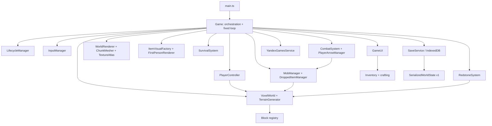
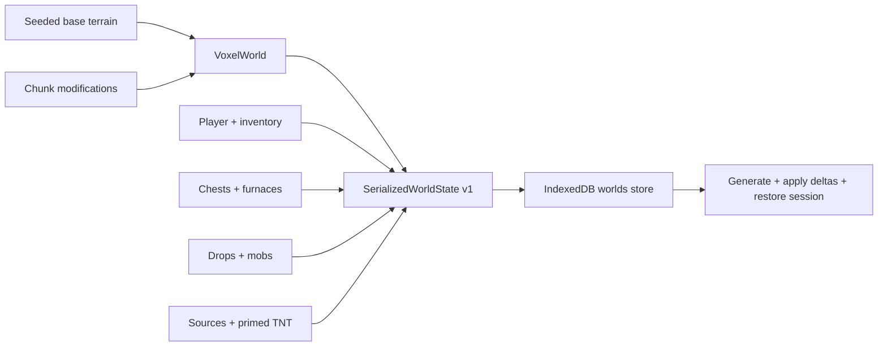

# Архитектура

## Цели

Архитектура Frontier Cubes рассчитана на большую, но ограниченную browser alpha:

- детерминированная fixed-step simulation с частотой `20 TPS`;
- data-first registries вместо разбросанных switch-таблиц;
- процедурный мир, который сохраняет только изменения;
- bounded runtime systems для chunks, dropped items, mobs и projectiles;
- независимая local playability при отсутствии platform SDK;
- минимальное число production dependencies: Three.js для WebGL, Vite/TypeScript для toolchain.

Это single-player client-only приложение. Server authority, networking и ECS framework отсутствуют намеренно.

## Карта подсистем



Главный принцип: `Game` соединяет системы, но правила blocks/items/crafting, player physics, survival formulas и entity simulation остаются в отдельных модулях, которые можно тестировать без WebGL UI.

## Boot и владение ресурсами

`src/main.ts` находит canvas/UI roots, создаёт один `Game` и запускает `initialize()`.

Во время initialization параллельно:

1. открывается IndexedDB;
2. инициализируется Yandex SDK либо local no-op path;
3. строится runtime texture atlas из whitelist-файлов `public/textures`.

После этого показывается интерактивное главное меню и вызывается platform loading-ready marker. `Game` владеет renderer, scene, camera, lifecycle, audio, input, save и platform adapters. Объекты конкретного мира собраны в `GameSession` и освобождаются при выходе/смене мира.

## Fixed loop и порядок tick

Render loop использует `requestAnimationFrame`. Реальная frame delta ограничивается `MAX_FRAME_DELTA = 0.25 s`, затем накапливается в accumulator. Пока accumulator не меньше `FIXED_DT = 0.05 s`, выполняется simulation tick. Камера интерполируется между `previousPosition` и текущей позицией игрока.

Simulation продвигается только в lifecycle state `PLAYING`. Текущий tick логически выполняет:

1. world clock, scheduled block ticks и furnaces;
2. combat state: held/off-hand, shield use и cooldown;
3. player input, hunger-aware sprint gate, AABB physics и survival/environment update;
4. chunk ensure/prune и ограниченный dirty rebuild;
5. block/mob targeting, mining, melee и use action;
6. food/bow use и player projectiles;
7. mob AI/physics/projectiles;
8. mob damage, drops и explosion events;
9. dropped-item physics/pickup;
10. pressure-plate occupancy, bounded redstone propagation, primed TNT fuse, explosion queue (budgeted batch apply) и explosion events;
11. autosave check и HUD refresh.

Такой порядок даёт простой детерминированный каркас, но не заявляет bit-exact vanilla ordering.

## Lifecycle

`GameLifecycleManager` использует состояния:

```text
LOADING → MENU → PLAYING ↔ PAUSED
                    ↓
                   DEAD
PLAYING → AD / BACKGROUND → controlled resume
```

На входе в `PLAYING` audio возобновляется и Yandex `GameplayAPI.start()` вызывается idempotently. В остальных states simulation/audio останавливаются и вызывается `GameplayAPI.stop()`. Background также инициирует save.

Текущая state machine хранит только одно предыдущее состояние. Для production желательно перейти к набору независимых pause reasons, чтобы user pause, platform modal и visibility не могли ошибочно отменить друг друга.

## Data registries

### Blocks

`src/blocks/types.ts` определяет stable numeric `BlockId` и data contract: hardness, collision/light `opaque`, independent `occludesFaces`, `renderLayer`, `renderShape`, tool, tier, drops, textures, emission, flammability, gravity, liquid, replaceability, redstone power и contact damage.

`src/blocks/registry.ts` является canonical block catalog. Он строит индексы по numeric ID и string key, валидирует uniqueness и автоматически создаёт block items для definitions, которые не отключили `hasItem`.

Numeric IDs лежат в chunk arrays и saves. Их нельзя переиспользовать для другого блока без migration.

### Items и inventory

`src/items/registry.ts` содержит discriminated unions для block/resource/food/tool/weapon/shield/armor. Max stack, durability, tool stats, food values и equipment constraints приходят из definition, а не из UI.

`Inventory` владеет 36 ordinary slots, armor record и off-hand. Все getters возвращают clones, поэтому внешняя система не может тихо изменить внутренний stack. Serialization валидируется при restore.

### Crafting и smelting

Recipes в `src/crafting/recipes.ts` поддерживают exact item, `anyOf` и tags. Matcher нормализует occupied bounds, умеет shifted/mirrored shaped recipes и shapeless backtracking, возвращая consumption plan.

`VoxelWorld.tickFurnaces()` использует те же `findSmeltingRecipe()` и `getFuelBurnTicks()`, что data layer и tests. Iron/gold, glass, charcoal и raw foods проходят через один canonical registry; output count, cooking time и max stack берутся из definitions.

## World model

### Chunks

`Chunk` хранит blocks в плотном `Uint16Array` длиной `16 × 80 × 16`. Индекс:

```text
index = y × 16 × 16 + z × 16 + x
```

`VoxelWorld` переводит world coordinates в chunk/local coordinates через floor division и positive modulo, что корректно работает с отрицательными X/Z.

### Generation

`TerrainGenerator` хеширует строковый seed и использует собственные value-noise/fBm helpers. Column generation выбирает biome и height; chunk pass заполняет bedrock/stone/top layers/water, затем вырезает caves, размещает ores и decor. Итоговые height/biome каждого столбца сохраняются в `Chunk.surfaceHeights`/`biomeCodes`, чтобы mesher не повторял noise sampling для каждого видимого face.

Генератор не читает browser state или wall clock, поэтому базовый terrain воспроизводим по seed. Loot, часть explosions и некоторые runtime decisions используют `Math.random()` и не являются replay-deterministic.

### Modifications и block entities

При `setBlock(..., record = true)` изменение сохраняется в:

```text
Map<chunkKey, Map<linearBlockIndex, BlockId>>
```

При повторной генерации chunk delta накладывается поверх base terrain. Chest/furnace states хранятся отдельно по world block key `x,y,z`. Redstone сохраняет только source/primed-entity state, а derived wire power пересчитывает после restore.

Scheduled block queue ограничена, за tick обрабатывается bounded число updates. Gravity-блоки ставят falling-block spawn вместо телепорта; liquids сохраняют минимальный downward path.

Каждый chunk хранит два `Uint8Array` света. Sky light заполняется сверху вниз по столбцу и коротко растекается по соседям; block light flood идёт от emissive блоков (torch 14, redstone torch 7, lava 15) с лимитом `8192` узлов. Одиночная смена блока вызывает `relightAround` (через `relightRegion`). Массовые записи идут через `VoxelWorld.applyBlockBatch`: каждый загруженный chunk в регионе получает `recomputeChunkSky` максимум один раз, затем один `propagateBlockLight` по union AABB. Cube faces пишут per-vertex `skyLight`/`blockLight` как среднее четырёх клеток у вершины (smooth lighting lite), плюс `faceShade` / `emissionLight` и biome tint в `color`. Chunk materials — `MeshBasicMaterial` с `onBeforeCompile`: shader делает `max(sky^γ * daylight, torchWarm * block)` и **не** применяет Lambert N·L. World entities используют тот же `composeWorldLight` через `sampleEntityLight`. Тёплый цвет факела живёт только в block-light contribution, daylight/sky остаётся нейтральным.

## Rendering

`TextureAtlas.create()` собирает нужные block textures в power-of-two canvas atlas. Содержимое tile — `32×32`, вокруг него экструдируется gutter `4 px`; UV указывают только на content. Pixel art использует nearest magnification, `NearestMipmapLinearFilter`, mipmaps, ограниченную renderer-capability anisotropy и sRGB. Это снижает shimmer и не даёт mip levels смешивать соседние tiles. Missing texture получает заметный magenta/black fallback. Raw `assets/` остаётся локальным и исключён из публичного Git; воспроизводимая runtime-копия состоит из 162 whitelist-файлов в `public/textures`, включая `oak_door_upper`, entity sheets/layers, Steve arm, arrow projectile, bow stages и шесть vegetation sprites.

`ChunkMesher` проходит плотный block array, читает соседние chunk arrays один раз на build и добавляет только faces, у которых сосед не `occludesFaces`. Cube hot path развёрнут по шести направлениям и не вызывает `world.getBlock()`/`columnAt()` на каждый face. Geometry содержит positions, normals, UV, tint colors и lighting attributes. Grass/leaves получают biome RGB tint из chunk column cache. `opaque` больше не выбирает render material. `cross`-растения с `lightingMode: vegetation` пишут две диагональные плоскости × две намотки в отдельный vegetation buffer чанка: sample normal `(0,1,0)`, чтобы sky/block sample совпадал с grass top. Отдельных `Object3D` на растение нет. Leaves/torch/door остаются в общем DoubleSide cutout. Torch — cuboid `TORCH_WIDTH×TORCH_HEIGHT` с UV crop opaque региона; wall torch использует общий `torchLocalMatrix` (основание на стене, `TORCH_WALL_TILT = -0.40`).

`WorldRenderer` создаёт независимые material paths через `createWorldChunkMaterial`:

- opaque `MeshBasicMaterial` без blending;
- cutout material с `alphaTest=0.42`, `transparent=false`, depth test/write и `DoubleSide` для leaves и alpha sprites;
- vegetation cutout material с тем же atlas/`alphaTest`, но `FrontSide`, потому что растения уже имеют двустороннюю геометрию;
- translucent glass material с opacity `0.52`;
- отдельный translucent water material с opacity `0.70` и более поздним render order.

Все пять шейдеров делят `worldDaylightUniform`, который `Game` обновляет каждый render frame. Dirty chunks перестраиваются с лимитом jobs и бюджетом миллисекунд; generation и meshing не совмещаются в один fixed tick, а repeated dirty changes coalesce. Дальние chunk visuals освобождают geometry.

Selection outline — тот же `LineSegments` в `WorldRenderer`. `selectionBoxesForBlock()` строит oriented boxes из фактической special geometry (cube / torch / button / lever / plate / wire / door / cross); геометрии кэшируются по shape key, voxel raycast не меняется.

`itemRenderProfiles` — data-only слой классификации `block/generated/handheld/bow/shield`. `item/handheld` — semantic parent `item/generated`: та же sprite geometry, без отдельной 3D-геометрии инструментов. First-person generated/handheld/bow используют один shared pose `[0.50, -0.56, -0.82]`, Euler `[0, 0, 14]°`. `scale 0.85` пишется напрямую в Three.js (`object.scale`); это не `vanilla 0.68 * projectMultiplier`. Vanilla JSON `rotation [0,-90,25]` не копируется: Y=-90 отбрасывается как Minecraft camera-basis conversion, pitch/yaw остаются 0, чтобы generated +Z front смотрел в камеру. Dev-only query `heldScale/heldX/heldY/heldZ/heldRoll/heldPitch/heldYaw` подменяет этот idle transform 1:1 и не пишется в save. `?qaItem=` по умолчанию изолирует предмет (`qaView=front|back|left|right`, без bob/swing); `qaView=held` — прежний first-person; `qaSideDebug=1` красит стороны. `ItemVisualFactory` — общий adapter: обычный cube block item получает UV-cube из atlas, а sprite items (включая held torch) проходят через `GeneratedItemGeometry`. Held torch не переиспользует placed cuboid; projectile `ArrowVisualFactory` не используется для held arrow.

`GeneratedItemGeometry` следует ItemModelGenerator 1.9: один SOUTH front quad и один NORTH back quad на весь sprite (back U mirrored), толщина Z 7.5–8.5 в 0–16 model units (`1/16`), силуэт даёт alpha texture. Side faces только на opaque→transparent границах (`alpha == 0`, out-of-bounds = transparent) с merge соседних spans одного facing; winding — внешняя оболочка (CCW с outward normal). Texel coords масштабируются в те же 16×16 model units, поэтому 32×32 pack не меняет размер/толщину, только детализацию границы. Along-span UV покрывает полные texel (`u = texel/size`); collapsed UV берёт центр opaque texel, чтобы nearest не сэмплировал transparent neighbor. `qaSideDebug` пишет vertex colors по facing и не попадает в production cache. PNG scan и geometry создаются один раз и кэшируются по texture path; во frame loop меняются только transform или ссылка на уже готовый bow variant mesh. Generated item `createEntityMaterial({ wrap: false })` сохраняет voxel light для drops, но не mob wrap-shade на тонких сторонах.

`FirstPersonRenderer` владеет отдельными scene и perspective camera. После world render `Game` очищает только depth buffer и рисует руку/предмет поверх мира; renderer info сбрасывается один раз перед обоими проходами, поэтому F3 учитывает полную сцену. Textured Steve arm — UV-cuboid и показывается только при пустом main slot; при любом held item она скрыта. Frame state содержит движение, землю, sprint, mining, swing, food/bow progress и shield state. Bow остаётся generated mesh с texture swap `bow` / `bow_pulling_0/1/2` по vanilla pull `0+ / 0.65 / 0.9`, замедляет игрока и плавно сужает world FOV; mesh не изгибается. Каждая поза вычисляется от неизменяемого preset, а не от предыдущего кадра, что исключает накопление transform drift. Модель меняется только при смене item id или дискретной bow stage.

Render camera не ждёт следующего fixed tick: `applyImmediateRenderLook()` каждый `requestAnimationFrame` применяет текущие `InputManager.yaw/pitch`. `PlayerController` по-прежнему потребляет тот же input на границе simulation tick для физики и сериализации. Такое разделение убирает ступенчатое вращение при сохранении детерминированного `20 TPS` gameplay loop.

`BlockDefinition.renderShape` маршрутизирует non-cube blocks в расширяемые builders. Lever — stone base и pivoted handle; torch — cuboid stick с wall/floor `torchLocalMatrix`; vegetation — batched crossed quads с `lightingMode`/`biomeTint` на definition; wire — ground quad; button — малый cuboid на floor/wall/ceiling; pressure plate — тонкая plate; oak door — вертикальная панель толщиной `3/16` на occupied face. Stairs/slabs/beds/containers остаются следующим geometry extension point.

## Player, survival и combat

### PlayerController

Позиция игрока привязана к центру ступней. Collision resolver строит AABB, двигает его по Y/X/Z, ограничивает displacement ближайшим solid collision box, затем пробует step-up. Slabs получают half-height collision; cactus — inset box.

Controller отвечает только за movement/physics state и сообщает fall damage callback. Health ownership остаётся в `SurvivalSystem`.

`PlayerTickResult.jumped` true только в tick реального takeoff (`jump && grounded && !liquid`). Поэтому удерживаемая кнопка не повторяет jump exhaustion каждый airborne tick.

### SurvivalSystem

SurvivalSystem хранит health, hunger, saturation, exhaustion, absorption, air/fire timers, difficulty, hurt resistance и spawn point. Он принимает context, а не напрямую управляет UI. Armor stats читаются через узкий `Inventory.getSlot` contract.

Damage pipeline:

```text
requested damage
→ hurt-resistance filtering
→ optional armor formula
→ absorption
→ health/death callbacks
```

Orchestrator применяет mob knockback только когда возвращённый `DamageResult.dealt > 0`, поэтому fully blocked или i-frame ignored hit не создаёт движение без урона. Survival sprint input отдельно блокируется при hunger `≤ 6`; Creative этот gate не использует.

### CombatSystem

CombatSystem хранит attack cooldown и shield state. Melee result вычисляет strength/damage/critical/knockback, но не изменяет health цели — это делает orchestrator через MobManager/SurvivalSystem.

`ArrowPhysics` задаёт общий для player и skeleton контракт в блоках на tick: launch velocity, Gaussian inaccuracy с сохранением длины вектора, `0.99` air drag, `0.6` water drag и `0.05 block/tick²` gravity. `ArrowVisualFactory` кэширует общий crossed-plane mesh из локального projectile sheet. `PlayerArrowManager` владеет ограниченным набором player arrows, за tick выполняет continuous segment raycast до ближайшего block/mob intersection, считает damage из текущей скорости и оставляет block-hit projectile в `inGround` до bounded timeout.

## Entities

### DroppedItemManager

Dropped items имеют bounded capacity, pickup delay, despawn timer, simple voxel physics, merging, partial pickup и serialization. `onPickup` возвращает реально принятую inventory count, поэтому полный inventory не удаляет предмет из мира. Менеджер получает тот же `ItemVisualFactory`, что и first-person renderer: настоящие item textures/atlas cubes bob-ятся и медленно вращаются, а thresholds `1/2/17/33` показывают `1/2/3/4` bounded visual copies. World-dropped meshes получают `sampleEntityLight` на 20 TPS.

### MobManager

MobManager владеет mob entities и skeleton projectiles. Definitions задают size, health, speed, ranges, damage, cooldown и loot. Runtime state machine включает idle/wander/chase/attack/hurt/die. Skeleton projectiles используют те же `ArrowPhysics` и переданный Game-owned `ArrowVisualFactory`, поэтому их scale, orientation, drag, gravity, collision и cleanup не расходятся с player arrows.

Освещение мобов идёт из voxel `skyLight`/`blockLight`: `sampleEntityLight` усредняет feet/torso/head, `createEntityMaterial` (`MeshBasicMaterial` + wrap ≥ 0.76) умножает на этот RGB. Scene hemisphere/directional больше не являются источником света мобов — тот же класс бага, что Lambert на terrain. Spawn/burn light checks читают `combinedLight`.

Вместо тяжёлого pathfinding используется direct steering, voxel collision/line of sight и optional `stepHeight` в `moveVoxelBody` (мобы карабкаются на один блок). Hostile melee сравнивает 3D distance между eye positions и требует voxel LOS. `playerTargetable: false` сохраняет player-centred spawning/despawn для Creative, но убирает игрока из hostile target selection. Events `playerDamage`, `explosion` и `drop` накапливаются и потребляются `Game`, что сохраняет границу между entity simulation и player inventory/health/world destruction.

Caps зависят от coarse pointer profile. Restore может принудительно создать сохранённых мобов в пределах общего hard cap.

### FallingBlockManager

Когда gravity-блок теряет опору, `VoxelWorld` кладёт spawn в bounded queue. `Game` создаёт falling entity с block mesh, gravity `-32` и voxel AABB; при земле блок возвращается в grid. Save schema 1 опционально сериализует in-flight entities.

`VoxelVisualFactory` обслуживает textured entity cuboids; item visuals вынесены в `ItemVisualFactory`. Оба используют `createEntityMaterial` из `worldLighting.ts`. `TexturedCuboidGeometry` вычисляет legacy cross-layout UV для всех шести faces из logical offset/width/height/depth; normalized UV одинаковы для 1× и 2× physical sheets. Entity materials используют nearest, sRGB, no mipmaps и alpha test.

`LegacyModel` является единым adapter для code-defined rigs: `16 model units = 1 block`, legacy Y направлен вниз, default ground plane равен `Y=24`. `rotationPoint` создаёт `Group pivot`, а `addBox origin` остаётся локальным центром cuboid; Euler X/Z меняют знак после отражения Y. Несколько definitions могут добавлять boxes в parts с одинаковыми именами — так base sheep и wool остаются разными слоями на общих pivots.

Cow, pig, chicken, sheep, zombie, skeleton, creeper и spider имеют отдельные legacy definitions. Sheep добавляет inflated fur layer поверх более длинных base legs, чтобы шерсть не заменяла видимые ноги. Только skeleton torso материал получает `DoubleSide`, сохраняя читаемость тонкой грудной клетки; zombie outer headwear использует локальный `alphaTest=0.45`, а остальные mob materials остаются на базовом threshold/front side. Spider имеет eyes overlay. Animation всегда вычисляет `baseRotation + bounded offset`, поэтому pose не накапливает ошибку. Soft horizontal mob separation использует не более `1024` unordered pair checks за update. Physics AABB остаётся в `MobDefinition` и не зависит от visual mesh. Числовой reference и честные пометки exact/approx находятся в `MOB_MODEL_REFERENCE.md`.

## Basic redstone

`RedstoneSystem` — отдельная bounded simulation над `VoxelWorld`. `Game` вызывает `notifyBlockChanged()` после placement, mining и explosion destruction, затем обновляет систему один раз за fixed tick.

Состояние разделено на:

- source map для torch, lever, button и pressure plate;
- derived `wirePower` map со значениями `0–15`;
- dirty queue/set для ленивого распространения;
- bounded collection primed TNT;
- очередь explosion events, которую `Game` сливает в `ExplosionQueue`;

Dust распространяет сигнал по шести voxel-соседям, уменьшая уровень на единицу. Torch постоянна, lever переключается use action, button хранит оставшееся pulse time, pressure plate получает occupancy из positions игрока, мобов и dropped items.

Powered TNT удаляется из мира и становится отдельной Three.js entity с fuse `4 s`, gravity и voxel AABB. Visual интерполируется между ticks. После fuse RedstoneSystem выдаёт typed explosion event. `Game` кладёт event в `ExplosionQueue`: resolve (скан без мутаций, scalar distance) → `applyBlockBatch` → один `relightRegion` на union bounds → `notifyBlocksChanged` с Set-dedupe → chain TNT через `primeTnt(..., { blockAlreadyRemoved: true })`. За tick обрабатывается ограниченный budget (jobs + voxels + ~2–3.5 ms). Одиночный TNT обычно укладывается в один tick; mass chain растягивается, не блокируя render. Explosion не вызывает immediate mesh rebuild.

Serialization version 2 хранит active sources, lever/button attachment/facing, остаток timed button и primed TNT с fuse и velocity. Restore принимает version 1. Wire power намеренно не сохраняется. Optional `blockStates` и `fallingBlocks` лежат в том же schema 1 snapshot.

Default safety bounds: до `2,048` sources, `64` primed TNT, `512` propagation steps за update и `8,192` queued updates. Это basic redstone approximation без directional dust shapes, quasi-connectivity и advanced components.

## UI и input

`GameUI` строит screens/modals как DOM, а не рисует интерфейс в WebGL. Это упрощает responsive layout и debugging. Inventory UI оперирует теми же `ItemStack`/matcher APIs, что и tests.

HUD получает фактический attack strength. Shield blocking state уходит в `FirstPersonRenderer`, а DOM остаётся для интерфейса, не для руки или held item.

`InputManager` нормализует desktop и touch в общий `MoveInput` плюс edge-triggered attack/use flags. Desktop sprint — `Shift`, sneak — `C`; touch action buttons не менялись. Desktop использует pointer lock; touch создаёт joystick, look zone и action buttons.

CSS применяет safe-area insets, compact landscape layouts и portrait rotation overlay. UI не должен менять simulation напрямую: callbacks возвращаются в `Game`.

`GameUI` также переключает `#app.controls-suppressed`, поэтому touch look/joystick/actions скрыты на menus и modals и не перехватывают pointer input поверх UI.

HUD обновляется с частотой `10 Hz` и меняет DOM только при изменившемся значении. F3 собирает rolling frame/tick average, p95/spike, chunk generation/mesh jobs и timings, dirty/rendered/loaded chunks, faces/triangles/draw calls и entity counts; текст пересобирается примерно `2.9 Hz`, а не каждый render frame.

## Persistence



`SaveService` делает structured clones на границе storage и сортирует summaries по `updatedAt`. Autosaves сериализуются через promise chain, чтобы параллельные записи не обгоняли друг друга.

Если IndexedDB отсутствует, используется in-memory Map. Это graceful degradation, но не durable save.

## Yandex adapter

`YandexGamesService` изолирует optional SDK:

- `initialize()` ловит отсутствие или ошибку SDK;
- `loadingReady()` отправляется не более одного раза;
- `gameplayStart/Stop()` idempotent;
- platform pause/resume events переводятся в lifecycle callbacks;
- local development не блокируется `/sdk.js`.

Ads, authorization, cloud saves, leaderboards и payments находятся вне текущего adapter scope.

## Performance boundaries

В коде уже есть несколько hard/bounded limits:

- frame delta cap `0.25 s`;
- один новый chunk за normal gameplay tick;
- один или два dirty chunk rebuild за tick в зависимости от pointer profile плюс `4/7 ms` soft budget;
- periodic chunk pruning;
- scheduled block queue max `4096`, processing max `64/tick`;
- dropped item cap default `128`;
- desktop/mobile mob and projectile caps, separation до `1024` pairs/update;
- player arrow cap `48`, lifetime `8 s`.
- redstone source/TNT/queue/steps caps.

Эти ограничения защищают main thread от неограниченного роста, но не заменяют profiling. Воспроизводимый `npm run benchmark:performance` отдельно измеряет 81 chunk generation/meshing и 600 updates для 24 mobs. Текущий профиль не оправдывает worker migration в этом проходе: сначала устранён подтверждённый synchronous mesh hot path; worker остаётся архитектурным следующим шагом для слабых устройств и больших render distances.

## Правила расширения

- Новый block: выделить новый stable `BlockId`, добавить registry definition, runtime texture whitelist и tests; при special shape добавить model/collision/state явно.
- Новый item: definition + texture + recipe/drop path + stack/equipment tests.
- Новая save field: обновить `SerializedWorldState`, validation, round-trip test и migration policy.
- Новая simulation system: fixed tick ownership у `Game`, bounded collections, explicit dispose и serializable state при необходимости.
- Redstone extension: сохранять derived/sourced state boundary, bounded propagation и общий explosion event contract; advanced component не должен обходить эти ограничения.
- Platform feature: держать за adapter boundary; local mode должен оставаться playable.
- Asset: сначала provenance/license, затем whitelist import; наличие файла в raw `assets/` не означает разрешение на runtime use.
